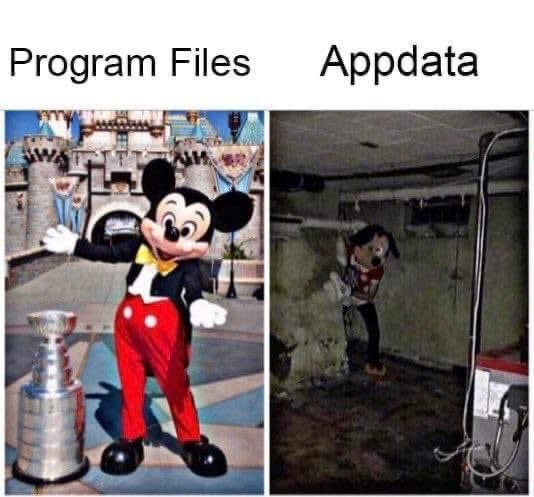

# 诊所知识清单

这里列出了能够胜任部长工作需要掌握的最少知识，学完了你就可以当部长啦（？）

注：本文写于2026年3、4、5月，请保持更新维护！ ——25诊所

## 软件知识

诊所服务的目标电脑大多为Windows系统，因此关于Linux仅需掌握其安装方法即可。当然也鼓励大家自行了解更多Linux和MacOS的知识。

> 北京理工大学Linux用户小组：QQ群910758498

### BIOS

当我们在按下开机键时，首先被启动的是BIOS系统（现代电脑使用UEFI而非传统BIOS，但是我们仍然习惯用BIOS称呼），它的作用是：初始化硬件、引导启动操作系统。在按下开机键屏幕出现logo到Windows加载的圈圈出现间就是BIOS在工作的时间。在BIOS工作期间按下特殊的按键（大部分电脑是F2）可以进入BIOS的设置界面。

BIOS在结束其它工作后会引导Windows系统或者PE等启动，并为它们提供一些所需的参数。BIOS一般按照顺序进行引导：本机的硬盘、USB、CD盘、网络远程，当在本项找不到可以启动的系统时，就会尝试在下一项找可以启动的系统，如果遍历结束还是找不到就进入BIOS界面。

这就是为什么我们要想进PE系统需要修改启动项：当电脑里的硬盘上有系统时，BIOS会优先引导它，而不是我们存在U盘中的PE。要想引导PE，需要要么禁用从本机硬盘启动，要么将USB的优先级前置。具体的操作取决于BIOS本身，需要根据具体情况进行操作。

BIOS并不是直接启动系统的，而是去启动用于启动系统的引导程序。Windows系统的引导程序叫作windows boot manager，linux的叫作grub。这二者在BIOS启动选项中分别以windows Boot Manager和具体的linux发行版（比如ubuntu、fedora）。需要注意的是grub可以引导windows，而windows boot manager只能引导windows。所以当电脑里同时有windows和linux时，要在bios中将grub放在启动顺序的第一位。

BIOS里还有一些选项需要我们注意。首先是安全启动（secure boot）。如果我们启用了安全启动，BIOS在引导启动时就要去检查自己正在启动的系统是不是官方的、正版的，以避免启动某些病毒程序损坏电脑。正经的操作系统（电脑里的Windows、Ubuntu等）都可以通过检查，使用正版镜像制作的启动盘也可以通过，但是我们常用的PE并不行——它是非官方组织自制的。因此，在设置进入PE前，我们需要在BIOS中关闭安全启动。

有时候我们会发现在BIOS找不到安全启动的选项，或者选项是灰色的不允许修改（常见于华为、小米、机械师、神舟），这时候需要寻找设置管理员密码（supervisor password），设置此密码后即可修改安全启动选项。开启管理员密码后每次进入BIOS时都需要输入这个密码，因此在操作完成后请务必关闭密码，方法是在修改密码的地方将新密码设为空即可取消密码。

注：开启管理员密码可能导致windows引导失效，关闭管理员密码即可解决。

然后是VMD。并不是所有电脑都有VMD这个功能，一般只有使用intel cpu的华硕（包括rog）和机械师品牌的电脑有这个选项。当开启VMD时，我们在windows或ubuntu的安装程序内可能找不到硬盘。因此在给这些品牌电脑装系统前要在bios中检查是否开启了VMD。

> 在关闭VMD、安装好双系统后可能出现在尝试进入原有的windows时蓝屏的情况，此时需要在PE中修复引导，或者采用[一些神秘的解决方法：见INACCESSIBLE_BOOT_DEVICE节](/clinic/bsod)

调整某些BIOS选项，如安全启动、管理员密码都会使windows的pin码失效，恢复BIOS原有设置，或者联网重置pin即可解决。

### 操作系统

世界上最主流的操作系统是Windows、Linux和macos。macos是苹果电脑独占的。我们一般工作遇到最多的是windows系统，windows历史悠久，有相当多的版本，我们最常遇到的是win10和win11。linux本身是只是一个内核，不同的厂商或者开发者根据其实现了具有不同特征的系统，称为发行版，比如ubuntu、fedora、arch。但是由于它们都使用linux内核，因此在运行逻辑、操作上都几乎一致，因此都统称为linux。

关于windows系统主要介绍PE和WinRE。

PE（pre-installation environment）是一种可以储存在U盘中的，极度精简的Windows系统，可以用它修复系统、修复文件、安装系统。它在启动时会将自身加载到内存里，因此在PE启动后可以直接拔出PE盘，并不会影响pe系统的正常运行。

pe内一般都附带了若干软件，这实际上分为内置软件和外置软件两种，前者在pe启动的时候会一同加载进内存而后者不会。因此如果你拔出了pe盘，外置软件就不能正常运行了。

诊所目前使用的PE是wepe，一种常见的PE系统，其包含了diskgenius、UEFI引导修复等若干实用工具。

PE缺乏运行库，因此大部分软件（如各种烤鸡工具、python脚本、jar文件）都无法在PE中运行，也没有很多常用工具（如manage-bde）。

WinRE（windows recovery environemnt）就是当系统未能正常启动时出现的有“高级选项”“修复工具”等选项的蓝屏界面。当windows被不正常关闭（如长按电源或拔除供电导致的强制关机、显卡虚焊导致的强制关机）三次后，再次开机就会进入这个界面。在winre里选择继续启动就可以正常继续启动系统。另外，在点击重启时按住shift也可以进入winre，

winre本身是储存在一个独立的分区中的，常命名为recovery（恢复分区）。这意味着只要恢复分区存在，当系统出现故障时仍可以正常启动winre。winre里有一个“命令提示符”，点击它会打开一个cmd。在cmd界面我们发现，winre加载在X盘上，这个X盘就像是正常情况下的C盘，有windows、users等文件夹。这也说明winre就是一个简单的windows系统。

因此，winre拥有windows的全套工具，比如manage-bde。这适用于一个场景：机主的系统损坏无法开启，但是硬盘上有bitlocker使得我们无法在pe里备份数据。那么就可以尝试进入winre，在winre中使用manage-bde关闭bitlocker。

> 还可以在winre里解除系统开机密码，方法见[干掉windows密码](https://www.bilibili.com/video/BV1gK4y1x7XP)。替换的exe也可以是utilman.exe，这是锁屏界面右下角的那个无障碍功能。如果替换utilman.exe，点击无障碍功能即可打开cmd。

此外，在winre里还可以进入安全模式。安全模式是禁用了外置设备驱动、分辨率调节、联网等功能的windows系统。有时我们会遇到一种奇怪的问题：电脑一打上显卡驱动就会立刻黑屏掉电关机。此时就可以考虑进入安全模式，安全模式不加载显卡驱动，因此电脑不会黑屏，之后在安全模式里卸载驱动。

与pe不同，linux的livecd环境是一个完整可用的系统，拥有绝大多数设备的驱动。因此如果出于某些特殊原因需要在电脑上加载一个完整可用的系统，可以考虑开启一个livecd。比如触控板不可用时判断是其本身问题还是系统问题就可以开一个livecd试试。这里不建议用pe，是因为pe本身包含的驱动也不多，可能触控板本身没问题但是由于pe缺乏对应驱动导致无法使用。

> 诊所livecd正在开发中！

### 磁盘分区

一个物理硬盘可以分为多个分区（partition），每个分区的大小和于其它分区的相对位置是固定的。每个分区都有其自己的文件系统（file system），文件系统是电脑操作系统用于储存、管理文件的规则方法。Windows系统最常使用的是NTFS文件系统，linux是ext4，macos则是APFS。不同操作系统对各个文件系统的支持程度各不相同。windows对NTFS、exfat和fat文件系统的分区既可以读取其中的文件，又可以向其写入文件，如果想要支持其它文件系统就需要安装特别的软件。

每个NTFS分区都有其盘符，系统分区的盘符是C。需要注意的是，盘符并不是固定的。比如一个U盘在电脑A中盘符为E，那么当它插入到一台已经有一个盘符为E的电脑中时，其盘符会顺延为F。再比如当我们的电脑中有两个windows并存时，在其中一个系统中会观察到正在运行的这个系统的系统分区盘符是C，而另一个系统的系统分区则会是D。这点在PE系统内非常关键，因为有时PE盘内的某个分区可能占据了C，那么原机的C盘就变成了D。如果我们是冲着要删除系统中分区D的目的进入PE盘，未经检查就删除了PE中的D，那么就实际上删除了系统所在的分区，造成很严重的事故。

NTFS文件系统分区的大小是可以调整的。在磁盘管理中可以新建、删除、扩容、压缩分区。压缩分区会在分区从分区右侧分出一块，变成未被分配的空间。要想扩容分区也只能从分区右侧的空闲空间扩容。分区只能从右侧调整大小，这是其本身的实现方式决定的。有时我们会遇到需要从左边分出空间的情况，这时就需要使用diskgenius了，见下文的第四种复杂情况。

要使用diskgenius进行硬盘操作前需要进入PE，以保证在其工作时没有其它程序干扰导致操作失败甚至数据损毁。但是在PE内进行任何硬盘操作前需要确认关闭了bitlocker。

> 一定不能忘记关闭bitlocker！在没有关闭bitlocker的情况下在pe对分区进行任何操作都会导致分区损坏，数据丢失！	

如果打开diskgenius，我们会观察到有两个在磁盘管理中不会显示的分区：ESP和MSR。这是引导分区，无论是windows还是linux，都要将其自己的引导程序放在ESP分区中，BIOS才能识别并引导系统。这两个分区不可删除。

有时候Windows在更新后蓝屏，无法进入系统，就是其引导损坏导致的。PE中有一个“UEFI引导修复”可以修复Windows引导。如果没有成功，可以在diskgenius中删除原分区，并创建新的ESP分区（这种方法不适用于还装载了linux的情况，因为这样创建的新分区只包含Windows的）。

我们有时会遇到四种比较复杂的分区操作，其中第三种操作最为复杂：

1. 机主购买了一块硬盘，希望我们将系统从原来的硬盘导入到这个新的硬盘中

这种情况可以使用diskgenius中的“系统迁移功能”。迁移后需要检查系统能否正常开启，如不能则需要修复引导。

2. 机主购买了新电脑，希望将旧电脑的硬盘插到新电脑中作为系统盘使用

这种情况直接插入旧硬盘即可，如果在BIOS中找不到启动项则需要修复引导。由于新旧电脑上各个设备（扬声器、触控板等）型号不同，旧电脑上的系统可能无法在新电脑上正常工作，需要重新安装驱动。但是这样可能会出现各种隐性的问题，因此不建议这样操作。

3. 机主购买了新的硬盘，希望将原有的分区迁移上去，并扩大分区容量

比如机主之前是一个512G的硬盘，上面有256G的C和128G的D，120G的E。现在机主加装了一个1TB的硬盘，希望把D和E移动到新的硬盘，各分512GB，然后将原来的硬盘全部给C。

加装好硬盘后，直接在PE里使用diskgenius就可以复制分区，在复制的时候可以调整分区大小。但是由于盘符不能重复，因此D盘复制后会变成别的盘符。因此这种场景的难点是在移动分区的同时需要保留原分区的盘符。要保留盘符是因为，比如机主的D盘是用来装软件的，那么如果盘符更改了，这些软件就无法正确寻找路径（以前是D:/xxx/xxx，现在了变成F:/xxx/xxx）。

因此需要这样的操作：在复制了分区后，进入系统，打开磁盘管理，右键D盘，删除D盘的盘符，然后右键D盘对应的副本，将其盘符改为D。对所有复制了的分区都进行这个操作，随后重启。注意此时不要删除原来的分区。

重启后看看新的D盘中文件能发访问，软件能否打开，如果可以那么就可以删除原来的分区，并将空闲的空间给C了。

4. 需要从分区左侧开辟空间

这常见于机主电脑左侧是C盘，右侧是D盘，C盘大小很小，已经快满了；而D盘很大，空间绰绰有余。我们想要将D盘的空间分给C一部分，但是按照上面的说法这在磁盘管理中是无法实现的。因此我们需要使用diskgenius，在需要调整的分区上右键，点击调整分区大小。在这里是可以从左边调整分区大小的。因此我们可以将D盘从左边分出一部分，再分给C。diskgenius是通过一种特殊的技术实现这个功能的，这个操作本身耗时较长，在移动的过程中千万不能断电，因此在此之前请检查电源是否插好。

todo!("具体用法")

### bitlocker

bitlocker是微软的一种加密分区的技术。开启了bitlocker的分区不能在其它电脑上访问，必须输入此分区的密码才行。这个密码储存在进行加密的电脑的tpm芯片和微软的服务器上。因此若想将一块硬盘移动到其它电脑上使用，则需要提前关闭bitlocker，否则就需要去微软的网站登录微软账号找密钥，非常麻烦。关闭安全模式也可能触发bitlocker锁定，重新打开安全模式即可解决。

如果我们在PE中强行对开启了bitlocker的分区进行修改，则会直接破坏掉这个分区，使得数据丢失。因此，在PE中进行任何分区操作之前，一定要检查是否关闭了bitlocker！

检查和关闭bitlocker的方法有两种，第一可以在设置 隐私与安全 设备加密 中看到设备加密状态，实际上就是bitlocker状态。在“设备加密”点击关机即可关闭bitlocker。有些版本的windows并没有这个选项，或者有时我们需要在winre中进行操作，此时可以使用第二个方法：打开终端，输入`manage-bde -status`即可查看bitlocker状态，使用`manage-bde -off <盘符>`（比如`manage-bde -off C:`）即可关闭对应分区的bitlocker。当在`manage-bde -status`的输出里显示`完全解密`或者`Fully Decrypted`就说明这个分区解密完成了。

解密一般需要较长时间，解密过程中可以正常关机，在解密时输入`manage-bde -on <盘符>`可以继续加密。但是不能强制关机，这会导致数据损坏。

### C盘

C盘是windows系统本身以及用户文件存放的位置，很多软件也会将文件存放在C盘。我们经常接到要清理C盘的业务，因此搞清楚C盘的组成和可以清理的部分是非常必要的。

C盘主要有三大部分：Users文件夹，Program Files和Program Files (x86)文件夹、Windows文件夹。

Users文件夹存放系统里所有用户的用户文件夹，包含用户的桌面、文档、下载等文件夹，很多程序也会将与用户相关的文件存放在这里。

需要注意的是`Users/<用户名>/AppData/Local`、`Users/<用户名>/AppData/LocalLow`、`Users/<用户名>/AppData/Roaming`文件夹，它们各自有分工，但是都用于储存应用程序的各种文件。很多垃圾便出于此。特别是`AppData\Local\Temp`，这里存放临时文件，可以直接删除。但是更可靠的方法是在设置中`系统` -> `储存` -> `临时文件`处删除。

Program Files和Program Files (x86)文件夹主要用于存放应用程序本身。Windows文件夹则储存着windows系统本身的各种文件，对其修改可能导致系统功能损坏。

根目录下可能有两个很大的文件：hiberfil.sys和pagefile.sys。前者是休眠文件，后者是虚拟内存。这二者不能直接删除，但是有办法通过关闭对应功能从而去除这两个文件。但是不推荐这样做。

在清C盘前可以先观察机主C盘的大小。C盘至少要150G，如果空间充裕可以分300G。有些电脑C盘只分了100G甚至更少，这种情况下常规清理不会有太大效果，应该做的是考虑扩容C盘。

### 用户和权限

在上古时代，计算机是极其庞大、昂贵的器件。一台电脑，往往需要供很多人使用。古人使用电脑，是为了编写程序，进行科学计算一类的工作，这其中大多时间是在思考、输入，而非运行程序。因此计算机在大部分时间是空闲的。如果每个人按序依次使用电脑，无疑会带来很大的资源浪费，也会降低工作效率。因此，早在1969年，就出现了成熟的多用户操作系统。运行这种系统的电脑可以同时连接多套显示屏和键盘，让多人同时使用电脑，每个人就是一个用户。

在这种情况下，我们当然不想让别人随意访问甚至修改我们自己的文件。因此，多文件操作系统对每个用户都有其自己的用户文件夹。有时用户间需要共享一些文件，就有了共享文件夹。

添加新用户、删除不再需要的用户、维护系统，这些操作都需要专门负责系统的人来做。为了安全，一般用户不能进行这些操作。因此不同用户是有权限的区别的，拥有最高权限的就是管理员用户。

现代操作系统都是多用户的，只不过个人电脑一般不会分多个用户，因此我们感知小一些。在windows里，`C:/Users/`下存着各个用户的个人文件，也可以在这里看到公共的文件夹。

### 任务管理器和运行

任务管理器有多个板块，“进程”列出了电脑在运行的全部进程，以及CPU、内存等的占用情况，右键一个进程可以强制关闭它；“性能”展示出CPU、内存、硬盘等的具体情况，比较重要的是CPU的频率；“启动应用”里是所有会在开机时自启动的应用，可以在这里设置需要让哪些自启。其它板块于我们而言作用较小。

> 每个运行着的程序都有其自己的进程

桌面和资源管理器都是由一个叫作“explorer.exe”的程序实现的。如果出现了桌面或者资源管理器卡死，我们可以招出任务管理器，将explorer强制关闭，随后其会自行重新启动，恢复正常工作。

任务管理器可以用ctrl+shift+esc快速开启，也可以ctrl+alt+delete，在出现的界面里选择任务管理器。特别是后者在桌面卡死时非常实用，因为它在系统的优先级极高，系统卡死时它往往可以正常工作。

[任务管理器的有趣历史](https://www.bilibili.com/video/BV1Fny3ByEfJ)

在“进程”板块有一个“运行新任务”，点击它会打开一个对话框。如果我们按下快捷键win+R同样会打开它。开启的这个对话框应用叫作“运行”。只需要把你要运行的程序的名字或者路径放到里面就可以运行对应的程序。常见的使用场景是打开注册表编辑器，就是在这里输入“regedit.exe”。

### 环境变量

在运行里输入“regedit.exe”就能打开注册表编辑器，那么windows是怎么知道这里“regedit.exe”具体在哪的呢？再比如在终端输入python，终端是怎么知道python装在哪里的？这是因为windows预先记录了几个位置，当我们输入“regedit.exe”这种不指定路径的程序时，它会从预先记录的这些位置里寻找有没有对应的程序。这些“预先记录的位置”就是环境变量。

我们可以在设置里搜索“查看高级系统设置”，在弹出的界面里点击“环境变量”，就可以看到并修改环境变量了。这里有用户环境变量和系统环境变量的区分，我们一般只需考虑系统变量。在系统变量里有一个“PATH”，点开会发现它存放着一些文件夹路径。当我们输入“regedit.exe”之类的指令时，系统就会从这些目录里寻找对应的程序。

我们还可以看到有其它变量，这是为了其它程序使用的，比如如果你安装了java那么会有一个“JAVA_HOME”，值的java安装的位置。

### 注册表

注册表储存着一些系统和软件的需要长期保存的配置选项。注册表是一组树状组成的键值对，随意修改注册表有导致系统损坏的风险。

windows自带了一个注册表编辑器，在运行中输入regedit.exe即可开启。

由于程序也可以编辑注册表，随着各种程序的野蛮操作，注册表很有可能存在大量没有用的项，干扰系统正常运行（如vmware卸载不当遗漏的一个注册表项会导致电脑无法联网）。另外，不当的卸载（比如没有使用卸载程序，而是直接删除了软件文件），或者卸载程序本身就忘记了清理注册表，也会导致注册表残留。此时可以使用ccleaner的清理注册表功能进行清理。注意一次扫描、清理后再次扫描可能会出现新的残留项，因此要多清理几次才能保证完全清除干净。

### 应用程序

电脑里的程序有两种，一种是需要安装才能用的，一种是直接点击exe文件就能用的。安装程序其实并不是什么高深的技术，它只干了两件事：第一，解压自己，复制到安装位置；第二，在注册表和环境变量里写入自己需要的值。有些程序可能还会注册自己的服务，生成一些配置文件等。

那么同样的，卸载程序只是把安装程序的工作反过来，删掉安装位置里属于自己的文件、清除自己的注册表和环境变量等。（不过由于卸载程序是软件厂商开发的，因此也有卸载程序不能卸载干净的情况。因此我们推荐使用geek uninstaller卸载，它会扫描卸载残留。）

说这些是要说明：如果卸载程序缺失或者无法运行，我们可以使用手动卸载的方式。即删除安装位置的文件（之后使用everything搜索有无卸载残留）、清理注册表（直接使用ccleaner扫描即可），有可能还需要手动删除环境变量。不过在卸载程序还在的时候最好是用卸载程序。

### 驱动和设备管理器

驱动是一类程序，告诉系统如何控制使用某个硬件。比如，缺少无线网卡驱动，电脑就不能连接wifi；缺少显卡驱动，电脑就不能使用显卡；缺少声卡驱动，电脑就放不出声音。

windows系统自带了很多驱动，在安装系统时，其会自己识别硬件并安装相应的驱动。但是很多时候windows并不能在自带的驱动中找到合适的，这就是为什么有时重装系统后发现触控板不能用、电脑没有声音、连不上网。这时就需要从互联网上获取合适的驱动。一个简单的方法是运行windows更新，它会寻找并下载合适的驱动。但是windows更新过于缓慢，有时会失败。因此更好的方法是在电脑品牌的官网寻找驱动下载界面，一般此处可以根据电脑型号提供下载链接。

有时候刚装好的系统没有无线网卡驱动，无法联网，此时可以使用easydrv安装网卡驱动，随后从官网下载驱动。实际上easydrv也可以安装其它硬件的驱动，但是无法保证驱动版本更新，因此建议从官网下载驱动。

> 有时安装了声卡驱动仍旧没有声音，此时要在官网检查是否会多个需要安装的声卡驱动，如果没有遗落的驱动，尝试卸载驱动“intel智音技术（intel SST）”解决

有一些设备使用通用协议，不需要额外安装驱动：屏幕、鼠标（注意不是触控板）、键盘、有线网卡。也就是说，哪怕你刚安装的系统对电脑上所有硬件都不支持，但是外接的鼠标、自带的（和外接的）键盘、屏幕、有线网肯定是能用的。

一般来说，越老的系统对新硬件的支持越差，因为其没有新硬件对应的驱动。不要在24、25年的电脑上安装win10以前的windows或2204之前的ubuntu。

我们可以在设备管理器管理对驱动进行禁用或者卸载。

todo!("设备管理器的进阶功能")

## 硬件知识

注：笔记本与台式机的很多硬件组成和功能并不相同，这里讲的是笔记本相关的。

### 主板上的主要硬件

注：本节是按照笔记本的开机上电顺序组织的。

#### EC

ec芯片（embedded controller）主要负责控制开机信号、调节风扇转速、控制键盘、控制电源指示灯和键盘灯等底层功能。我们在很多品牌的电脑上都能观察到一个现象：当按下开机键时，风扇会开始以较快的速率转动，在进入系统后反而转速降低。这是因为在系统启动前，风扇转速是ec的内部策略控制的。以保证在开机时电脑能够正常散热。之后则由系统与ec协作，根据实际温度和电源模式等进行控制。刚开机时电脑温度不会很高，因此系统就将转速又降了下去。另外，若电脑的温度超过了某一最大限度（温度墙），电脑会立刻断电关机从而保护电脑不被损坏，这也是ec直接控制实现的。

如果遇到：按下开机键没反应、插电不能开机且电源指示灯没反应就有可能是ec的问题。

开机时，ec会发出开机信号，其它芯片（PCH）会带起若干个电压，最重要的就是3.3V和5V供电。因此，可以通过发出开机信号后测量主板上是否出了3.3V和5V来判断ec是否正常工作。

#### 南桥

注：现代笔记本一般使用PCH而非传统意义的南桥

ec正常开启后会带起南桥（southbridge），南桥负责处理与外部设备，如USB、网卡、BIOS芯片等的数据传输工作，也负责控制电源状态。在开机时，南桥会发出信号，使电源管理芯片带起CPU、内存的供电。

因此，如果电脑出了3.3V和5V，但是屏幕不亮，可能就是南桥的问题。这时候需要观察电流。如果上电还没有到CPU，那么电流会在0.9A左右，并且电流不会跳动，那很大概率就是南桥坏了。

#### CPU

todo!("CPU的作用")

todo!("CPU的工作原理")

此时，内存还没有上电，这段过程的程序是运行在CPU缓存上的。

我们看到的闪闪发亮的“cpu核心”，称为die。一般台式机的cpu会在die上涂上硅脂并上一个盖子，而笔记本的芯片die直接暴露在外，称为裸die。

#### BIOS
	
我们在软件部分介绍过BIOS系统的作用。BIOS系统本身是储存在BIOS芯片里的。当CPU供电稳定后，CPU会从BIOS芯片中读取启动BIOS，开始根据BIOS程序对硬件进行初始化。

当这步即将结束时，我们应该能在屏幕上看到电脑厂商的logo。不过不会出现windows系统加载的圆圈，因为这一步还没有开始加载系统。

#### 内存

CPU读取BIOS程序，BIOS指导CPU对硬件进行初始化，第一个初始化的就是内存。

大部分电脑使用内存条插槽，只需要从槽上取下原来的内存条，插入新的就可以完成内存条的更换。还有部分电脑的内存是焊在主板上的，这样可以进一步减小电脑厚度，常见于轻薄本。

我们经常遇到这种不开机问题：电脑正常开启，卡在了logo界面，没有系统加载的图标。这说明电脑没有完成对硬件的检查，最常见的就是卡在了内存，这一般是内存条的金手指上有异物，进而接触不良导致的。此时可以考虑：拆下内存条，使用橡皮擦拭内存条后插回。如果仍没有解决可以考虑对内存条进行排列组合（交换顺序、只插一根在两个槽上都试试）。如果是加入新内存后不开机，可能是新加的内存的频率有问题。

注：笔者的2024幻16air有一个奇怪的问题：插着网线转USB的线时无法开机，卡在logo界面，暂时还没有研究明白为什么。

#### 硬盘

在完成内存的初始化后会进行硬盘和其它设备（比如键盘、显卡）的初始化。此时BIOS会去查找引导分区，引导启动系统，之后的过程在软件篇已经做过介绍了。

#### GPU

现代gpu主要作用是进行图形渲染和快速并行的简单计算。前者体现在如游戏等需要大量渲染的情况，后者体现在运行ai模型等需要大量计算的情况。

显卡有与CPU集成在一起的集成显卡（称为集显或者核显），和独立存在的独立显卡（独显）两种。一般笔记本电脑的CPU都带有集显。由于集显和CPU共用供电和带宽，加之其本身设计因素，因此性能往往远不如独显。显卡进行计算、处理图像也需要内存，独立显卡有专门的显存，集显占据一部分内存作为显存。

显卡正常工作需要驱动。独显必须安装驱动才可以正常工作，集显一般有通用驱动，即使不额外安装驱动也可以使用（但是可以会限制一部分功能和性能）。

### 其它硬件

#### 主板

主板承载着其它硬件。一些硬件，如CPU、各种供电芯片和电容电阻都是直接焊接在主板上的。主板上还有若干接口，借助排线连接其它设备。主板上运行的是直流电，220V交流电在充电器转换为直流电，一般是20V或者19V，传入主板。主板上有若干电压转换电路，将20V转为各个部件需要的电压，大部分部件需要的电压不超过5V。

主板的螺柱都是接地的（注意接地是个相对概念，不一定是地球大地，也可以指代电路设计中的0电压点），因此若要在主板上测量电压或压降，需要将万用表的一头搭在螺柱上。但是在这之前要验证接地良好，方法就是用欧姆档打不同螺柱，确保蜂鸣。

在插上充电器后，主板的接地就会与充电器的地线通过电容耦合的方式连接（如果是三脚充电器），并真正接地。

除了在上面介绍过的硬件，主板上常见的器件和芯片还有：

1. 若干电容、电阻、电感、二极管、三极管、MOS管、功率放大器。它们的作用请自行学习模拟电路。
2. 检查点。就是一些特殊的焊点或0欧电阻，用于维修主板时进行测量。
3. 声卡芯片、有线网卡芯片。不同于无线网卡，这二者一般是直接焊在主板上，无法更换的。
4. CPU、GPU、屏幕等的供电芯片。
5. 内存芯片。一些电脑使用板载内存，也有使用可插拔内存条的。
6. 显存芯片。

有很多排线与主板相连。仔细观察可以发现这些排线内部是若干更细的线。通过数电的知识可以明白：在某一时刻，通过改变这些线的电压，就可以传递不同的信息。比如有四根线，记0到0.3V表示0，2.5到3V表示1，那么控制四根线电压分别是0V，3V，0V，3V就表示0101。这样线的另一端就可以知道传输的信息是0101。这个过程是极快的，我们可以在几纳秒内发送几百次，这样就能在极短时间内传输大量的二进制信息。

通过主板的用料和电路设计，也能看出电脑的品质。高端品牌（如rog）都会布置大量的保护电路、采用质量极佳的供电电感，因此很少出现“rog电脑静电击穿”的问题，也很少有rog电脑供电烧毁导致电脑损毁的案例。与之相反，较为廉价的机械革命在保护设计上就极为不足，进而节省大量设计、耗材、调试成本。这也就片面解释了同样配置不同品牌间差价极大的原因（rog本身也存在溢价，并不完全贵在用料好上）。

#### 散热系统

电脑上以CPU、GPU和南桥为代表的一些硬件发热量很大。CPU一般进行轻度工作时的功率在20W左右。如果没有外部散热，在这个功率下，CPU只需0.5到2s就可以从25度上升到100度。因此，散热系统的作用是很大的。

笔记本电脑的散热系统主要有导热铜管和风扇组成。导热铜管是一组铜管，内部中空，填充着冷却液。铜管覆盖在CPU、GPU、供电电感和MOS管、显存芯片、南桥、板载内存芯片上，热量从发热源往铜管的两侧高效传导。铜管越多，散热能力越强。

近年的电脑出现了一种叫作均热板的散热模组，代替铜管，它能让热量分布更加均匀。

铜管的两侧是风扇，风扇从电脑底部（D壳）吸入冷空气，经由铜管变化成的鳍片带走热量，热空气从背部（A壳下）和两侧（键盘两侧）吹出。笔记本风扇最高转速一般可以达到八千转甚至更高。有些轻薄本可能只有一个风扇，有些上古笔记本有将两个风扇放在同一侧的设计，非常奇怪。

散热铜管和发热器件都是固体，这意味着二者不能完全贴合。而如果任由空气至于其中，其极低的导热能力会严重影响散热系统的工作能力（在CPU与散热模组之间空隙中的空气导热能力大概是1.5W）。因此一般使用硅脂作为导热材料填充缝隙，同样条件下硅脂的导热能力是500W左右。有一种叫作相变片的材料，是一种特殊的硅脂，它在常温是固态，在升温时变成液态。这种材料相对硅脂的导热能力有轻度的提升。另外还有一种叫作液金的导热材料，就是一种镓的合金，在常温下物理性质和汞比较相似，它的导热能力在5000W左右。

随着时间的推移，硅脂会逐渐氧化变干，导热能力下降。另外，由于泵出效应，硅脂会慢慢地从中心向两侧散开，使得空气进入。因此，硅脂需要定期更换，一般一年更换一次为宜。

既然液金这么厉害，比硅脂的导热能力高出一个数量级，为什么液金没有得到普及呢？最主要的原因是，液金受热融化，会在die上流动。由于并不可能在此期间保证die绝对水平，液金受到重力和泵出效应的作用会逐渐向die外偏移，称为液金偏移。液金偏移会显著降低电脑的散热能力。一般正常使用一年液金偏移的程度就会很大，即使在使用电脑时格外小心。

如笔者的幻16air，在使用一年后液金已经严重偏移，待机cpu能达到八十度。

液金是金属合金，一旦落到主板上会导致短路，烧毁主板。原厂液金的电脑都有完备的防泄漏设计，但是原厂是硅脂的并没有，因此不能直接将硅脂换成液金。当抬起使用液金电脑的散热模组时，可能有液金会飞溅出来。在清理液金时也有可能会让液金粘到主板上。因此诊所是不接液金换硅脂的业务的。

另外，散热系统的瓶颈并不在这层导热材料，因为硅脂也有500W的能力，只要涂抹适当完全可以应对一切发热场景。散热系统的瓶颈在于鳍片。因此近年的笔记本会选择采用内吹设计。内吹设计的电脑不会从两侧出风，而是将一股冷空气吹进主板，它直接经过铜管，从电脑背部吹出。这种设计能够显著提升的散热能力。

电脑的内存、硬盘和其它小器件也会发热，有些电脑会设计一个小风扇置于主板下方，它能够引进一股风覆盖整个主板，起到散热的作用。

#### 键盘

笔记本电脑的键盘通过一根排线与主板相连。键盘排线一般位于电脑下方（靠近电池一侧），是一根很宽的排线。为什么这么宽？

键盘上的键可以视为若干行和若干列的矩阵，如果提前约定好每个键对应的行号和列号，就可以根据这两个数字确定那个键。因此，笔记本键盘的排线就是同时将这两个数字传给主板，一个线代表一个数字。比如笔者的幻16air有83个键，7行18列，那么就需要7+18=25根线。

除此以外，键盘还有背光需要正负极和地线，大写锁定和数字锁定灯需要额外接线，有些电脑的电源键也是集成在键盘上的，这又增加了线。因此键盘排线一般很宽。

因此，如果电脑出现一行或者一列键没有反应，极大可能就是某一条排线断了。

注：有些电脑的背光是一根另外的排线。

#### 屏幕和AB面

电脑AB面包裹着屏幕（专业叫作屏幕总成）和摄像头，有些电脑的无线网天线也在这里。

屏幕总成通过屏线与主板相连，这根线很宽，一般位于主板上方。屏线很脆弱，尽量不要弯折。屏幕有LCD和OLED两种。OLED只有一层，但是LCD屏幕有两层：一层用来成色，但是这层不发光，另一层用来发光，使得颜色能被清楚地看到。发光层叫作背光，我们在调节电脑亮度时，实际调节的就是背光的亮度。如果背光坏了，我们可以使用手电筒照射屏幕来看到内容。因此若出现系统已经正常启动（大小写有反应），但是屏幕不亮，可以用手机手电照射屏幕看看是不是背光坏了。

注：有些电脑有触摸屏（代表是华为），触摸屏一般是一根与屏幕独立的排线。

#### 风扇

笔记本电脑的风扇有两种常见工作电压：5V和12V。哪怕是同一型号电脑也有可能部分使用5V部分12V，这两种的接口是不一样的，因此若要选购风扇一定向客服仔细确认。

风扇内部是一个电机，大部分可以以每分钟八千转的最高转速工作，有些甚至可以达到一万转。如果风扇的转轴松动导致歪斜，风扇扇叶可能会打到包裹扇叶的金属层，产生振动和很大的噪声。可以通过两指按照直径按住两侧扇叶，两指依次发力观察扇叶摇摆情况的方法检查转轴是否松动。

#### 电池

笔记本电池通过电源排线和主板相连。长期使用的电池可能会鼓包，此时必须立刻更换。若电脑长期没有使用，电池可能会亏电，即插电能开机，拔充电器立刻黑屏，系统不识别电池。这种情况先考虑放静电，如果不行就只能更换电池。亏电电池激活很困难。

通过一些化学知识可知，随着电池寿命增加，电池的最大容量会逐渐下降，能提供的续航也随之下降。电池的健康度与循环次数有关。循环次数指的是电池充电累计百分比达到100%的次数。循环次数越多电池健康度越低。因此建议尽可能插电使用电脑（插电时电池完全不工作），以避免充电过程，从而延长电池寿命。

越高的电池电量意味着电池内部更活跃的化学反应，相较于更低电量，100%电量会让电池寿命下降更快。因此可以将最大充电量设为80%来延长电池寿命。

### 笔记本完整组成

#### 上半身

上半身指的是屏幕的那一半。

最外层是A壳，A壳通过两根或更多易拉胶与屏幕总成相固定。有些电脑在屏幕总成上面有一个摄像头，摄像头的排线一般是压在A壳和屏幕总成之间的。有些电脑的天线在A壳顶部，这种的天线也是压在A壳和屏幕总成之间的。

A壳最下方是转轴和固定转轴与A壳的底座。有些电脑的天线也在这里。A壳下方和屏幕总成之间有一段空隙，这里会放置屏线、天线和摄像头排线。

A壳和B壳使用卡扣和双面胶固定在一起，在最下面有留给上述排线的缺口。需要注意的是常见是B壳是在屏幕总成一侧内延的，比屏幕总成略高一些。这种情况只需要使用指甲和金属翘片就能将B壳拆下。但是还有一种B壳与屏幕总成在一个平面（所谓的镜面屏），这种就不能通过简单工具取下B壳了。后者常见于高端品牌的轻薄本，如苹果和rog幻系列。

#### 下半身

下半身指键盘和主板那一半。

最上层是C壳、触控板和键盘。一几年的笔记本有键盘与C壳通过卡扣相连的设计，只需要用撬棒撬开就能更换键盘。现代电脑的键盘都是通过塑料焊接焊在C壳上的，更换相当复杂。键盘下面会有一层金属板，保证键盘不会下压，保证电脑的刚性。这一层金属板事实上隔离开了键盘和主板，因此键盘进水只要立刻控水，水大概率不会流到主板上（但并不意味着简单控水就可以）。

金属板再往下就是主板了。一般电脑会有一层绝缘贴纸隔绝二者。有些电脑只有一张完整的主板，还有主板加独立的小板的设计，小板和主板通过排线连接。主板上压着散热模组和电池。

再往下就是D壳。D壳和C壳通过卡扣和螺丝相互固定。

### 常见笔记本的特点

记住诊所常见机型的特点，对加快处理业务的效率是至关重要的。诊所最常见的机型系列是联想拯救者和华硕天选。

#### 拯救者

D壳：没有保护螺丝。

散热模组：全部为弹簧螺丝。

拆散热模组注意事项：拯救者有两个为硬盘散热的盖子固定在散热模组上，需要先将其拆下才能取下散热模组。

风扇和散热模组：二者通过一圈小螺丝固定在一起，需要一并拆下。拆下这圈小螺丝和固定二者的胶带即可分离。风扇和散热鳍片之间极易积灰，因此一定要将二者分开清理。

屏线：压在散热模组下，必须拆下散热模组才能将其拆下。

硬盘：两个M.2硬盘插槽，上面有金属盖遮挡。

内存：两个DDR5内存插槽，上面有一个金属屏蔽罩，通过夹扣固定，需要从两侧向内捏将其取下。

常见问题及其表现：

1. cpu虚焊。常见表现为电脑时不时蓝屏，报错代码`WHEA_UNCORRECTABLE_ERROR`；需要多次按下电源才能开机；高负载运行立刻蓝屏重启。对于严重的虚焊导致无法开机的情况，可以通过用绝缘棒（比如螺丝刀的后端）按压散热模组的cpu一侧观察开机电脑是否有变化来确认是否为虚焊。虚焊只能通过重植cpu来根治。

#### 天选

D壳：右下角必为保护螺丝，有可能上面中间两颗也是。

散热模组：没有弹簧螺丝，但是螺丝容易滑丝。

拆散热模组注意事项：天选的散热模组被屏线挡住，需要先将屏线拆下。

风扇和散热模组：二者通过一圈小螺丝固定在一起，需要一并拆下。拆下这圈小螺丝和固定二者的胶带即可分离。风扇和散热鳍片之间极易积灰，因此一定要将二者分开清理。

屏线：压在散热模组上，其靠近接口的一小截应该压在铜管下方。

硬盘：两个M.2硬盘插槽。

内存：两个DDR5内存插槽，上面有一张贴纸，通过夹扣固定，需要从两侧向内捏将其取下。

常见问题及其表现：

1. 转轴螺柱断裂。表现为电脑开盖时D壳脱出。对于不严重的可以通过ab胶粘住螺柱来解决，对于严重的只能更换c壳。
2. 无线网卡失效（掉网卡）。表现为电脑没有wifi选项。这是部分天选机型网卡与硬盘叠在一起，硬盘运行高温导致网卡失效导致的。可以通过放静电和重新插拔网卡暂时解决。根治方法是更换一个耐高温的网卡。

## 维修知识

### 诊断问题的步骤

计算机有一个非常重要的特性：无论是什么价格，什么年代，新的还是快要报废的，笔记本还是台式，各种电脑对于相同的输入，绝对会给出相同的输出。指出这点是为了说明：当出现一些软件问题（比如matlab打不开），我们应该明确这与电脑的硬件无关。电脑的各种问题基本可以直接分为软件和硬件问题，也有一些是硬件故障体现在软件上（比如显卡虚焊导致无法安装显卡驱动），只有极少数问题是软硬件同时造成的。

#### 明确问题，划定界限

既然要诊断问题，那么当然要保证我们可以观察到问题。有些问题不是一直出现的。比如电脑使用过程中黑屏，这个黑屏会发生的时间是不固定的。再比如电脑风扇异响，也不一定每次运行都有异响。有些问题还有触发条件，比如电脑平时都正常工作，只要一安装显卡驱动就蓝屏。因此，在诊断这一步，需要保证问题能稳定复现，或者有办法稳定触发。

这也是为了保证我们在修复结束后能确定真的是修好了而不是恰好问题没有出现。

在观察了解了问题后就要确定问题是软件还是硬件问题，这需要有一定的软硬件知识和经验。当我们最初面对一个问题时凭直觉做出的判断不一定是对的，因此在诊断过程中需要根据实时情况更新判断。

其实大部分时候还是比较好判断的。比如风扇异响肯定是硬件问题、matlab打不开肯定是软件问题。有几种比较模糊的情况，需要去做进一步的界定。

第一是不开机（指的是一切按下电源键后进不去系统的情况）。不开机无疑是最复杂的一种问题。在前面的部分我们已经从主板上电时序到从BIOS到系统的整个过程梳理的电脑是如何启动的。在这个过程中任何一环出现了问题都会导致不开机。如果屏幕不亮、大小写没有反应，那么毫无疑问是硬件问题。但是看到出现了logo也不一定就是软件问题，卡在出现windows加载的圆圈前都是硬件问题所致。

第二是蓝屏。出现蓝屏要看具体报错代码，也要看是什么诱发了蓝屏。有些蓝屏是某些运行库出错导致系统崩溃，属于软件问题；有些是硬件无法正常工作（如cpu、gpu虚焊，内存接触不良），属于硬件问题。

第三是某个硬件没法使用（如无法联网、触控板不能正常工作）。这种情况需要先排查驱动和设置是否正确，之后再尝试更换或者重新插拔硬件。

第四是电脑卡顿。如果电脑的功率和频率明显不足，那么卡顿大概率是散热不足所致，属于硬件问题；如果频率正常，系统内卡顿而切换到pe后没有问题，那么大概率是进程太多、垃圾软件占用、驱动错误等软件问题。

对于后两种情况，如果想要知道是不是系统的问题，可以考虑进入pe或者某个linux的livecd检查硬件是否能正常工作。

#### 结合知识推测原因

其实这与上一步是有重合的。区别在于，界定这一步更多出自经验，是很快的。而推测原因这一步就需要结合软硬件知识，去做出原因的鉴别。这一步是比较复杂的，好在我们很少遇到0

### 控制变量法

### 特殊操作

### 主板问题诊断

### 常见通病和疑难杂症

## 诊所工作知识

### 常见操作概述

### 工作的准备

诊所严禁酒后值班！这是必须遵循的、保证诊所安全生产的铁律。

在工作前请确认所处环境和自身状况。不要在缺氧的环境工作，不要在自身疲惫的时候工作，这会影响自己的判断力和操作精度，进而导致事故。

