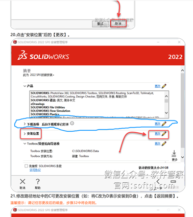

# SolidWorks

## 卸载

> 如果之前安装过 SolidWorks 务必确保旧版本被完全卸载，再进行安装，且尽量安装比原版本更新或相同的版本（安装高版本再安装低版本会遇到奇怪的报错）

[详细卸载流程](https://wiki.bitnp.net/zh/clinic/software_install) 

导出日志压缩包，解压后打开最新日志，搜索 `cwa`，根据搜索得到的文件路径进行进一步诊断。
- `%USER%\AppData\Local`, `%USER%\AppData\Roaming` 和 `%WINDOWS%` 下都有 `SolidWorks` 的文件残留，建议删除。
- 建议使用 `CCleaner` 清理注册表残留。
## 安装

> 绝大部分人都装 2022，人家不知道装什么就都装 2022，相对好装。
> 
> ——王懋

### 以Solidworks 2022为例来介绍SW安装过程

>电脑上必须要有Office或WPS
>
> 安装时必须断网。
>
> 用户名不能为中文
>
> 电脑设备名不能为中文。
>
> 关闭所有杀毒软件（如果拿不准，可以下载火绒，再关闭火绒的保护，来间接关掉 defender）
>
> 如果不准备用 Solidworks 画电路和 PCB，建议取消勾选 `Solidworks Electrical`。
>
> 在后续安装过程中，可能会报安装管理程序注册xxx.dll时失败/错误，已返回0x3这种，一般关闭重新用管理员运行setup就好了
>
> 建议启用.NET 3.5（非一定必要，但建议，如果没启用一般也不影响装）
{.is-warning}

**务必仔细阅读上述注意事项后再开始安装！**

---

### 详细安装说明

[软件管家安装说明链接](https://mp.weixin.qq.com/mp/appmsgalbum)

### 其他说明

1.打开下载Solidworks安装包的路径，找到Solidworks.2022.SP0.Premium.DVD和_SolidSQUAD_.7Z
2.解压_SolidSQUAD_.7Z，打开解压后的文件夹
- 注意关闭后台下载选项。

{.align-center}

- 注意安装位置

	- 本体安装位置，Toolbox 安装位置，Electrical 安装位置；
	- 安装路径不要太长，建议就只把 C 改 D；
  - 安装目录也不要有中文。
  
### 常见问题

80% 的问题出在 1-6%。

- 2-5% 期间主要是安装一些运行库，对应 SW2022 镜像 `PreReqs` 文件夹里的内容。
- 通常是以下几种问题：

	- `VCRedist` (50%)
  - `VBA` (30%)
  - `SQLServer` (15)
  
- 弹窗可能会说明问题，但建议结合日志文件看。
- 报什么解决什么。

	- 比如报 `VBA` 或者日志里说 `VBA` 问题，就去 `PreReqs` 里面找 `VBA`，然后安装，看 `VBA` 报错的日志；
  - 或者简单说，如果 `VBA` 弹已安装新版本，就直接卸掉 `VBA` 新版本，然后再重新安装 SW。
  	
    - 卸载的时候可以用 控制面板 / `GeekUninstall` / **卸载疑难解答**(Microsoft Program Install and Uninstall)工具
    
  - 如果确定不会用 SW 画电路板，可以直接在安装时取消 Electical 的安装，这样就不可能报 `SQL` 问题了。(航模队一定用不到这个组件，机器人队估计也用不到)
  
- 过了 6% 可以暂时休息一下，到 20%-28% 再紧张一下，40-50% 再紧张一下，后面大概率没啥问题。

上述出现问题，解决完问题重新安装的时候，可能会在选路径时报错（已有Solidworks Crop这种），那就去删掉对应位置的 Solidworks Crop文件夹，然后再选一次路径

还有一种情况，在安装完成最后覆盖原文件时，提示 XXX 文件被占用，无法复制。打开任务管理器，搜索`sw`、`solidworks`这两个关键词，结束`SOLIDWORKS Visualize Queue`、`SldWorks_fs`这两个程序，一般就能解除占用。如果仍然报错，可以去 PE 里拷（


### 安装完成的常见问题

-  无法连接到许可服务器

	<kbd>Win</kbd> + <kbd>R</kbd>，输入 `services.msc` ，找到 `SolidWorks Flexnet Server`，看是否运行，尝试启动；
   - 如果启动失败，去 `C:\SolidWorks_Flexnet_Server`，看是否有 7~9 个文件
  
  	 - 如果有，那就运行 `server_install.bat`，如果报错，可以试试先卸载 server 再安装
     - 如果没有，就去安装包的破解文件夹重新复制 SolidWorks Flexnet Server 文件夹
      
	- 如果一开始就启动成功，但是还是无法连接至许可服务器，检查电脑名（非用户名）是否为中文，如果是，修改为英文再继续
    
- 许可证不一致

	去解压后的破解文件夹里，将Program Files文件夹里的内容复制到安装路径。
  
	- 一般默认安装在所在盘的 `X:\Program Files\Solidworks Crop` 文件夹，一般复制 Program Files 文件夹去对应盘根目录就行，如果修改过其他位置就去对应位置复制。
  
	- 如果还不行，将破解文件夹 `Program Files\solidworks` 里的 `netapi32.dll` 复制到安装目录 `X:\Program Files\Solidworks Crop\solidworks` 里替换就行。

### 多版本共存相关

- SolidWorks 可以多版本共存，先旧后新应该没啥问题

- 不要删除或者 uninstall C 盘的 Flexnet Server

- 新的安装位置要与原位置不同（SOLIDWORKS  Crop、SOLIDWORKS Data、SOLIDWORKS Electrical都要不同，建议新建一个统一的安装位置）


> 有问题直接喊我。
>
> ——王懋、史玥

# Ubuntu 系列

## 安装Ubuntu 20.04.6

### 制作启动U盘

> 建议使用 Ventoy 完成启动盘制作

- 用 Ventoy 工具制作好 Ventoy 启动盘，然后向 ventoy 分区放入 Ubuntu 20.04.6 镜像文件（.iso）
- 在磁盘管理里（或 PE 里用 DiskGenius）为 Ubuntu 预留出一部分空闲分区（通常 50G 或者更多）
- 进 BIOS 关闭安全启动，设置 U 盘为第一启动盘

### 安装Ubuntu
- 重启进入 Ventoy 的镜像选择界面，选择 Ubuntu 20.04.6（或对应版本，以下为 20.04.6 安装流程）
- 选择最上方 Ubuntu 即可（如果遇到进去后黑屏等问题，可以选择 Safe Graphics 选项 ）
- 进入 Ubuntu Live CD 后，选择Install Ubuntu（保持 English，最好不要在这里改中文）
- 连接 Wi-Fi，若无 Wi-Fi设置，则回到上一步，用 USB 网络共享后继续
- 选择正常安装

> 并勾选下方的 `下载更新` 以及 `安装 Third Party...`

- 选择其他安装
- 找到之前预留的空闲空间，选中空余空间 Free space
- 选种 Free space，点击旁边加号建立分区

#### 分区设置

- 在 Free Space 里新建一个大小 1000MB 的 EFI 分区
- 要再建立一个和内存几乎一样大的 Swap 分区（比如内存为 16G,这里就是 16000MB）
- 剩下空间可以偷懒全部建立 EXT4 格式分区，挂载根目录（/））
- 设置地址为 Shanghai
- 设置用户名和密码（建议密码尽量简单，Linux 下输密码场景还是很多的）

> 重启进入系统

### 设置语言

- 连接网络（如果之前连过 Wi-Fi，现在应该还连着，USB 网络共享可能需要重新开
- 打开设置，Region & Language 项，选择 Manage Installed Languages
- 进去之后可能需要下载资源（选择 Install 即可）
- 等结束后，选择语言为汉语，重启进入后，回到语言设置界面
- 在输入源里 Chinese 里面，选择 Pinyin-intelligent

从此语言设置结束

## 常见问题

- 之前有的设备没有 Wi-Fi，安装完成后还是没有
	一般是驱动问题，没有网卡驱动导致的
	下面是 `8852BE` 的安装方法，其他网卡型号建议上网查询，以实际情况为准

```bash
sudo apt install git
sudo apt install make
git clone http://github.com/lwfinger/rtw8852be
cd rtw8852be  # 改变工作目录到rtw8852be
make -j20 # 加快编译速度的多行并行命令
sudo make install
sudo modprobe -v 8852be
```

通常运行完成就会出现 Wi-Fi 选项了

## 迁移系统 修复 Grub 引导

[参考资料](https://blog.csdn.net/weixin_54026671/article/details/118106335)

迁移系统时，可先按常规操作在 PE 中将分区克隆至新硬盘。完成后启动进入 Ubuntu 安装镜像，选择 `试用 Ubuntu`。

打开 `GParted` 或类似工具，查看硬盘有无 EFI 分区。若无，更改分区大小，腾出约 500MB 空间作为 EFI 分区。

`sudo fdisk /dev/<新硬盘设备名>` 检查分区表，确认 EFI 分区类型为 `EFI System`，记住 **EFI分区名**。

> **当且仅当**之前新建了 EFI 分区时才格式化！
{.is-warning}

`sudo mkfs.vfat -F 16 /dev/<EFI分区名>` 将 EFI 分区格式化为 FAT16。

```bash
# 挂载系统分区
sudo mount <Ubuntu系统分区> /mnt
# 挂在EFI分区到系统下 /boot/efi
sudo mount <EFI分区> /mnt/boot/efi
# 挂载了 LiveCD 环境的运行目录
for i in /dev /dev/pts /proc /sys /run; do sudo mount -B $i /mnt$i; done
# LiveCD 环境 + 原系统文件 = 借尸还魂
sudo chroot /mnt
# 装 Grub
grub-install <Ubuntu所在硬盘设备名>
update-grub
```

# 安装 ROS

- 以在 `Ubuntu` 上安装 `ROS1 Noetic`为例，以下用鱼香肉丝一键安装工具演示。

	- 打开终端，在终端中输入`sudo apt update`，然后输入密码
	- 继续输入 `sudo apt install wget`
	- 继续输入 `wget http://fishros.com/install -O fishros && . fishros`
	- 在接下来的鱼香肉丝一键安装器中选择需要的软件（ROS1 & 2，VSCode，QQ，微信都有）
  
> 可以更换系统源，但不要清理第三方
> 安装完成后可以通过检测命令跑一下，大体上安装结束了

# AutoDesk系列软件安装（CAD，Inventor等）

## 安装

通常 CAD 和 Inventor 安装不难，无非再卸了重装。

但是有一个问题目前无解，期待后人解决：

- 安装时 进度条跑得飞快，提示安装完成且无报错，安装目录什么都没有；
- 安装完成也是什么都没有。

遇到过两三次，试了清注册表，清路径，用 geek 等都试过了，无法解决，只能重装系统。

## 激活

其实某种程度上来说，不急的话建议机主去 Autodesk 官网认证一下学生，最多 2 天时间就能认证完。

这样安装正版软件会减少很多麻烦，不用担心破解问题，而且对 Autodesk 全家桶都有效，每年续一下就好了。

## 卸载

卸载时首选 Autodesk App Manager，全部勾选，然后一次性卸载，卸载完清理注册表，可以去翻翻目录文件。
