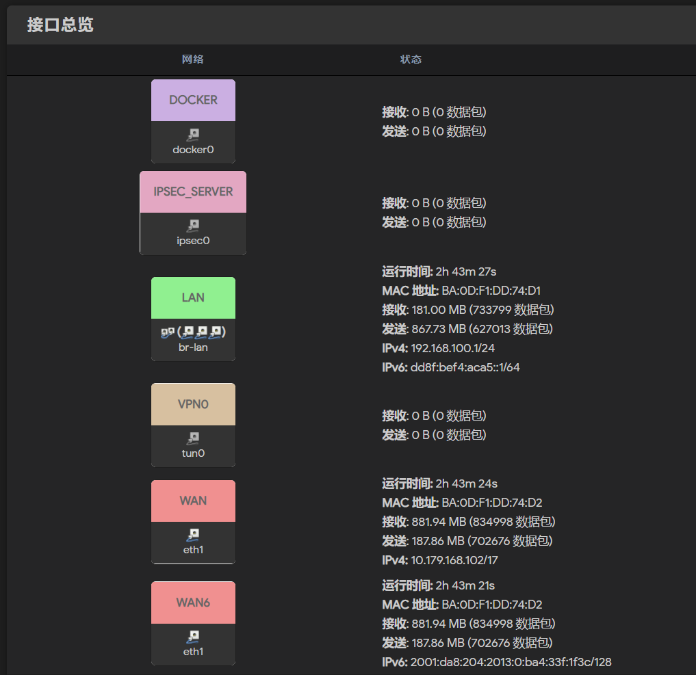
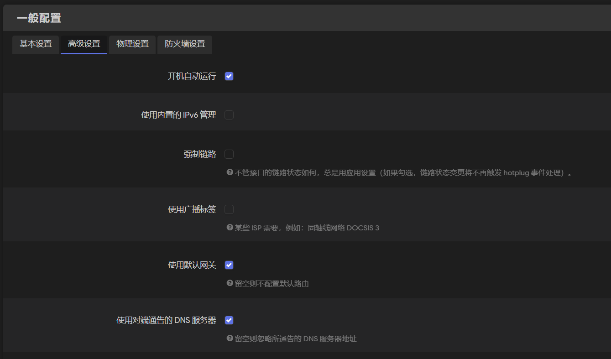
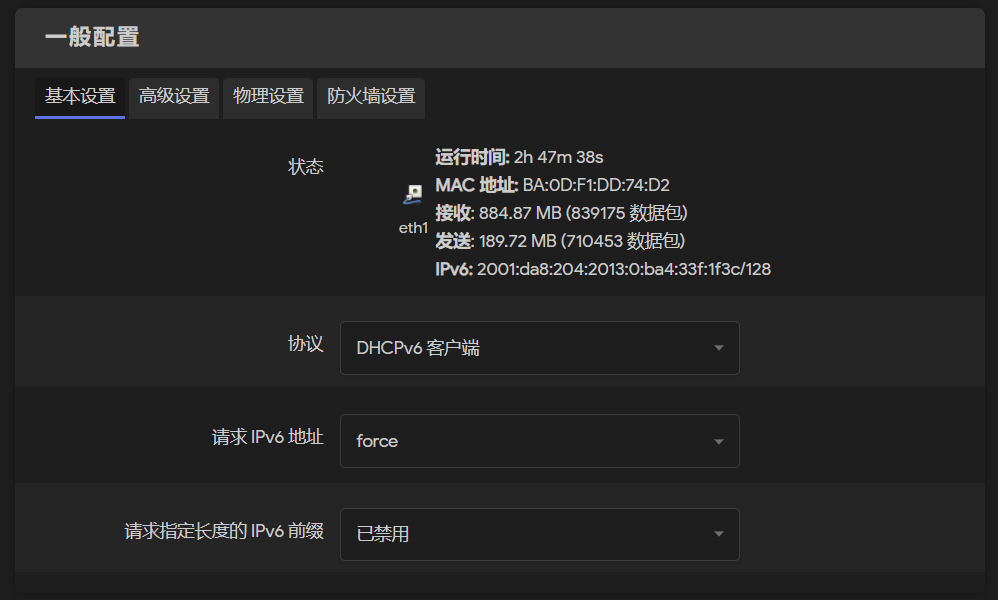
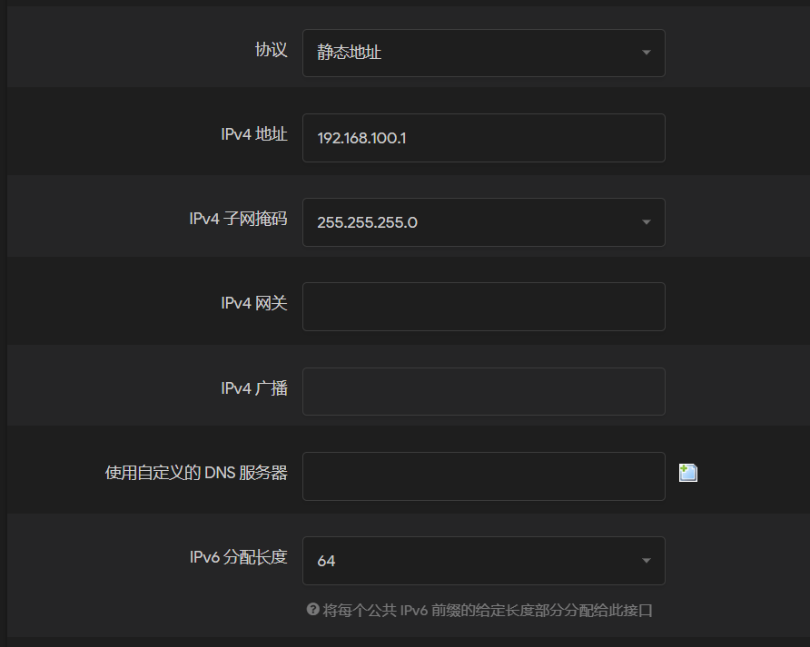
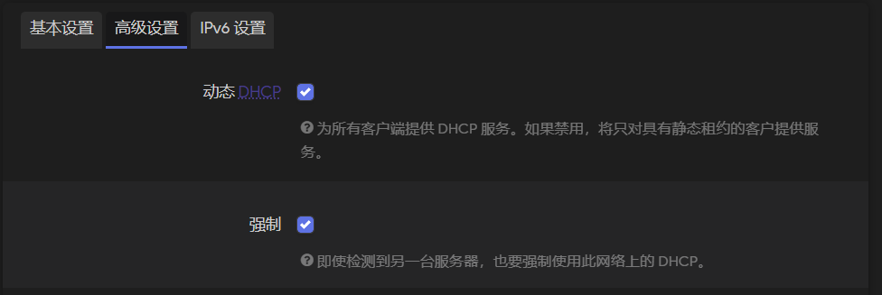
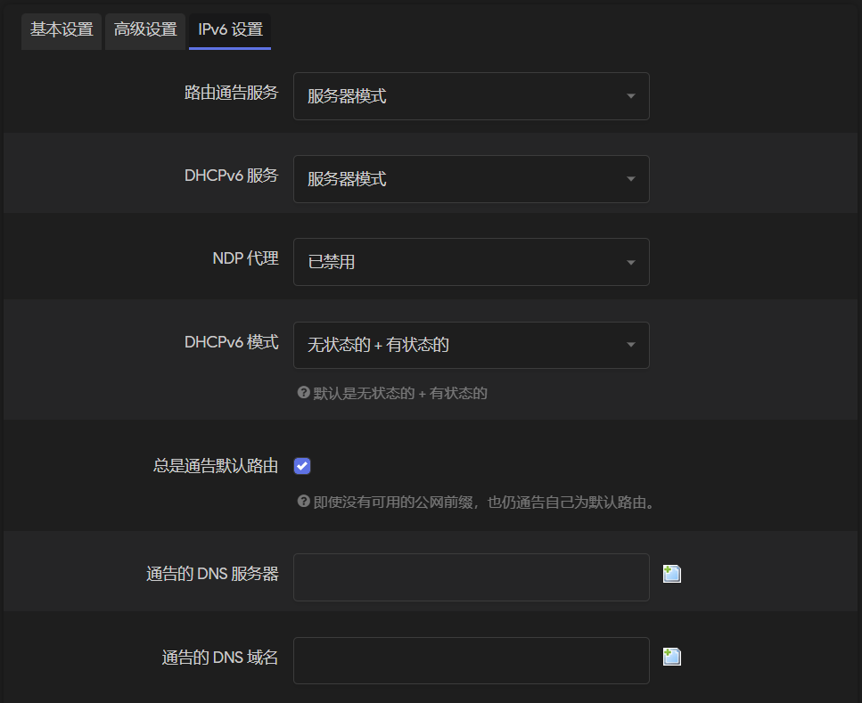
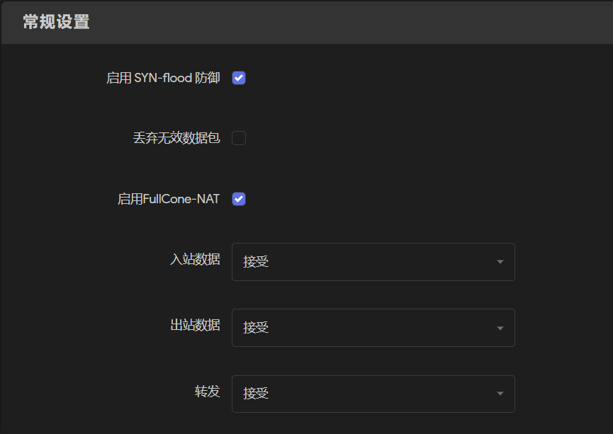
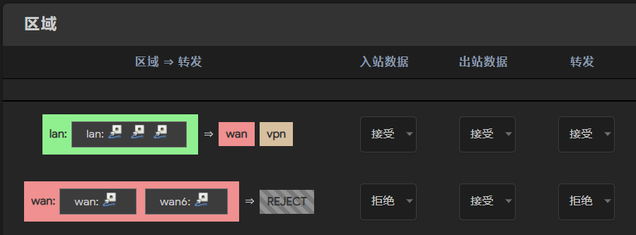
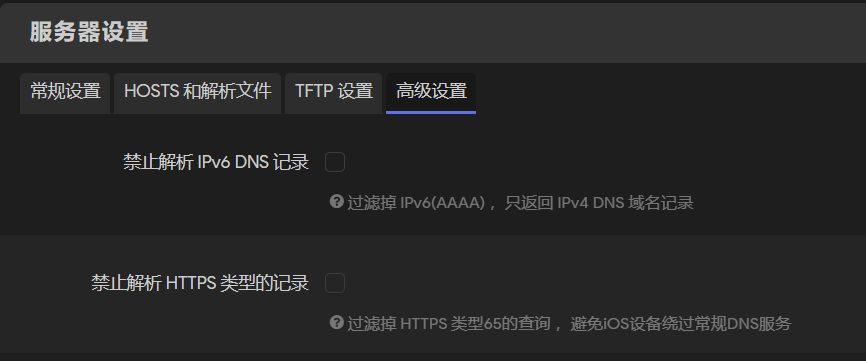

# 校园网环境Openwrt配置nat6

由于校园网环境下发的地址是`/128`的，通常情况下openwrt就算获取到ipv6地址也无法继续向下级lan口中的其他设备分配可用的公网v6地址。因此就需要对openwrt进行一些额外的配置。从原理上来说，让lan中设备能够正常使用v6访问外网的方法有两种，第一是配置ipv6穿透，即将WAN和LAN桥接在一起，并且在桥接接口上选择只转发v6数据包，这样，v4仍然使用nat4正常转发，而v6的工作则会类似于交换机，使接入路由器lan的设备都被分配一个正常v6地址。这种方法能让子设备都获得正常的`2001`开头的教育网v6地址，然而其配置较为复杂 *(其实就是我不会)*，并且由于安卓原生不支持DHCPv6，安卓子设备也无法使用ipv6。第二种方案是使用nat6，为lan口下的设备分配本地v6地址，然后数据包经过openwrt的nat6再转发给外网。这种配置方法会对路由器的性能有一定要求，并且lan口下设备是不能直接从外网访问的，只能通过后续配置uPnP解决。本文主要介绍BIT校园网环境下使用nat6让openwrt下接入设备正常访问ipv6网站的方法。

本文使用的环境信息如下。

> 路由器型号：FastRhino R68S
> 架构：	ARMv8
> 固件版本：OpenWrt R22.9.1 / LuCI Master (git-22.243.50955-10aa838)
> 内核版本：4.19.245

## Openwrt获取ipv6地址

在正式使用nat6之前，我们首先要确保openwrt本身能拿到校园网分配的ipv6地址。这里建议在正式配置之前先用电脑直接连接网口尝试，确保网口是能正常分配ipv6地址的。另外，注意一个问题，***校园网环境下同时使用有线和无线可能会让有线的ipv6地址获取失败（无Internet访问权限）***，因此确保你在调试时关掉无线接入。

在确认网口能够正常获取ipv6地址之后，我们来对openwrt的设置进行一些调整，确保后续其wan口能正常获得ipv6地址。首先，确定你的网络接口至少包含了`lan`、`wan`、和`wan6`。



然后进行以下步骤。

1. 关闭`wan`接口中**高级设置**的**使用内置的ipv6管理**，并选择**使用默认网关**。

2. 在`wan6`的**基本设置**中，**协议**选择`DHCPv6`，**请求IPV6地址**选择**强制/force**，**请求指定长度的IPV6前缀**选择**禁用**。

3. 在`wan6`的**高级设置**中，关闭**使用内置的IPV6管理**，并选择**使用默认网关**。

4. 在`lan`口的**基本设置**中，将**IPv6分配长度**设置为`64`。

5. 在`lan`上方的**高级设置**中，关闭**使用内置的IPV6管理**，并选择**使用默认网关**。

6. 在`lan`下方的**高级设置**中，打开**动态DHCP**和**强制**。

7. 在`lan`下方的**IPV6设置**中，**路由通告服务**选择**服务器模式**，**DHCPv6服务**选择**服务器模式**，**NDP代理**选择**已禁用**，**DHCPv6模式**选择**无状态的+有状态的**，勾选**总是通告默认路由**。

8. 选择**网络** --> **防火墙**，在**基本设置**中打开**转发**。

正确的区域配置应该如图所示。

9. 选择**网络** --> **DHCP/DNS** --> **高级设置**，取消勾选**禁止解析IPV6 DNS记录**。

> **P.S.**  记住关闭**DHCP/DNS**常规设置下的**重绑定保护**，否则会造成无法解析内网地址。 

至此，稍等片刻，理论上你应该能看到你的`wan6`接口已经获取到了`2001`开头的教育网v6地址。可以使用网络诊断中的`traceroute`试验是否能正常访问到v6网站。

## 配置nat6

接下来首先修改**网络** --> **接口**中的**全局网络选项**。将**IPV6 ULA前缀**改为一个`dd`开头的`/64`地址（总之不能为默认的`local ipv6 address`），笔者使用的是`dd8f:bef4:aca5::/64`。如果GUI中没有此选项，可以考虑直接在终端中操作，修改`/etc/config/network`，添加以下内容：

```bash
config globals 'globals'
	option ula_prefix 'dd8f:bef4:aca5::/64'
    option packet_steering '1'
```

完成后，可以确认一下，此时正常情况下游设备得到的ipv6地址的前缀就是上面的ula前缀。但此时下游设备还不能nat。

安装必要的软件包`ip6tables`和`kmod-ipt-nat6`。

在终端中执行命令

```bash
ip -6 r add default via ` ip -6 route | grep "default from" | awk 'NR==1{print $5,$6,$7}'`
ip6tables -t nat -A POSTROUTING -o eth1 -j MASQUERADE
```

执行后，理论上下游设备就能正常通过`nat6`访问外网v6网站了。为了持久化，我们将以下脚本内容加入到**系统** --> **启动项**中：

```bash
# Put your custom commands here that should be executed once
# the system init finished. By default this file does nothing.
line=0
while [ $line -eq 0 ]
do
        sleep 10
        line=`route -A inet6 | grep 2001 | awk 'END{print NR}'`
done
ip -6 r add default via ` ip -6 route | grep "default from" | awk 'NR==1{print $5,$6,$7}'`
ip6tables -t nat -A POSTROUTING -o eth1 -j MASQUERADE
exit 0
```

注意，在上述命令和脚本中，我都默认lan口设备使用的物理接口是`eth1`，你需要根据自己的实际情况进行更改。
