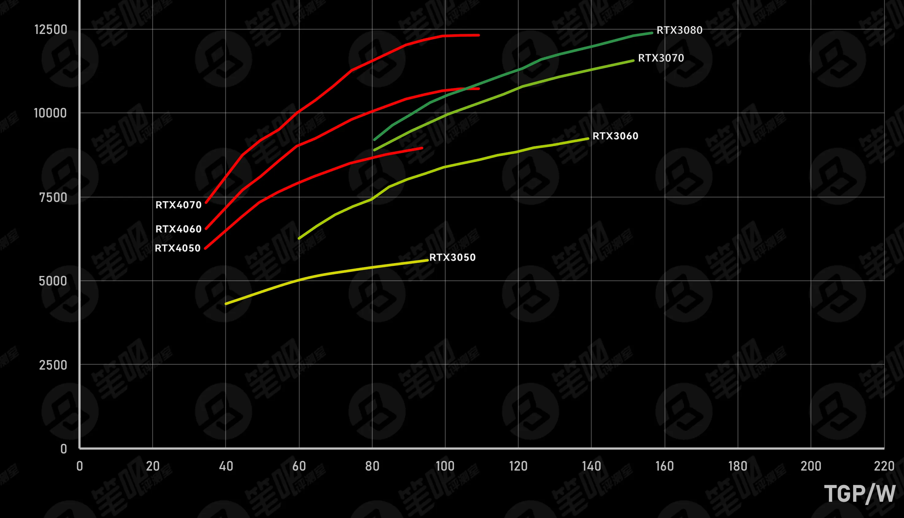
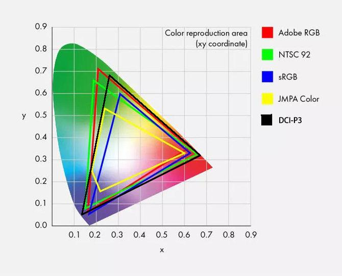
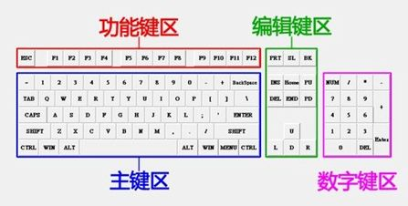
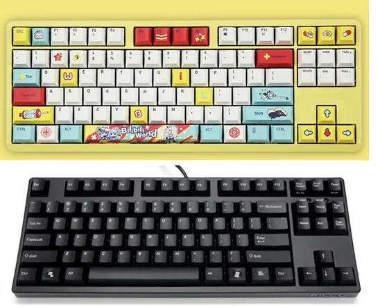
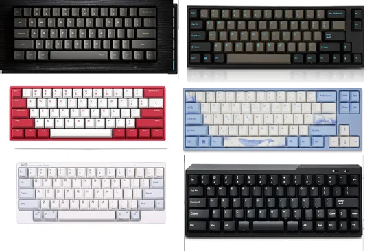

> 以下正文最后更新于2023年8月。
>
> 2024版：[腾讯文档](https://docs.qq.com/aio/DYm9ha3dCR0ZreVVD?p=nFkmBsfVQnSQJWMQ22EWZb)
{.is-info}

# 前言
在阅览推荐表时，繁杂的参数信息对于之前接触硬件设备甚少的同学来说是一种沉重的信息负担，为了能够解答选购过程中容易出现的各种疑惑，帮助“小白”也能自己选出合适的笔电，我们在此以 FAQ 的形式解释一些推荐表中常见的名词，回答一些较为普遍的问题。我们强烈建议各位同学在参阅推荐表之前仔细阅读本篇 FAQ，铺垫一部分选购知识。

# 选购一台笔记本之前，我应该先考虑些什么？

## 考虑个人实际需求

**首先应当仔细审视自己的在生产力方面以及娱乐方面的习惯、偏好，得出自己的需求。** 需求往往可区分为：**预算要求、便携性、续航能力、屏幕素质、性能需求、特殊需求等。**

举例来说，小曹很少玩游戏，希望离开宿舍在外时也能随时用电子设备处理学习与工作中的事务，日常也不需要使用电脑进行高负载工作（视频剪辑、3D建模等），且不希望花太多资金在笔记本购买上，最多只想花 5000 元左右。小曹对设备的需求即可归纳为：注重续航能力与便携性（需要带到不同地方使用），没有太高的性能需求和特殊要求（不玩游戏无高负载应用），预算 5000 元以下。同理，**各位同学在选购之前也可以先设立一个明确的预算水准，再结合自己的游戏类型和游玩频率、生产力软件使用状况、学习习惯偏好等，找到自己对笔记本的针对需求**，便于选购。同时，**我们欢迎各位同学带上自己详细的预算与需求信息，加入电脑推荐咨询 QQ 群 824722253 咨询。**

## 考虑校园使用场景的特殊性

结合北理校园情况（校区面积大且图书馆/教室电源较少），如果设备过于笨重且超过个人日常承载能力，很有可能会影响上课/在外学习时的笔电使用体验。

以下说明能帮助大家更好的判断：14 寸及以下笔电基本可以轻松装入大部分书包，且重量基本较轻，大部分都近似 3—4 本教科书的重量；而 15.6 寸及以上的设备，往往需要较大背包、旅行包或是专门的电脑收纳包才可以携带。若是游戏本，重量更是基本相当于 6—8 本教科书。我们假设早上离开寝室时携带当天课程需要的全部书籍，即 1—5 本。**携带便携性好的笔记本，书包总重量可能只相当于五六本书，但便携性差的设备则会使整体负重相当于十多本书。** 更何况便携性差的设备往往续航表现不佳，想要长时间使用还要带上近乎 2 本书重的电源适配器，可谓雪上加霜。

**综上，我们建议各位同学在选购时或多或少加入对续航能力与便携性的预估与考量。**

## 哪些算是特殊需求？他们各自需要笔记本的哪些能力？

在这里我们列举一部分特殊需求供大家参考：

- 专业高分辨率视频剪辑——需要较高的 CPU 与显卡性能
- 工程、竞赛级别的绘画作图——需要较高的屏幕素质
- 工程、竞赛级别的机器学习——需要较高的显卡性能
- 工程、竞赛级别的 3D 建模——需要较高的显卡性能
- 深度学习——需要较高的显卡性能且显卡支持 CUDA 加速

（再次强调：工程、竞赛级别对某些方面确实有高性能要求，但 **对于大部分仿真、建模的入门学习，当前世代的大部分笔电的性能基本都可以胜任，只是不同设备可能在体验上有差距。不必过于恐惧性能不足** ）

# 笔记本的价格高低由什么来决定？越贵的笔记本性能越好吗?

## 笔记本市场需要一分为二

- **游戏本市场：设备价格由其游戏体验、性能释放能力决定**
- **轻薄本市场：设备价格由机身轻薄程度、续航能力、外部质感、移动办公体验等决定**

由此可见，两个市场存在两套不同的评价体系，如果跨越市场看价格，是十分片面而不严谨的。游戏本与轻薄本不应该被横向比较，而是应该将他们各自放入自己的市场中，用该市场的评价体系纵向比较。

## 隐性参数是价格的重要影响因素

隐性参数是指纸面性能参数之外的设备配置，如**外部做工、键盘手感、触控板手感、摄像头位置、机身设计等与设备性能无关，只能反应于实际体验的因素**。隐性参数看似不重要，实则对于产品综合体验有巨大的影响，也会极大程度的影响到设备价格，尤其是在轻薄本市场中：7000 元和 5000 元的产品可能有着完全相同的硬件参数，这 2000 元的差价就反映在了⼀些隐性的方面，例如全金属的机身带来的绝佳手感与稳定性，独家设计的键盘布局，更好的按键手感以及独特的外观设计等。

## 品牌溢价会显著影响设备价格

部分品牌由于定位高端并长时间得到市场的认可，产生了极高的品牌溢价，也会显著影响到价格。能否接受溢价要取决于消费者对品牌的认可度与预算。

**综上不难发现，“越贵的笔记本性能越强”这一结论并不严谨，不同的市场评价体系，隐性参数和品牌溢价都使得笔电价格与性能不构成严格正相关。**

## 部长团对各价位段机子的概述

### 轻薄本

3000~5000：
这一价位段的轻薄本一般是标压/低压 U+核显的搭配，多数情况下的办公聊天观影体验很好，但视频剪辑、机器学习、建模软件以及游玩大型单机游戏时体验不会太好。如果对以上用途有需求，同时对笔记本便携性要求不高的同学可以选购同价位游戏本或者增加预算。同时 4.5k 以下的轻薄本由于成本限制，会有一定短板（已标明），这个价位段考虑了一些上一代的笔记本（换代降价后性价比较高），介意是旧一代处理器的用户慎重考虑。

5000~10000：
这一价位段的轻薄本各厂商的竞品比较多，留给消费者的选择也比较多。这一价位段的机器在机身质感，屏幕表现，拓展性等方面有了不同程度的提升，同时，这个价位段的足以满足本科阶段的课内学习需求，所以不必有性能焦虑，更多的看自己的需求自行挑选，比如续航，拓展，便携等等。

10000+：
该价位段的轻薄本分为两种，一种为兼顾性能和轻薄的全能本，定位介于轻薄本和游戏本之间，能满足各种场合的使用，而另一种则专注于办公需求，屏幕素质较高，键盘手感普遍较好，续航能力强，且更加轻薄，完全满足日常泡图书馆、写论文或摸鱼的需求。但部分功能是为商务人士设计，在学校的日常使用中较为鸡肋，部分机型性能依然不高，整体性价比较低，除部分需求对口的同学外，购买人数较少。

### 游戏本

5000~7500：
由于今年 40 系显卡在笔记本市场的广泛使用，在这个价位段以下很难满足既是一线品牌又有性价比的要求。这一价位段分布上既有 2022 年有性价比老电脑，也有如宏碁掠夺者这样用料扎实的准一线品牌。这一价位段是大多数学生买笔记本的预算区间，推荐时主打一个有性价比，在屏幕方面的表现和性能表现均比较出色，能够度过本科四年学习阶段而不会具有过多的性能焦虑，同时可以1080P 流畅运行大部分游戏，但在外观、噪声和重量上控制不佳。在选择时，有意避开部分一线品牌低性价比电脑，若有执意追求一线品牌电脑同学，可在网协电脑咨询群中询问热心部员。

7500~10000：
这一价位段可以购买到今年各大一线品牌的高性价比和旗舰电脑，各厂商的竞品比较多，有充足的选择余地。相比于上一个价位段，这一价位段的机器普遍在屏幕和性能上有较大提升，可较流畅 2K 游玩大部分 3A 游戏，同时在如噪音控制、质量上也有所提升，具有较强的拓展性。无论如何，选择时更需要明确自己的需求并自行挑选，比如续航，拓展，便携等等。除此之外，表中所列只是一部分电脑，这个价位基本上可以任选各大品牌的主流电脑，更多推荐电脑可加入网协电脑咨询群询问。

10000+：
当预算超过 1 万元时，就可以获得当今笔记本市场上旗舰级别的性能了。值得注意的是，万元以下，主流配置的笔记本已经可以基本满足本科阶段的学习任务。除非特殊需求，否则一般没必要上顶级配置的笔记本，请同学们务必量力而行。以下推荐中部分款式是针对万元左右相对性价比较高或有独特亮点性的电脑进行推荐。而超过 15k 的电脑仅针对拥有钟鼓馔玉生活的同学进行推荐，请各位同学务必量力而行。对外星人、雷蛇等高端品牌感兴趣或有更高预算的同学可以加入网协电脑推荐咨询 QQ 群作更进一步的咨询。

# 我该去哪儿购买笔电？

## 京东自营，天猫旗舰店等官方渠道

注意在京东购买时需要留意商品前是否有自营标识。

类似的线上渠道有以下优势：

- 更方便的保修；
- 设备未激活状态下支持七天无理由退货；
- 更透明、合理的价格；
- 产品来路更加正规；

但仍要注意所谓“授权店”与官方旗舰店之间的区别。

## 不推荐线下实体店

实体店往往存在以下现象：

- 线下渠道大多售价高于线上；
- 线下容易买到库存机/掉包机；
- 线下发生不退定金等恶性事件的概率较大；
- 线下推销员可能恶意误导消费者购买性价比较低的机器；

部分企业的线下官方直营店（如华为、小米、苹果等）不在该范畴，但店员仍可能倾向推荐低性价比、高利润的机型。

# 购机时品牌重要吗？

## 选购笔电最重要的是根据预算和需求选择合适的笔电型号

**品牌不是电脑选购的第一要素，预算和需求才是**。各大笔电厂商内部都有许多产品线，即使是同一个品牌下的产品，也有性价比的高低、表现的优秀与否之分。由此可见，一个品牌下一个产品的水平并不能代表整个品牌的水平，**优先挑选品牌再选机型或者根据所谓的“品牌特点”来选购是很不理智的**。应当以价格为限定条件，在相应的价格段内按需求选择具体型号。

## 在同价位有多款型号可选的情况下才优先考虑大品牌的机器

原因：
- 大品牌相对有更好的配套服务和售后政策；
- 大品牌和产业上下游合作良好，生态配套完善；
- 大品牌的市场经验相对丰富，推出的产品更能符合消费者需求；

# 设备同时有锐龙版/酷睿版，是什么意思？有什么区别？

## CPU 简要说明

关于 CPU，有以下两点需要注意：

**目前市售笔电的 CPU 性能基本都足以应付本科阶段日常学习生活的大部分工况；**

CPU 具有标压/低压之分，名称中带 U/G/P/Y 的 CPU 往往为低压 CPU，带H/HS/HX/HK 的往往为标压 CPU。标压 CPU 有更激进的性能，但选购时切忌因为盲目追求性能而偏爱标压 CPU：低压 CPU 虽然功率更低，但却因此换来了更好的续航能力。此外，不插电状态下，低压 CPU 相较于标压 CPU 往往会拥有更稳定的性能释放，带来了移动使用状态下稳定的性能供应，即所谓的离电性能较强。

## 锐龙版/酷睿版区分

**锐龙版指搭载 AMD 品牌 CPU 的版本/酷睿版指搭载英特尔 CPU 的版本。** 同价位情况下，两者往往有以下区别：

- 英特尔：
 ⚫ 同级下相比竞品往往有更好的工程软件优化与游戏帧数表现；
 ⚫ 搭载英特尔芯片的设备供货相对充足；
- AMD：
 ⚫ 往往有更高的性价比。尤其是在中低价位段，基本可以做到同价位综合性能稳稳超过英特尔竞品；
 ⚫ 最新的 Zen3 / Zen4 架构产品拥有更好的功耗表现，带来了更优秀的续航保障；
- 结论：
 ⚫ 追求各方面软件优化与更极致的游戏帧数表现则优先选择英特尔；
 ⚫ 低预算购机且看重综合性能释放、更强的续航则优先选择 AMD；

除此之外的大部分情况下，同款设备的锐龙版/酷睿版之间并不会有太大的使用体验差距，建议哪款有货买哪款。如果十分在意比较两者的理论性能，可以参考下方性能排序进行选择。

## 主流 CPU 性能排序

(数据来源于 https://rank.kkj.cn；仅从理论性能角度排序；未包含能耗等参数。请理性参考）
|Intel|AMD|
|-----|-----|
| |Ryzen R9 7945HX|
|Core i9 13900HX| |
|Core i9 12900HX| |
| |Ryzen R7 7745HX|
|Core i9 13900H| |
| |Ryzen R9 7940HS|
| |Ryzen R7 7840HS|
|Core i9 12900H| |
|Core i7 12700H| |
| |Ryzen R7 7735H/6800H|
| |Ryzen R7 7735U/6800U|
| |Ryzen R7 7730U/5825U/5800U|
|Core i7 1260P| |
|Core i5 1240P| |

# 关于 Intel 新一代大小核处理器

Intel 自十二代酷睿起引入大小核处理器以正面对决 AMD 的 Zen 系列架构处理器。所谓大小核处理器分为大核（P 核、带超线程）与小核（E 核，不带超线程），其中小核每四核一个簇，占据与一个大核相同的面积。在第十三代酷睿处理器中最多可选择 8 大核 16 小核共计 24 核 32 线程的处理器。注意 Windows 11 能够较好地调度该类型处理器，但 Windows 11 发布已逾一年且仍存在较多bug，因而若选购该型处理器请搭配 Windows 11 使用并随时更新至最新版本。

在 Intel 所期望的调度方案中，大核能够负载前台的程序运行、计算等任务，而小核负责处理后台的轻负载与计算任务。但在实际使用中 Intel 给出的调度方案是在电脑空闲始终保持一个大核处于唤醒状态而其他大核与所有小核关闭，一旦有前台负载优先放到大核上跑（无论是轻负载还是重负载），而若把程序窗口最小化或者以其他窗口覆盖当前程序后该程序的计算线程自动绑定至小核上。这种调度方案在笔记本上会导致处理器平均功耗偏高，发热量较大，使得其续航远短于搭载 AMD 锐龙处理器的笔记本。所以如果追求轻薄本长续航的话，Intel 大小核处理器并不是一个好选择。并且自十三代酷睿起 Intel 处理器全面禁用 AVX512 指令集，该指令集主要用于科学计算等领域，如果你有相关需求的话也不建议选择 Intel 处理器。

# 显卡是什么有什么用？

显卡是计算机系统中负责图形处理的硬件设备。通常来说，游戏、视频剪辑、3D 建模等各种专业软件、AI 运算等高度依赖显卡。其中，Intel 与 AMD 目前在主流移动端笔记本中均加入了高性能集成显卡，Nvidia 与 AMD 则提供了高性能独立显卡。

## 核显

集成显卡一般和 CPU 在同一个 die 上制作，占用部分系统内存作为显存。

其中，AMD 移动处理器在 7030 系列处理器中集成最高 8CU 的 GCN 5.0(Vega) 架构显卡，在 7035、7040 系列处理器中集成最高 12CU 的 RDNA 2 架构显卡，这两种型号的集成显卡性能强悍，能够追平甚至超过 Nvidia MX 系列显卡或RTX2050 等低端型号，甚至可以在低画质的设置下带动相当一部分要求较低的游戏。因此若选购 AMD 轻薄本、全能本则可直接选择核显版本，性价比更高且笔记本续航更长。

而 Intel 移动处理器目前在全系列中均集成最高 96EU 的 Xe 架构显卡。该显卡较对应 AMD 处理器核显性能更差，但能够满足基本使用需求，能够进行轻度游戏。且该型显卡对视频编码、解码的支持较好，在剪辑视频时会有一定加速作用。

AMD 在高性能的 HX 系列处理器中集成了 2CU 的 RDNA 2 架构显卡。该型显卡性能孱弱，只能满足基本使用。但由于该系列 CPU 均为 AMD 桌面端下放，且均配有高性能独立显卡，因此该核显只做应急使用或离电时关闭独显延长续航时使用。

## 独立显卡

笔记本独立显卡提供商目前主要为 Nvidia。AMD 虽然也会制造一部分移动端独立显卡，但其搭载的游戏本不多，市场占比较小故可忽略不计。

目前主流游戏本搭载 RTX4050、RTX4060、RTX4070 等独立显卡。但目前 Nvidia 忽视游戏市场，主流独立显卡均出现显存位宽倒砍一刀，CUDA 核心数目削减、显卡命名强行提升一级的现象，导致目前带独立显卡的笔记本电脑价格更贵。但 Nvidia 选用台积电 4nm 制程工艺能耗比较强，显卡性能受功耗影响较 30 系显卡更小，因而 40 系显卡盲目提升显卡功耗并不能带来大量性能提升。总的来讲，RTX4050、RTX4060 显卡更适合用于全能本市场；而 RTX4060，RTX4070 等显卡更适用于游戏本市场。如下便为猪王制作的笔记本显卡能耗曲线。可看出 40 系显卡甜点功率均在 100W 左右，提升显卡功耗并不能使显卡性能明显提升。

## 独显直连

独显直连是指独立显卡将画面直接输出至屏幕而不经过核显处理。该模式有利于提升游戏帧数，带来更好的游戏体验；但相对的，该模式也会使得笔记本整机功耗提升，发热量增大。如今该模式已经成为大部分游戏本的标配功能。

与独显直连相对的则是混合输出。该模式指独立显卡将处理后的数据交给核显，由核显生成画面再输出到屏幕。该功能功耗较前一种低且会导致帧数减少。

当然部分游戏本为延长续航也会提供核显输出的模式。该模式会彻底关闭独显，仅使用核显进行画面计算与视频输出。如若在游戏过程中出现帧数明显较少、卡顿等现象，应检查模式是否处于核显输出模式。

目前市面上相当一部分游戏本支持在这三种模式间自由切换。

# 关于 AMD 新一代移动端处理器的命名规则

2023年年初 AMD 公布了新一代移动端处理器的命名规则，这个规则较往常有非常大的变化，处理器命名由四位数字和尾缀组成。接下来介绍各位数字以及尾缀的意义。

第一位数字代表处理器推出的年份。锐龙 7000 系移动处理器的 7 便代表其于 2023 年推出。以此类推。

第二位数字则代表 CPU 的定位。其中 1 代表速龙银牌，2 代表速龙金牌，3、4 代表锐龙 3，5、6 代表锐龙 5，7 代表锐龙 7，8 代表锐龙 7 或者锐龙 9，9则代表锐龙 9。

第三位数字代表 CPU 的架构，这是最重要的一个数字，因为 CPU 使用的架构越先进，CPU 性能也就相对更强。其中 1 代表 CPU 使用 Zen、Zen+架构，2 代表 CPU 使用 Zen 2 架构，3 代表 CPU 使用 Zen3、Zen 3+架构，4 代表 CPU
使用 Zen 4 架构，以此类推。

第四位数字为 0 或 5，通常来讲该位数字为 5 的 CPU 在 CPU 架构、性能或者集成的 Radeon 显卡的性能更强。

尾缀则代表 CPU 的功耗。HX 代表 55W 以上功耗，主要应用于高端游戏本；HS 代表 35W 左右或以上的功耗，主要应用于标压轻薄本、全能本、普通游戏本等领域；U 代表功耗在 15-28W 间，主要应用在轻薄本、商务本、特殊形态的便携式设备等领域；当然在中国大陆还有特供的 H 后缀 CPU，只不过按照目前发布的处理器来看该后缀的处理器规格与 HS 完全一样，故不作深入介绍。还有其他两个后缀由于不属于本次电脑推荐的范畴，故此次不做介绍。

这个命名规则也更有利于 AMD 销售更多的马甲 CPU 了，下面举几个常见的例子：

> Ryzen 7 7735H/Ryzen 7 7735HS = Ryzen 7 6800H 频率提升 0.05GHz
Ryzen 7 7735U = Ryzen 7 6800U
Ryzen 7 7730U = Ryzen 7 5825U = Ryzen 7 5800U

选购配备这些处理器的笔记本电脑时应注意其对比配备新一代处理器的笔记本电脑的价格，若价格不是特别有优势则不推荐选购这类笔记本。

# 什么是内存？如何评价其性能？

如果我们把电脑比作一个工作间的话，那么内存就相当于摆放各种东西的桌面。电脑运行过程中，所有软件产生的进程都把它们的数据放在内存上，方便CPU 读取，就好像工匠把工具、原材料一股脑摆放在桌面上方便自己工作一样。由此不难理解，**内存越大，意味着“桌面”越大，能放下的东西也就越多，即同时能运行的软件更多，并行工作的上限更高**。内存的相关参数很多，其中容量是影响最大的，目前 16G 内存便能满足绝大部分需求。

以下是一些和内存相关的知识。

## DDR5、DDR4、LPDDR5、LPDDR4 是什么

这些名称代表着这些内存属于不同的代际，具体区别如下。

DDR5 内存为最新一代内存，其带宽高但延迟较高频 DDR4 更高，且经过多轮调价后价格已经来到一个相对合理的区间，该内存主要用于游戏本以及部分商务本（如惠普战 99）上，一般为双插槽或者板载+单插槽的方式来配置，可以根据需求拓展或更换。部分笔记本会使用板载设计。

DDR4 内存为上一代内存，目前价格已经降到很低，高频 DDR4 内存的表现持平甚至超过 DDR5 内存的，但使用 DDR4 内存的新笔记本越来越少。DDR4 同 DDR5，多采用双插槽或板载+单插槽的方式配置，可根据需求来拓展或更换。部分笔记本会使用板载设计。

LPDDR5、LPDDR4 内存为对应内存的低功耗版本，主要使用于轻薄本、全能本上，注意该型内存带宽虽高，但延迟非常高，性能较 DDR5、DDR4 内存均有所降低，且两种内存均为板载设计，不能拓展或更换。

## 内存容量与频率

电脑在运行过程中会将程序和它产生的数据放在内存中方便取用。内存越大，能够同时运行的软件也越多，意味着电脑并行工作上限越高。目前笔记本市场均普及了 16GB 内存，能够满足日常使用；也有少部分笔记本配备了 32GB 内存，能够满足绝大部分场景使用。

内存频率是衡量内存性能的一个重要标准，频率越高，则内存性能相对越好。目前主流笔记本均配备 DDR4-3200 或 DDR5-5600 内存。但由于 DDR5 内存频率较高，CPU 内存控制器多采用分频的方式与内存交换数据，故单纯地比较 DDR5 内存频率是无法正确比较内存性能的，更多需要进行实测。

## 单通道与双通道

一般家用 CPU 均带有两个内存控制器，每个内存控制器提供 64-bit 带宽。在配备双插槽内存的笔记本上一个内存控制器对应一个插槽，在板载+单插槽内存的笔记本上一个内存控制器对应板载内存、另一个对应一个插槽。当插槽中带有内存时则对应内存控制器启用。若在使用中仅有一个内存控制器启用则称为单通道，两个内存控制器均启用则称为双通道。目前主流笔记本均配备双通道内存；也有一部分笔记本会空余一个插槽，可自行购买内存进行添加。

双通道较单通道能够带来两倍的内存带宽，这对于一些内存数据交换较多的应用具有较好的提升，对于核显的性能也有较大提升。但若选择不同内存组双通道时可能会导致频率无法稳定在原来的频率上（目前概率已经非常小了），一般组双通道内存要求两条内存频率等参数一致。非对称双通道指使用两条容量不同的内存组成双通道，通常来讲与常规双通道的区别不会太大。

使用 LPDDR4、LPDDR5 内存的笔记本一般均按双通道模式配置内存。

# 不同笔记本的屏幕有什么区别

屏幕的主要参数有分辨率、尺寸、色域、刷新率、比例、面板、亮度等。作为每天使用电脑都要看到的部分，屏幕素质能够直接影响用户的使用体验，因此选购过程中应当关注屏幕本身的素质。

## 屏幕尺寸

屏幕尺寸一般指屏幕对角线的长度。目前主流轻薄本屏幕尺寸多为 13.3 寸、14 寸、15.6 英寸，主流游戏本多为 15.6 英寸、16.1 英寸、17.3 英寸，显示器尺寸则为 23.8 寸、27 寸、32 寸等。尺寸越大，则屏幕所能放下的窗口越多，便携性也会随之下降。基本上 15.6 英寸以上屏幕的电脑必须用更大的背包才能装下。若不清楚屏幕的实际大小可在线下店实际体验后再做出选择。

## 屏幕比例

屏幕的比例一般有 16:9、16:10、3:2 等。其中 16:9 比例是传统笔记本配置的比例，目前新笔记本中较少配置这种屏幕。

16:10 比例多为目前新出笔记本配备屏幕，该比例屏幕较传统 16:9 屏幕更长，因此笔记本电脑的下巴可以做得更窄，B 面屏占比较高，观感较好。

3:2 屏幕多见于华为出品的一些笔记本上，该比例屏幕观感较长，便于进行文字处理工作。

## 屏幕分辨率

目前主流屏幕分辨率（按 16:9 算）为 1080P（1920\*1080），2K（2560\*1440），4K（3840\*2160）。在相同尺寸下一般来讲分辨率越高，屏幕显示得越细腻。但要注意 Windows 系统对于高分辨率的屏幕不是特别友好；且分辨率越高，对显卡的要求也越高，故不推荐盲目选择高分辨率屏幕。

一般来说 15.6 英寸及以下尺寸屏幕建议使用 1080P 分辨率，15.6 英寸以上的屏幕 1080P 也能够满足使用，也可根据实际情况选择 2K 分辨率。在笔记本上不是特别推荐 4K 分辨率，因为笔记本屏幕尺寸本身较小，2K 分别率也足够细腻，加上 Windows 本身对 4K 的支持不算太好，并且笔记本端受限于显卡性能，以 4K 分辨率进行游戏等高负载工作时实际帧数会有所下降，可能会出现一定程度的卡顿。因此分辨率的选择应结合自身对于屏幕显示细腻程度的要求以及实际使用情况来看。

## 屏幕面板

目前屏幕面板分为传统的 LCD 屏幕与目前开始流行的 OLED 屏幕。

笔记本上 LCD 屏幕主要分为 IPS、TN、miniLED 等面板。IPS 面板具有显示效果较为均衡、视角广、色彩呈现准确的特点，也存在对比度不高、容易漏光等缺点，是一种较为均衡的屏幕。TN 面板具有可视角度较窄、色彩显示不足等缺点，但其技术成熟、响应速度快、刷新率极高的特性使其成为高端的高刷新率（一般达到 360Hz 以上）游戏本的标配。miniLED 面板为新技术，其优势在于高亮度、高对比度，但其价格高昂，一般见于高端专业显示器或工作站上，常规笔记本或游戏本一般不会配备该型面板。

OLED 屏幕在色彩、对比度、亮度等方面对 LCD 屏幕实现了完全超越，但OLED 屏幕目前寿命不如 LCD 屏幕，且该型面板容易出现烧屏（指 OLED 屏幕老化不均匀导致的残影）、频闪等影响显示效果的问题。目前不推荐选购使用OLED 屏幕的笔记本。

## 屏幕刷新率

目前屏幕刷新率主要有 60Hz、90Hz、120Hz、144Hz 等。若想要获得更加流畅的体验或较好的电竞体验可选择带有高刷新率的屏幕。当然目前部分游戏本上也搭载了 360Hz 1080P 甚至更高刷新率的专业电竞屏幕，但对普通人来讲很难体会到这种屏幕与其他刷新率屏幕的差距。选购前也可以在线下店进行实际体验或利用手边容易找到的高刷新率屏幕进行体验后再做决定。

## 屏幕色域

目前屏幕色域主要有 72% NTSC、100% sRGB、100% DCI-P3 等多种规格色域。Windows 系统默认使用 sRGB 色域。

标称 72% NTSC 或者 100% sRGB 色域的屏幕可以满足大部分同学的日常需求。但应注意到是 72% NTSC 色域与 100 %sRGB 色域是不等价的，覆盖 72% NTSC 色域的屏幕一般无法完全覆盖 100% sRGB 色域，覆盖 100% sRGB 色域的屏幕一般包含了 72% NTSC 色域。在实际选择屏幕时更推荐选择 100% sRGB色域的屏幕。如有视频调色、创意设计、专业摄影等专业创作需求可选购标称 100% Adobe RGB、100% DCI-P3 色域等专业屏幕。注意若选购标称 100% DCI-P3，100% Adobe RGB 色域的屏幕最好能够选择带有色域切换功能的。超过 100% sRGB 色域容积的屏幕在日常 Windows 桌面使用时体验会非常差。

注意 45% NTSC 等低色域屏幕显示效果与实际有极大差距，选购中应首先避免购买配备这类屏幕的笔记本。

若有专业创作需求，则还应关注 ΔE。ΔE 反映了屏幕色彩的准确度，该值越小则屏幕所显示色彩越准确。一般来讲该值≤1.0 时人眼无法感知差异，1~3 时仔细观察可以感知差异。一般不建议选购ΔE 较大或者未校色屏幕作为专业创作的屏幕。若 ΔE 值较大也可以去闲鱼或者淘宝上租借一个校色仪，按照一定操作生成校色文件，并将该校色文件安装则可大幅提升色准。

## 屏幕亮度

在其他规格均相同的情况下亮度越高的屏幕通常会有更好的观感。目前主流屏幕的亮度均能达到 400 尼特。且高亮度的屏幕能使用户能够在户外看清屏幕内容。通常来讲屏幕亮度不足以影响屏幕整体显示效果，市面上几乎所有的屏幕都能满足日常使用。

HDR（High Dynamic Range，高动态光照渲染）技术简单来讲就是一种提高影像亮度和对比度的处理技术。该技术能够将每个暗部的细节变量，暗的地方更暗，丰富更多的细节色彩，使得视频与图片能够呈现出更好的效果，带来更强的视觉冲击力。目前来讲 HDR 分为 HDR10、HDR400、HDR600、HDR1000 等等级，等级越高则效果越强。HDR 对视频和图片的提升效果是显著的，而对游戏的提升则需看所玩游戏是否支持。HDR 是屏幕的一个比较重要的加分项。

## 镜面屏与雾面屏

雾面屏一般指表面粗糙，经过防眩光处理的屏幕，这类屏幕表面就像覆盖了一层薄雾；而镜面屏表面光滑平整，通常有较强的反光效果。

一般来讲，镜面屏在昏暗或有光源控制手段的环境中效果较好；而雾面屏能够改善镜面屏的反光效果，在常规环境中能够有更好的显示效果。因此，镜面屏的使用比较挑环境（眩光可不是闹着玩的）。在学校图书馆、教室等光源较强、较杂乱的场景使用更推荐购买雾面屏。但应注意的是，配备触摸功能的笔记本电脑一般都使用镜面屏。

若无法确定哪种类型的屏幕更适合你，则你应该去线下店体验一下两种类型的屏幕。

**需要注意的是屏幕分辨率越高、刷新率越高、亮度越高，则屏幕耗电量越大。**

# 什么是硬盘？什么叫笔记本电脑的拓展性?

硬盘是计算机系统中存储数据的硬件设备。**需要注意的是，硬盘与内存的概念往往会被混淆而造成一些误会，选购时应分清存储数据的硬件叫硬盘而不叫内存**。由于现今笔记本出厂便自带预装系统的固态硬盘，且这些硬盘大多性能相近，只需考虑容量即可，因此我们通常不讨论不同笔记本自带硬盘的差异。

## 拓展性的概念及其意义

市场上部分笔记本会在内部空间预留空硬盘位置和接口，供消费者自行购买额外硬盘安装，增加电脑储存容量。**但并不是所有的笔电都拥有预留位；即使是拥有预留位的笔电，其预留的接口类型也会有区别**：M.2 接口购买 NVMe 硬盘，SATA 接口可购买 SATA 固态硬盘、2.5 寸机械硬盘）。**因此在选购时应当关注设备的拓展性，并考虑未来是否有拓展的意愿。**

## 关于笔记本硬盘的选购

笔记本使用的硬盘多为 M.2 2280，M.2 2242，M.2 2230 NVMe 固态硬盘，2.5 英寸固态硬盘，2.5 英寸机械硬盘。其中 2.5 英寸机械硬盘性价比低，且多为 SMR 叠瓦式记录，故一般不推荐选购 2.5 英寸机械硬盘。

由于笔记本内部空间有限，散热条件较差，选购 NVMe 硬盘时应避开诸如铠侠 RC20、三星 980Pro\990Pro（PM9A1）等本体温度较高的 NVMe 硬盘。温度越高，则硬盘稳定性越差、长时间读写性能会降低。通常建议选择如致态TiPlus 7100 等不带缓存的 NVMe 硬盘。这类硬盘温度较低，性能足够日常使用，稳定性强。而 2.5 英寸固态硬盘性能与 NVMe 固态硬盘相差较大，但由于产量稍小（比 2.5 英寸机械硬盘大），故其价格与 NVMe 硬盘不相上下。选购 2.5 英寸固态硬盘时应当注意笔记本是否具有 SATA 接口。

目前多数笔记本均配备两个 NVMe 硬盘接口，一般会空余一个接口供自己加硬盘；也有少量笔记本配备了 SATA 接口。但注意有相当一部分轻薄本、全能本没有空余硬盘位。故要扩大存储容量就必须替换原有硬盘并进行系统迁移。因此在购买前应先确定自己有无未来扩容需求，并查看目标笔记本是否支持扩容再进行购买。

替换下来的硬盘也可在淘宝上购买硬盘盒作为外置硬盘使用。该类外置硬盘性能较常规 U 盘或移动硬盘性能更强，适合用于大文件传输。

# 关于 N-1 代的选择

目前笔记本市场由于上次矿潮和疫情导致的 2021~2022 年笔记本缺货以及现在笔记本电脑需求降低的影响，上一代笔记本，甚至上上代笔记本目前仍以一个极低的价格在售，且多为半年及以上的库存货。加之目前英伟达显卡强行提价，Intel、AMD 先后强行将桌面端下放给游戏本，如今一台主流游戏本价格纷纷来到八九千，但性能较上一代仍未提升多少。而且由于笔记本功耗限制，即使是制程提升、架构换代，新机的性能提升仍然有限。这些因素导致了这些库存机的性能仍然能够跟上当前游戏本主流性能。结合往年游戏本市场来看，本年度游戏本性价比是近几年来最低的。因此，目前 N-1 代甚至 N-2 代都是高性价比的选择。

例如去年双十一杀出的 R9000K 2021，如今的红米游戏本 3060 版本都是性价比极高的存在。当然这种库存机是卖一台少一台，所以如果手头预算吃紧的话可以优先选择上一代甚至上上代笔记本，不过购机时应查询目标笔记本近期价格走势，在价格合适时果断出手，才能买到性价比较高的 N-1 代笔记本。

# 为什么我想购买的机型在电商平台长期无货？该怎么办？

由于多重因素的影响（疫情、虚拟货币矿潮、芯片供应短缺），市场上的部分热门机型与高性价比机型可能存在长期的缺货、无货的情况。面对这种情况，我们建议：

- 对于想要坚持购买特定机型的人，关注该机型在各大电商平台补货、预订、抢购的消息；该品牌如果有自己独立的销售平台（如联想），也可保持关注该平台，第一时间获得信息；
- 降低要求，选择略次但供货充足的机型；
- 如果有较强的甄别能力，可以自主寻找可靠、价格合理的第三方销售渠道。

# 我要如何对我的电脑进行日常维护？

笔记本电脑在长期高负载使用后，往往会出现散热性能降低、温度升高、甚至出现明显的卡顿现象。这种情况往往是电脑的散热性能降低导致的。而散热性能的降低除硬件损坏以外主要可以归结为两类：灰尘过多与硅脂效果减弱。

日常使用时，电脑的散热风扇与空气摩擦会不断积累静电，而静电会吸附空气中的灰尘，最终导致散热器上的灰尘不断累积，进而导致散热器的进风量下降，影响散热能力。硅脂是一种涂在 CPU/显卡晶圆与散热器之间的半固态物质，其作用是填补两者之间的空隙增强导热能力，而长时间使用会由于自然挥发导致硅
脂干掉，效果下降。

因此，我们建议电脑约半年一次打开后盖清理灰尘，约一年一次更换硅脂。清灰与硅脂更换均可使用 i 北理预约电脑诊所由我们的人员进行操作。

# 我的电脑玩游戏/跑项目的时候很烫/很响，会不会坏掉呢？

部分大型游戏对电脑性能要求比较高，需要 CPU 和显卡以较高的负载运行，而高负载是与高功耗画等号的，在这种情况下，电脑整机的发热功耗很容易达到200W 以上，而笔记本受限于体积，为了获得较好的散热能力，往往需要使散热器风扇以较高的转速运行，这时风扇就会发出较大的声音。再者，现在的电脑都具有完善的保护措施，会自行判断电脑的温度是否正常，只要运行时没有出现过热关机的情况（如果遇到这种情况建议咨询我们），通常我们可以不用担心高温/噪音的问题。

# 我要如何进行数据备份

最近诊所的咨询群里有人的数据出现了不同程度的丢失。数据备份应严格保障重要数据有至少三个备份：一份在自己的电脑上，一份在外置的存储介质里，一份在网盘里或者异地存储介质里。

其中在自己电脑上的数据若选择使用固态硬盘存储，则应选择一块质量较好的原厂固态硬盘；若选用机械硬盘存储，则在搬动电脑时应避免振动、磕碰等问题。

注意，外置存储介质应选择空气填充机械硬盘等可靠性高、恢复难度较低、恢复成功率较高的存储介质，而非选择 U 盘、PSSD（移动固态硬盘）、氦气填充机械硬盘等可靠性差或恢复难度较高的存储介质。如果数据量大（超过 100T甚至更多），可以考虑使用磁带机备份。

特别注意的是 NAND 闪存的冷数据问题。冷数据一般指离线不经常访问的数据。在 NAND 闪存中由于数据是以电荷储存于特制的储存单元的形式储存的，本身存在漏电现象，长时间不访问会导致闪存储存单元电平模糊甚至消失，硬盘自带纠错功能无法起作用，导致硬盘读取速度极低甚至硬盘中的数据消失不见的问题。所以，以 NAND 闪存为主要存储介质的存储产品如 U 盘、SD 卡、各种 SSD 硬盘等均不建议用作数据备份的存储介质。

网盘可选择阿里云盘、夸克网盘等传输速度较高、容量较大的网盘。注意网盘应尽量避免保存私密或机密数据。异地存储介质可视数据量大小选择光盘、磁带等便于运输、便于保存的存储介质；若只能使用机械硬盘存储，则在机械硬盘运（数据）输（传输）过程中应以大量泡沫保护硬盘，避免运输过程中的振动损
坏硬盘。

如果出现数据丢失的情况，网协电脑诊所是无法提供恢复数据服务的，请联系相关从业人员进行恢复（注意数据恢复报价极高且恢复概率较低），**并做好数据无法恢复的心理准备**。

# 我要如何挑选外接键盘鼠标与键盘膜

## 键盘鼠标连接方式的选择

外接键鼠一般使用有线连接、无线 2.4G 连接、蓝牙连接三种方式与电脑连接。其中，延迟方面一般来讲有限<无线 2.4G<<蓝牙，选择外接键鼠时应考虑使用场景对延迟的要求。

同时随着技术迭代，罗技、雷蛇等专业外设厂家通过不断优化使得其旗下部分产品的无线 2.4G 连接、蓝牙连接的延迟能够达到甚至优于部分使用有线连接的键鼠。若必须使用无线连接可考虑选购相关产品。

若要玩 FPS 等对延迟要求较高的场景，建议尽量选择有线键鼠，也可选择无线 2.4G 的键鼠。

若要满足便携、多设备连接等，建议选择蓝牙，无线 2.4G 的键鼠。

注意以无线 2.4G 方式与电脑连接的键鼠多会带有一个小的 USB 接收器，该接收器应妥善保管。若要在诊所进行拆机工作，应提前取下该接收器。

## 键盘的选择

键盘选择应从配列与轴体两方面来考虑。
键盘配列一般指键盘的布局设计。目前市面上常见配列有 100%配列、60%配列、80%配列等。

- 100%配列：与传统键盘类似为 104 键，也有增加了几个自定义按键的 108键或者减少了几个键的 98 键等配置。这类键盘比较适合空间充裕，有快速输入数字需求的同学。98 键、96 键由于键位改变需要一定实际适应。

- 80%配列：这种配列一般就是 100%配列砍掉数字键区而成，有 87 键或84 键设计，比较紧凑，适合大多数人使用。

- 60%配列：在 80%配列的基础上去掉方向键、Fn 键。这类键盘通常需要使用组合键但方便携带。一般分为不带方向键的 60 键或者带方向键的 64 键、66 键等。

还有其他小众配列，这类配列多属于客制化键盘范畴，此次不做过多讨论。

目前键盘一般分为薄膜键盘、机械键盘、静电容键盘。其中静电容键盘价格较高（1000 元以上），市场占比较小，故不在本节讨论范围。

薄膜键盘多见于大部分笔记本或一些便宜的键盘上，该类型键盘通常具有较好防水防尘效果，且其形式多样，可做得比较小巧便于携带。

机械键盘目前随着国产轴体的崛起而变得常见。应注意机械键盘轴体多样，选购时应先搜索相关轴体的评价或者在淘宝上购买一个试轴器进行尝试后再选购。

## 鼠标的选择

一般鼠标均带有左右两键以及滚轮。目前相当一部分鼠标配备了宏按键，即通过驱动自定义鼠标上按键的功能。

鼠标回报率：指鼠标在 1 秒内向电脑报告位置的次数。回报率一般在 FPS 游戏中有较大影响，较高的回报率能够在 FPS 游戏中带来更精细的操作。但注意回报率越高对 CPU 性能消耗越大。

鼠标 DPI：一般反映鼠标的定位精度。一般 DPI 值越高，指针移动相同像素点时鼠标所需移动距离越小。建议在分辨率较高的屏幕中选择较高的 DPI 值以达到更好的使用体验。

## 键盘膜的利弊

键盘膜多用于阻挡灰尘进入键盘、减少键盘磨损，但也会存在影响打字手感、影响散热（部分游戏本会从键盘进风）等负面影响（猪王对此[有讲](https://www.bilibili.com/video/BV1d8411e7ie/)）。注意前往诊所前应取下键盘膜以避免丢失。

# 我能在寝室装配台式机吗？

由于目前我校的宿舍事实上已经实行不断电的政策并且经过实际检验部分宿舍能够在限电范围内带动高端台式机平台，以及鉴于如今高性能笔记本市场价格高企而台式机内存、硬盘等配件价格持续走低，攒一台高性能台式机甚至塔式服务器在我校宿舍实际上已经成为可能。因而本节主要讲解台式机的配置以及一些简单的服务器常识。

我校寝室主要为四人寝以及六人寝两种规格，其中四人寝限电 650W，六人寝不限电；而且最近一年内寝室几乎没有在晚上断过电，这也为配置服务器提供了一定便利。

如果你有幸分到了六人寝，请按自己的意愿配置台式机并无视接下来的所有内容。

当然大部分的命运是分到一个四人寝，但由于电脑并不是一个纯的阻性负载，所以我们的选择的台式机总的平均功耗在 550~600W 比较合适（毕竟还有室友）。

## 电源

电源是给整台机器提供电力的，作为基础性配件，其质量优劣决定了电脑的使用寿命。因此选择一个优质的电源极其重要。而关于电源的知识可以在 B 站上找 UP 主翼王的视频观看学习。也可以在网络上搜索相关资料、看电源拆解图等方式来确定一款电源的品质优劣。

一般来讲450~550 元足以购入一个带有80PLUS金牌认证的额定650W电源。实际上由于电源转化率等限制，台式机消耗的功率越接近所购电源的额定功率一半越好。但是不建议以 100~200 元购入一个低端电源甚至杂牌电源。这类低价电源一般存在方案较老，效率不高，偷换元件等问题，通常会出现纹波不稳、功率虚标等质量问题，很可能一波带走显卡、CPU、硬盘等随机的多个硬件，对电脑硬件是极大的危害。

## 硬盘与存储

然后是硬盘的选择。如今 NVMe SSD 的价格已经来到一个非常低的区间了，但是硬盘是存储数据的关键部件，选择一块稳定、性能强大的硬盘作为系统盘是非常有必要的，而系统盘则推荐使用原厂的固态硬盘。全球主流 NAND 闪存制造商为三星、海力士（并购 Intel 的业务）、长江存储、美光、铠侠（原东芝）、西数（闪迪）六家，其旗下对应 SSD 品牌分别为三星、Solidigm、致态、（主要出货 OEM）（英睿达，但是大 S 降级片）、铠侠、西数。

其中三星与西数的硬盘是最不推荐购买的硬盘。三星硬盘
（980Pro/PM9A1）有出现 0E 错误数暴涨（硬盘硬件损坏，无法修复）导致硬盘暴毙，并导致硬盘数据彻底丢失（如毕业论文等极其重要的数据）无法恢复的现象。并且新一代的 990Pro 虽然通过软件手段解决这个问题（似乎是不报 0E 错误了）但仍存在跑分虚高，实际性能不如友商产品的现象。同样，西部数据的硬盘会出现冷数据问题。该问题指长期未访问的数据出现丢失的现象，且官方也未给出较合理的解决方案；该问题自曝光后便不了了之。两厂商硬盘无法保证数据安全，故不推荐购买。美光主要出货 OEM，也售卖所谓的大 S 降级片。采用美光颗粒的硬盘多为第三方厂商出品，故不算太推荐购买。

若所存储数据可以自由地从网络上下载且需要长期进行读取，对速度有一定要求（如游戏文件、大型软件等），则可选择使用国产长江存储颗粒的非原厂硬盘。这类硬盘售价一般非常便宜，且长江存储颗粒质量上等、性能较强，因此这类硬盘性价比较高。但其稳定性相较于长江存储原厂品牌致态推出的硬盘更弱，故推荐该类盘作为从盘使用。

如果有大容量存储需求（超过 2TB），你或许应该考虑一下机械硬盘。机械硬盘目前主要技术为 SMR（叠瓦式存储）与 PMR（传统的垂直记录存储）。SMR机械硬盘虽然有容量大等优势，但其反复读写导致性能下降甚至直接暴毙的可能性极高，故不建议用于日常存储；而 PMR 机械硬盘虽然已经在消费级领域销声匿迹，但在监控级、企业级领域仍活跃。故机械硬盘应选择监控级硬盘或者企业级硬盘。但选购时应注意机械硬盘三大厂商（西数、希捷、东芝）中东芝技术较为落后，不推荐选购。应当注意的是企业级硬盘噪音一般比较大，建议选购前先行去 B 站上听机械硬盘的运行声音后再进行选购（部分企业级硬盘如日立（西数收购）7K4000 等硬盘的噪声完全可以吵醒睡觉的舍友）。

如若需要在多设备间处理同一个文件或者需要在校园网环境下随时访问到某个文件则应当考虑使用 NAS 服务器。关于 NAS 服务器后续会出教程，也欢迎开学后加入网协学习相关知识。

## CPU 与主板

由于近两代 Intel i7 及以上等级的 CPU 功耗非常高，在宿舍限电的情况下不推荐选购。

因此在宿舍使用应选择 Intel Core i5 及以下 CPU 或者 AMD 全系 CPU 等能耗比较为优秀的 CPU。目前市场情况是 Intel 方面可以搭配 DDR4 内存与二线厂商主板做到一个性价比非常高的方案；而 AMD 7000 系锐龙 CPU 价格经过多轮调整后已经非常合适，但主板价格高企且需搭配更贵的 DDR5 内存，整体价格偏高；AMD 5000 系锐龙价格持续走低，是目前性价比最高的方案，但问题是整套平台升级潜力不足。

注意 Intel 自 13 代酷睿起在 i5 上也配备了大小核技术，故选购时应参照前文所介绍的大小核技术的优劣来进行选择。

通常建议选购板 U 套装，这种套装一般会有较大力度的优惠。

## 显卡

目前显卡市场在矿潮后虽然能够自由购买，但近期的 AI 热潮又对显卡提出了更高的要求。支持 CUDA 运算的 N 卡价格高企，且 40 系经历配置缩水、强行提价后仍然维持着热销状态；而主攻游戏市场的 AMD 的 7900XTX、7900XT 两款对标 4090 的高端显卡双双拉胯，目前经历多轮驱动优化后勉强达到 4080的水准；后起之秀 Intel ARC 显卡仍存在定价偏高，游戏性能不强等问题，部分高端型号已经进入停产步伐。

同样随着矿潮褪去，一大批矿卡从矿工手中退出。这导致了目前显卡市场上出现大量翻新的 30 系显卡，Radeon RX580 8G（简称 588）仍然维持着 200 元的低价，各种笔记本显卡魔改卡、锁驱卡（一般使用 ES 核心）也出现在 pdd、咸鱼等平台。这些显卡来源不明，性能相较于原版显卡有所下降，稳定性基本看脸，所以不推荐购买这种显卡。

所以有钱就直接买 4090，实在差就买 4080，再次就买 4070 Ti，再实在没钱就用核显或者亮机卡凑合着吧。

当然如果你买显卡只为打游戏的话，7900XTX、7900XT、6800XT 不失为你的好选择。

注意选择 4090 这类高功耗显卡时应通过软件或 BIOS 将其功耗限制在一个较低的区间（实测 4090 50%功耗性能损失不到 20%）。

## 内存

内存目前 DDR4 已经掉成白菜价了，DDR5 也在不断下跌。有能力的同学可以组 DDR4-3200 64G 双通道或者 DDR5-6400 32G 双通道。大容量内存不仅在平时使用时更为流畅，更可在跑工程软件时不卡顿，花的时间更少。

B 站 UP 主 51972 做过一期评测[关注 DDR4 与 DDR5 内存的游戏表现](https://www.bilibili.com/video/BV1Ao4y1V7H5/)，视频略长，结论是目前来看高频 DDR4 双通道的表现更好。

## 散热

对于 Intel 平台来说，如果你选择了 Core i7 及以上 CPU，由于该系列 CPU 功耗非常高，建议直接选购 360 一体式水冷。

对于 Intel 平台其他 CPU 以及 AMD 全系 CPU，一款优秀的双塔风冷足以压制。这里推荐使用利民 FS140 散热器，该散热器日常价格 250r，活动时能降到 180r 左右。

## 机箱

这个也是一个见仁见智的选择，但选购时应注意主板版型、CPU 散热高度、显卡长度、水冷支持情况等限制条件，200 到 300 元足以购入一个漂亮的机箱。

但注意良乡校区灰尘量极大，应优先选择具有良好防尘性能的机箱或购入防尘板贴在机箱出风口上，并定期清理防尘板。

若选择 ITX 机箱，则可将机箱直接放置在桌面上，但该型机箱存在配件适配性差，定制配件价格极高，装机难度大，散热能力较差，拓展性较弱等问题。

若选择 m-ATX 机箱或 ATX 机箱，则可较好地把该型机箱放置于宿舍桌下的一个大格中（也可能会伸出来一点），这类型机箱通常拓展性强、散热能力强，装机难度较低，且相对不占桌下空间，是比较推荐选购的机箱。但注意选购侧透机箱时尽量避开玻璃侧板的机箱（玻璃侧板容易出现碎裂问题）。

若选择时下流行的海景房机箱，应注意该型机箱宽度较大（比普通 m-ATX 机箱宽约 10cm 以上），且装机要求具有较强的理线能力。但多出来的这 10cm 使得这类机箱通常放在桌上比较占地，而放于桌下又不太合适，故不推荐选择该型机箱。

若选择 E-ATX 或更大的机箱（通常用来自组特殊需求平台），该型机箱必须放于桌下，占据大量桌下空间。如果你比较在意桌下空间，则不建议选择该型机箱。

## 显示器

关于显示器分辨率、尺寸、色域等参数可参照前文屏幕部分。

目前显示器价格走低，1000 元以内足以购入一块 2k144 高素质屏幕。鉴于我校宿舍桌面大小限制，24 寸与 27 寸显示器是比较实用的。当然若不考虑桌上书架的限制，32 寸显示器也能勉强摆下。

如购入 24 寸显示器，后期还可以再购入一块 24 寸显示器、双屏显示器支架与已有屏幕组成逼格极高的双屏桌面，但此时选购时应注意查看显示器是否支持 VESA 壁挂。

显示器支架的固定点可以选择桌上预留的穿线孔。

## 外设

关于键鼠的介绍可看前面关于外接键鼠的部分。

在寝室不建议使用外置音箱，应使用头戴式耳机这类设备。

## 将所有组件组装并安装系统

关于组装教程，你可以在 B 站 UP 主硬件茶谈上找到其利用 3D 动画制作的装机教程。如果你觉得自己动手能力弱不敢装，可自行私下联系网协电脑诊所的同学，与他们约定时间以及约定装机费用，进行装机。

安装系统需要准备 PE 盘，系统映像以及一些辅助工具软件等。PE 盘建议使用微 PE、优启通等无广告和病毒植入的 PE 系统，系统映像可以从 msdn 或者学校的正版化软件平台上下载，安装教程容易在网上找到。当然你觉得你能力不够的话请自行将台式机拖到诊所来装系统。

**注意：网协电脑诊所不受理任何形式的装机工单，不受理任何上门装机的要求。**

## 服务器

服务器可以选择使用旧台式机改造或者购入低功耗平台。

若选用旧台式机改造，应注意尽量精简整个硬件系统以方便维护，且老台式的功耗一般较高、噪音一般较大，比较耗电；但这种方式较为全能，能够实现诸如 NAS、个人云盘、媒体服务器、PT 等各种应用场景，也能够扩展出其他硬件，实现更丰富的功能。

而购入低功耗平台虽然可以避免功耗与噪音问题，但其扩展性不足，一般只能支持 1~2 块硬盘；这种方式可以用来跑一些软路由、旁路由、打印服务器等负载较小，要求不高的场景。

而服务器为稳定运行一般选用 Windows 10 LTSC 或者 Linux 系统。前者使用习惯与常规 Windows 类似但系统开销比较大；Linux 系统多为命令行界面，需要先学习相当一部分的命令，利用 GitHub 上的一些开源的校园网登录项目来连校园网。这个对于自身的要求更高。后期或许会出更多的文章来讲解服务器的配置问题，也可以加入网协向大佬们学习。

