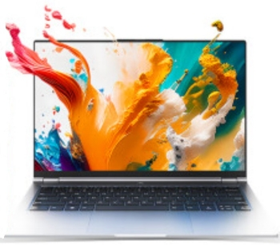
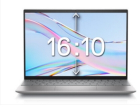
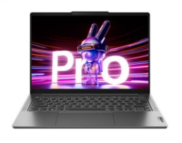
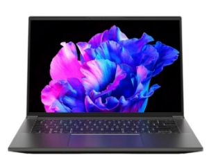
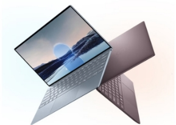
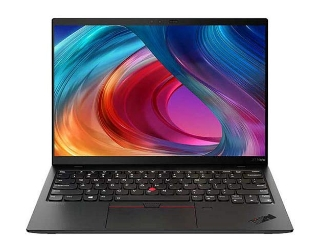
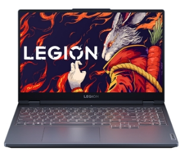
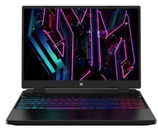
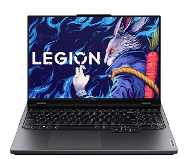

<Alert type="success">
最新电脑推荐表:[【腾讯文档】网协电脑选购指南2025](https://docs.qq.com/aio/DZm5ZRmJzd2ZpVkx5)
</Alert>

<Alert type="warning">
以下内容已不再更新！
</Alert>

> 2018–2024版：[BITNP/laptop-suggestions · GitHub](https://github.com/BITNP/laptop-suggestions)
> 2024版：[腾讯文档](https://docs.qq.com/aio/p/scmzu718dzus0zl)
>
> 文档版本：v1.3_20230903【已校对】

## **前言**

本篇电脑推荐表旨在以较为普适而全面的视角，依据参数和价格推荐适合同学们在校园使用的笔记本。在开始之前，我们恳请读者务必知悉以下几个注意事项：

- **欢迎大家在新的学年造访电脑诊所！**电脑诊所是隶属北理工网络开拓者协会的纯志愿性质组织，为全校师生**无偿提供电脑维护服务**，业务内容涵盖电脑问题维修，笔记本清灰，系统检修，软件安装，系统安装等诸多方面。诊所将在每周一至周五晚18:30——21:00，于**徐特立图书馆三楼第二自然阅览室311G研讨室**开放，期待为您服务!
- 本电脑推荐表仅作学习交流用，不保证能完全及时对应市场设备硬件配置与迭代后的配置细节，电脑实际配置信息请依照正规销售渠道提供的商品说明为准。
- **当下笔记本市场由于矿潮的衰退与新品笔记本端显卡、CPU上市铺货的放缓，笔记本价高难求的情况相较前段时间有较大的改善。但选购时仍不建议对某一品牌或型号产生“迷信”的思想。也正因如此，笔记本的市场价格仍热存在波动性，这里给出的参考价格可能与同学们当下在网络上看到的有所差距，我们也无法保证同学们能以参考价格买到对应的笔记本。**
- **关于配置方面，一般而言，更好的CPU/GPU意味着更好的性能，但是不同机型之间由于厂家设计，策略等原因，性能释放存在不同，因此同配置不同型号的笔记本性能也可能存在性能上的差距。因此，除去绝对的配置差距之外，性能释放这一点也是同学们（特别时对性能与性价比有需求的）在购机时需要考虑的。**
- 各大电商平台上，笔记本商品同名下可能存在有多种不同配置的型号，选购时请务必注意您的型号选择。
- 笔记本市场具有高度多样性，而不同人对电脑的要求与刚需也不尽相同，根据自己的实际需要选择出的设备才是最合适的。（例如为了便携性而牺牲性能选择极致轻薄的机型）
- 评判笔记本电脑时，往往以处理器、显卡、内存、硬盘以及屏幕等部分的参数作为评判依据，其中涉及到的评判标准较为复杂，因此**我们在“[电脑选购FAQ](/clinic/pc-faq)“中对各种术语、参数和注意事项进行了较为详细的说明**。如有需要请咨询网协**电脑推荐咨询QQ群**：`824722253`。

## **轻薄本**

**3000-5000：**

这一价位段的轻薄本一般是标压/低压 U+核显的搭配，多数情况下的办公聊天观影体验很好，但视频剪辑、机器学习、建模软件以及游玩大型单机游戏时体验不会太好。如果对以上用途有需求，同时对笔记本便携性要求不高的同学可以选购同价位游戏本或者增加预算。同时4.5k以下的轻薄本由于成本限制，会有一定短板（已标明），这个价位段考虑了一些上一代的笔记本（换代降价后性价比较高），介意是旧一代处理器的用户慎重考虑。

**5000-10000：**

这一价位段的轻薄本各厂商的竞品比较多，留给消费者的选择也比较多。这一价位段的机器在机身质感，屏幕表现，拓展性等方面有了不同程度的提升，同时，这个价位段的足以满足本科阶段的课内学习需求，所以不必有性能焦虑，更多的看自己的需求自行挑选，比如续航，拓展，便携等等。

**10000+：**

该价位段的轻薄本分为两种，一种为兼顾性能和轻薄的全能本，定位介于轻薄本和游戏本之间，能满足各种场合的使用，而另一种则专注于办公需求，屏幕素质较高，键盘手感普遍较好，续航能力强，且更加轻薄，完全满足日常泡图书馆、写论文或摸鱼的需求。但部分功能是为商务人士设计，在学校的日常使用中较为鸡肋，部分机型性能依然不高，整体性价比较低，除部分需求对口的同学外，购买人数较少。

### **3000-5000**

1. **红米 RedmiBook Pro14 锐龙版**

|**主要参数**||
| :-: | :- |
|**处理器**|**R5-6600H**|
|**内存**|**16GB DDR5 6400MHz**|
|**显卡**|**集成显卡Radeon 660M**|
|**硬盘**|**512GB PCIe4.0 SSD**|
|**显示器**|
**14英寸  2560\*1600分辨率 100%sRGB色域**  

**IPS屏 120Hz刷新率**
|
|**外观数据**|**厚16.98mm 净重1.45kg  电池56Wh**|
|**接口**|
**Type-c接口\*2  USB-A\*1  HDMI接口\*1**  

**3.5mm耳机口\*1**
|
|**参考价格**|**3398（京东）**|

|优缺点对比||
| :-: | - |
|**优势**|
1. **屏幕同价位较好 2.5K 120Hz 16:10**

2. **价格较低，性价比较高**

3. **全金属机身，质感较好**
|
|**缺陷**|
1. **最高亮度300nit**

2. **接口较少2C+1A+HDMI+3.5mm**
|
|**备注**|**3500元以下价位几乎最好的笔记本**|

2. **机械革命无界14Pro**

|主要参数||
| :-: | :- |
|**处理器**|**I5-13500H**|
|**内存**|**16GB DDR5 4800MHz**|
|**显卡**|**集成显卡Iris Xe Graphics**|
|**硬盘**|**1TB PCIe4.0 SSD**|
|**显示器**|
**14英寸 2880\*1800分辨率 100%sRGB色域** 

**IPS屏120Hz刷新率**
|
|**外观数据**|**厚17mm 净重1.47kg  电池60Wh**|
|**接口**|
**Type-c接口\*2  USB-A\*2  HDMI接口\*1**

**3.5mm耳机口\*1  TF卡槽\*1**
|
|**参考价格**|**3769（京东）（学生价）**|

|优缺点对比||
| :-: | - |
|**优势**|
1. **性价比高，性能好**

2. **接口丰富，且内部双PCIe4.0硬盘位，拓展性好**
|
|**缺陷**|
1. **品控和售后一般**

2. **续航一般**

3. **网卡性能一般**
|
|**备注**|**扩展性很好，质感强于无界14+。性价比高，小众品牌品控和售后一般**|

3. **惠普(HP) 战66 六代2023锐龙版**

|**主要参数**||
| :-: | :- |
|**处理器**|**R7-7730U**|
|**内存**|**16GB DDR4 3200MHz**|
|**显卡**|**集成显卡 Iris Xe Graphics**|
|**硬盘**|**512GB PCIe4.0 SSD**|
|**显示器**|
**14英寸 1920\*1080分辨率 100%sRGB色域** 

**IPS屏 60Hz刷新率**
|
|**外观数据**|**厚19.9mm 净重1.44kg  电池51Wh**|
|**接口**|
**Type-c接口\*1  USB-A\*3  HDMI接口\*1**

**3.5mm耳机口\*1  RJ45网口\*1**
|
|**参考价格**|**3999（京东）**|

|优缺点对比||
| :-: | :- |
|**优势**|
1. **PCIe4.0+PCIe3.0硬盘位，拓展性好，内存可更换**

2. **接口丰富，且电源不占用type-c接口**

3. **高负载噪音控制效果较好**

4. **保修政策非常好（2年上门保+1年意外险+2年电池保）**

5. **屏幕功耗低，续航好**
|
|**缺陷**|
1. **机身较厚（1.44kg，厚19.9mm），慎重考虑**

2. **方向键大小位置不常规**

3. **电源键易误触（位置不常规，在Del旁边）**

4. **核显性能较弱，电池较小，续航较短**

5. **屏幕分辨率为1080p**

6. **PCIe4.0硬盘因CPU限制在PCIe3.0速率**
|
|**备注**|
**售后极佳，续航不错，拓展较好，足够静音**

**适合对售后，拓展性和静音有需求的价格敏感型用户**

**（另可选3799的R5-7530U 1T硬盘版本和15.6寸版本）**
|

4. **荣耀MagicBook 14 2022 锐龙版**

|**主要参数**||
| :-: | :- |
|**处理器**|**R7-6800H**|
|**内存**|**16GB DDR5 6400MHz**|
|**显卡**|**集成显卡Radeon 680M**|
|**硬盘**|**512GB PCIe4.0 SSD**|
|**显示器**|
**14英寸 2164\*1440分辨率 100%sRGB色域** 

**IPS屏 60Hz刷新率**
|
|**外观数据**|**厚16.9mm 净重1.55kg 电池75Wh**|
|**接口**|
**Type-c接口\*2  USB-A\*1  HDMI接口\*1**

**3.5mm耳机口\*1**
|
|**参考价格**|**3999（京东）**|

|优缺点对比||
| :-: | - |
|**优势**|
1. **电池较大75Wh**  **续航极长**

2. **性能释放较好**

3. **高负载噪音较低，同时键帽温度较低**
|
|**缺陷**|
1. **机身较厚重**

2. **接口较少**

3. **用的是上一代处理器（性能很强够用）**
|
|**备注**|**适合华为手机/平板用户或对续航要求较高的用户或对核显性能有需求**|

5. **宏碁（Acer） 非凡GO 14**

|**主要参数**||
| :-: | :- |
|**处理器**|**I5-13500H**|
|**内存**|**16GB LPDDR5 4800MHz**|
|**显卡**|**集成显卡 Iris Xe Graphics**|
|**硬盘**|**512GB PCIe3.0 SSD**|
|**显示器**|
**14英寸 2880\*1800分辨率 100%DCI-P3色域** 

**OLED屏 90Hz刷新率** 
|
|**外观数据**|**厚14.9mm 净重1.3kg  电池65Wh**|
|**接口**|
**雷电4\*2  USB-A\*2  HDMI接口\*1**

**3.5mm耳机口\*1  TF卡槽\*1**
|
|**参考价格**|**4229（京东）**|

|优缺点对比||
| :-: | :- |
|**优势**|
1. **性价比高，性能好**

2. **双PCIe4.0硬盘位，拓展性好**

3. **DCI-P3色域覆盖范围更广，屏幕表现更生动，适合有一定设计需求的同学，摄像头清晰度很高（1440p）**

4. **接口丰富，重量较轻**
|
|**缺陷**|
1. **预装软件较多**

2. **高负载温度较高**

3. **原装适配器较重**

4. **不能单手开合**

5. **续航能力一般**
|
|**备注**|
**硬件不错但软件较差**

**适合对硬盘拓展性需求较高，对摄像头需求较高，对温度需求较低的用户**
|

6. **联想ThinkBook 14+ 2023款**

|**主要参数**||
| :-: | :- |
|**处理器**|**I5-13500H**|
|**内存**|**16GB LPDDR5 5200MHz**|
|**显卡**|**集成显卡 Iris Xe Graphics**|
|**硬盘**|**512GB PCIe4.0 SSD**|
|**显示器**|
**14英寸 2880\*1800分辨率 100%sRGB色域** 

**IPS 屏 90Hz刷新率**
|
|**外观数据**|**厚15.9mm 净重1.4kg  电池62Wh**|
|**接口**|
**雷电4\*1  Type-c接口\*1  USB-A\*3  HDMI接口\*1**  

**3.5mm耳机口\*1  TF卡槽\*1 RJ45网口\*1**
|
|**参考价格**|**4949（京东）（领券前4999）**|

|优缺点对比||
| :-: | :- |
|**·优势**|
1. **双PCIe4.0硬盘位，拓展性好**

2. **接口非常丰富且数量多**

3. **屏幕素质较高，最大亮度400nit（笔吧实测487nit），支持180度开合**

4. **性能释放比较激进**
|
|**缺陷**|
1. **续航一般**

2. **原装充电器不便携**

3. **高负载下键盘热感面积较大**

4. **同类型笔记本中较厚**
|
|**备注**|
**适合性能需求较高，拓展性需求较高，不太看重便携性的用户**

**保证拓展性同时，对续航要求较高可以考虑2022款锐龙版**

**对显卡性能有需求可以选购独显版**
|

7. **荣耀 MagicBook 14**

|**主要参数**||
| :-: | :- |
|**处理器**|**I5-13500H**|
|**内存**|**16GB LPDDR5 4800MHz**|
|**显卡**|**集成显卡 Iris Xe Graphics**|
|**硬盘**|**512GB PCIe4.0 SSD**|
|**显示器**|
**14.2英寸 2520\*1680分辨率 100%sRGB色域** 

**IPS屏 120Hz刷新率**
|
|**外观数据**|**厚16.9mm 净重1.52kg  电池75Wh**|
|**接口**|
**Type-c接口\*2  USB-A\*1  HDMI接口\*1**

**3.5mm耳机口\*1**
|
|**参考价格**|**4999（京东）**|

|优缺点对比||
| :-: | :- |
|**优势**|
1. **电池较大75Wh ，续航较长**

2. **屏幕亮度较高（笔吧实测最高567nit）**

3. **同价位机身质感较好**
|
|**缺陷**|
1. **机身较厚重**

2. **价格较高**

3. **接口较少**

4. **满载下表面温度较高**
|
|**备注**|
**适合使用华为手机/平板用户，对续航有一定要求的用户**

**对续航需求强烈的可以看看2022锐龙款（4099）**
|

8. **华硕 无畏Pro14 2022**

|**主要参数**||
| :-: | :- |
|**处理器**|**R7-6800H**|
|**内存**|**16GB LPDDR5 5500MHz**|
|**显卡**|**RTX3050 4G 45W**|
|**硬盘**|**512GB PCIe4.0 SSD**|
|**显示器**|
**14英寸 2880\*1800分辨率 100%P3色域** 

**OLED 屏 90Hz刷新率**
|
|**外观数据**|**厚17.9mm 净重1.49kg  电池63Wh**|
|**接口**|
**USB4 Type-c接口\*1  USB-A \*3 (3.2\*1+2.0\*2)**

**HDMI接口\*1 3.5mm耳机口\*1  TF卡槽\*1  RJ45网口\*1**
|
|**参考价格**|**4999（京东）**|

|优缺点对比||
| :-: | :- |
|**·优势**|
1. **接口丰富且电源不占用Type-C接口**

2. **屏幕素质较高，最大亮度600nit**

3. **性能释放比较激进**

4. **支持色域切换**
|
|**缺陷**|
1. **续航一般，噪音较大**

2. **固态硬盘性能一般且仅支持更换**

3. **左侧两个USB-A口为2.0速率**

4. **同类型笔记本中较厚**
|
|**备注**|
**适合性能和屏幕素质需求较高，不介意OLED屏，对显卡有一定需求，对硬盘速率和容量要求较低的用户**

**（另有无畏Pro16的15.6寸版本可供选择）**
|

### **5000-10000**

1. **戴尔 灵越13Pro 2023**

|**主要参数**||
| :-: | :- |
|**处理器**|**I5-1340P**|
|**内存**|**16GB LPDDR5 4800MHz**|
|**显卡**|**集成显卡 Iris Xe Graphics**|
|**硬盘**|**512GB PCIe4.0 SSD**|
|**显示器**|
**13英寸 2560\*1600分辨率 100%sRGB色域** 

**IPS 屏 60Hz刷新率**
|
|**外观数据**|**厚14.35mm 净重1.25kg  电池54Wh**|
|**接口**|
**雷电4\*2  USB-A\*1  HDMI接口\*1**  

**3.5mm耳机口\*1**
|
|**参考价格**|**5099（京东）（领券前5199）**|

|优缺点对比||
| :-: | :- |
|**·优势**|
1. **屏幕素质较高，支持180度开合**

2. **性能释放比较激进**

3. **13寸笔记本中键帽较大**
|
|**缺陷**|
1. **屏幕亮度仅有300nit**

2. **原装充电器较重**

3. **散热表现一般，噪音稍大**

4. **HDMI接口为1.4版本**
|
|**备注**|**适合对屏幕素质要求较高，需要优秀便携体验，没有太多外设拓展的用户**|

2. **联想小新Pro 14 2023款**

|**主要参数**||
| :-: | :- |
|**处理器**|**R7-7735HS**|
|**内存**|**16GB LPDDR5 6400MHz**|
|**显卡**|**集成显卡 Radeon 680M**|
|**硬盘**|**1TB PCIe4.0 SSD**|
|**显示器**|
**14英寸 2880\*1800分辨率 100%sRGB色域** 

**IPS 屏 120Hz刷新率**
|
|**外观数据**|**厚15.99mm 净重1.46kg  电池75Wh**|
|**接口**|
**USB4\*1  Type-c接口\*1  USB-A\*2  HDMI接口\*1**  

**3.5mm耳机口\*1  SD卡槽\*1**
|
|**参考价格**|**5189（京东）**|

|优缺点对比||
| :-: | :- |
|**·优势**|
1. **接口丰富**

2. **屏幕素质较高，最大亮度400nit** 

3. **续航较好**

4. **外放音质较好**
|
|**缺陷**|
1. **高负载下噪音较大**

2. **同类型笔记本中较重**

3. **满载下核心温度高**
|
|**备注**|
**适合对续航时间要求较高，对屏幕素质要求较高，对极致便携要求不是很高的用户。**

**另有16英寸版。**

**性能和续航做到了很好的平衡**
|

3. **惠普战X 14锐龙版 7840HS**

|**主要参数**||
| :-: | :- |
|**处理器**|**R7-7840HS**|
|**内存**|**16GB DDR5 5600MHz**|
|**显卡**|**集成显卡 Radeon780M** |
|**硬盘**|**1TB PCIe4.0 SSD**|
|**显示器**|
**14英寸  2560\*1600分辨率 100%DCI-P3色域** 

**IPS屏 120Hz刷新率**
|
|**外观数据**|**厚19.2mm 净重1.47kg  电池51Wh**|
|**接口**|
**雷电4\*2  USB-A\*2  HDMI接口\*1** 

**3.5mm耳机口\*1**
|
|**参考价格**|**5899（京东）**|

|优缺点对比||
| :-: | :- |
|**优势**|
1. **性能释放较好，拓展性好，双雷电4接口，内存可更换**

2. **全金属机身，大尺寸玻璃触控板，质感很好**

3. **175度开合，屏幕亮度高达500nit（笔吧实测583nit）**

4. **保修政策非常好（2年上门保+VIP专线+1年意外险）**
|
|**缺陷**|
1. **机身较厚重，价格较高**

2. **开机键位置不佳（Del左边）**

3. **电池容量较小**
|
|**备注**|
**适合对内存容量需求较高，接口拓展性需求较高，屏幕亮度需求较高，便携性需求较低的用户**

**售后极佳**
|

4. **荣耀matebook 14s 2023**

|**主要参数**||
| :-: | :- |
|**处理器**|**I5-13500H**|
|**内存**|**16GB DDR5 5200Mhz** |
|**显卡**|**集成显卡 Iris Xe Graphics**|
|**硬盘**|**1TB PCIe4.0 SSD** |
|**显示器**|
**14.2英寸 2520\*1680分辨率 100%sRGB色域** 

**LTPS 120Hz刷新率** 
|
|**外观数据**|**厚16.9mm 净重1.43kg 电池60Wh** |
|**接口**|**Usb-A3.2接口\*1 type-c接口\*2 3.5mm耳机口\*1 HDMI\*1**|
|**参考价格**|**6399（京东）**|

|优缺点对比||
| :-: | :- |
|**优势**|
1. **电池60Wh，续航能力较好**

2. **华为智慧互连方便使用**

3. **屏幕高分辨率高刷新率，支持DC调光**

4. **可选择性能模式或静音模式，风扇噪声不大**
|
|**缺陷**|
1. **内存和硬盘不可拓展**

2. **接口较少，可能需要自备拓展坞**
|
|**备注**|
**屏幕比例为3：2，华为电脑对于非华为用户性价比不高**

**内存不可拓展，硬盘不可拓展**

|

5. **宏碁非凡X14**

|**主要参数**||
| :-: | :- |
|**处理器**|**I5-13500H**|
|**内存**|**16GB DDR5 4800Mhz** |
|**显卡**|**RTX4050 6GB 60W**|
|**硬盘**|**1TB PCIe4.0 SSD** |
|**显示器**|
**14.5英寸 2880\*1800分辨率 100%P3色域**

**OLED屏 120Hz刷新率**
|
|**外观数据**|**厚17.9mm 净重1.55kg 电池76Wh**|
|**接口**|**Usb3.2接口\*2 雷电接口\*2 HDMI接口\*1 3.5mm耳机口\*1**|
|**参考价格**|**7299（京东）**|

|优缺点对比||
| :-: | - |
|**优势**|
1. **可以单手开合**

2. **屏幕素质高**

3. **电源键集成了指纹模块**

4. **4050显卡可满足大部分日常需求**

5. **噪音较小**
|
|**缺陷**|
1. **内存不可拓展**

2. **OLED屏幕有烧屏风险**

3. **续航一般**
|
|**备注**|
**京东目前缺货**

**内存不可拓展，硬盘可拓展**
|

6. **Matebook X pro**

|**主要参数**||
| :-: | :- |
|**处理器**|**I7-1360p**|
|**内存**|**16GB DDR5 4800MHz**|
|**显卡**|**集成显卡 Iris Xe Graphics**|
|**硬盘**|**1TB PCIe4.0 SSD**|
|**显示器**|
**14.2英寸 3120\*2080分辨率 100%P3色域** 

**LTPS屏 90Hz刷新率**
|
|**外观数据**|**厚15.5mm 净重1.38kg 60Wh**|
|**接口**|**雷电接口\*1 3.5mm耳机口\*1 type-c接口\*1**|
|**参考价格**|**9999（京东）**|

|优缺点对比||
| :-: | - |
|**优势**|
1. **摄像头支持人脸解锁和手势控制**

2. **屏幕分辨率高，且提供色彩管理功能，有8个不同色域可选，屏幕可触控**

3. **支持和华为手机/平板智慧互连，华为生态体验感较好**
|
|**缺陷**|
1. **没有usb-a接口**

2. **屏幕最大开角只有135度**

3. **没有独立显卡，性能不足以使用3dmax等软件**
|
|**备注**|
**屏幕比例为3：2**

**内存不可拓展，硬盘不可拓展**
|

7. **戴尔XPS 13**

|**主要参数**||
| :-: | :- |
|**处理器**|**I7-1250U**|
|**内存**|**16GB DDR5 5200MHz** |
|**显卡**|**集成显卡 Iris Xe Graphics**|
|**硬盘**|**512GB\*2 PCIe4.0 SSD** |
|**显示器**|
**13.4英寸 1920\*1200分辨率 100％sRGB色域** 

**WVA屏 60Hz**
|
|**外观数据**|**厚13.99mm 净重1.17kg 电池51Wh**|
|**接口**|**雷电接口\*2**|
|**参考价格**|**9999（京东）**|

|优缺点对比||
| :-: | - |
|**优势**|
1. **机身做工精致，质感优秀**

2. **摄像头搭载人脸识别功能**

3. **售后服务好，提供7x24h技术支持和意外损坏上门维修服务**

4. **整体体积较小，续航时间较长，适合携带外出使用**
|
|**缺陷**|
1. **只有两个雷电接口，拓展性较差**

2. **12代低压cpu性能一般，仅能应对简单文字办公**
|
|**备注**|
**有触屏版，12代cpu**

**内存不可拓展，硬盘不可拓展**
|

### **10000+**

1. **Thinkpad X1 Nano**

|**主要参数**||
| :-: | :- |
|**处理器**|**I7-1260P**|
|**内存**|**16GB DDR5 5200MHz**|
|**显卡**|**集成显卡 Iris Xe Graphics**|
|**硬盘**|**512GB PCIe4.0 SSD**|
|**显示器**|
**13英寸 2160\*1350分辨率 100%sRGB色域**

**LED屏 60Hz**
|
|**外观数据**|**厚13.87mm 净重0.9kg 48Wh**|
|**接口**|**雷电接口\*2 3.5mm耳机口**|
|**参考价格**|**11499（京东）**|

|优缺点对比||
| :-: | - |
|**优势**|
1. **采用碳纤维机身，提供足够强度的同时保证了足够轻薄**

2. **配备了由小红帽及三键组合而成的光标操控技术**

3. **配备了指纹识别和人脸识别**

4. **摄像头配备了联想视觉技术，支持效果增强，背景编辑和美颜等功能**

5. **内置LTE网卡，可插SIM卡使用流量，且赠送15GB\*12个月的流量**
|
|**缺陷**|
1. **电池容量不大，续航一般**

2. **接口较少，拓展性一般**
|
|**备注**|
**12代cpu**

**内存不可拓展，硬盘不可拓展**
|

2. **ROG幻16 2023**

|**主要参数**||
| :-: | :- |
|**处理器**|**I9-13900H**|
|**内存**|**16GB DDR4 3200Mhz**|
|**显卡**|**RTX4060 独显直连 120W**|
|**硬盘**|**1TB PCIe4.0 SSD**|
|**显示器**|
**16英寸 2560\*1600分辨率 100%P3色域** 

**IPS屏 240Hz刷新率**
|
|**外观数据**|**厚19.9mm 净重2kg 90Wh**|
|**接口**|**Usb3.2接口\*2 雷电接口\*2 HDMI接口\*1 type-c接口\*1**|
|**参考价格**|**12999（京东）**|

|优缺点对比||
| :-: | - |
|**优势**|
1. **可180度开合，屏幕有240Hz高刷新率和2.5k分辨率，且屏占比高，屏幕支持四种色域的调整**

2. **键盘可自定义光效**

3. **接口丰富，可满足拓展需求**

4. **散热为三风扇加七热管，且使用了液金，散热效率高**

5. **4060可满足绝大部分游戏和专业软件需求**
|
|**缺陷**|
1. **没有数字小键盘**

2. **续航一般，便携性一般**
|
|**备注**|
**目前部分地区无货，是轻薄性能兼顾的全能本**

**同时推荐幻14**

**内存可拓展，硬盘可拓展**
|

3. **LG gram Style14**

|**主要参数**||
| :-: | :- |
|**处理器**|**I7-1360P**|
|**内存**|**32GB DDR5 6000Mhz**|
|**显卡**|**集成显卡 Iris Xe Graphics**|
|**硬盘**|**1TB PCIe4.0 SSD**|
|**显示器**|
**14英寸 2880\*1800分辨率 100%P3色域** 

**OLED屏 90Hz刷新率**
|
|**外观数据**|**厚15.9mm 净重0.98kg 电池72Wh**|
|**接口**|**Usb3.2接口\*1 雷电接口\*2**|
|**参考价格**|**13699（京东）**|

|优缺点对比||
| :-: | - |
|**优势**|
1. **可以单手开合**

2. **屏幕色准高，有HDR模式，可以满足ps,pr等专业软件的使用**

3. **续航时间极长，达23小时**

4. **接口多，日常使用无需拓展坞**

5. **搭载intel unision，可以与安卓或ios设备实现无线传输**

6. **摄像头搭载人脸识别功能与智能防偷窥功能**
|
|**缺陷**|
1. **价格较高**

2. **性能一般，无法满足一些专业软件如3dmax的需求**
|
|**备注**|
**有16英寸款**

**内存不可拓展，硬盘可拓展**
|

## **游戏本**

**5000~7500：**

由于今年40系显卡在笔记本市场的广泛使用，在这个价位段以下很难满足既是一线品牌又有性价比的要求。这一价位段分布上既有2022年有性价比老电脑，也有如宏碁掠夺者这样用料扎实的准一线品牌。这一价位段是大多数学生买笔记本的预算区间，推荐时主要考虑性价比，在屏幕方面的表现和性能表现均比较出色，能够度过本科四年学习阶段而不会具有过多的性能焦虑，同时可以1080P流畅运行大部分游戏，但在外观、噪声和重量上控制不佳。在选择时，有意避开部分一线品牌低性价比电脑，若有执意追求一线品牌电脑同学，可加入网协电脑咨询QQ群**824722253**询问。

**7500-10000：**

这一价位段可以购买到今年各大一线品牌的高性价比和旗舰电脑，有充足的选择余地。此价位段的机器普遍在屏幕和性能上有较大提升，可较流畅2K游玩大部分3A游戏，同时在如噪音控制、质量上也有所提升，具有较强的拓展性。无论如何，选择时更需要明确自己的需求并自行挑选，比如续航，拓展，便携等等。除此之外，表中所列只是一部分电脑，这个价位基本上可以任选各大品牌的主流电脑，更多推荐电脑可加入网协电脑咨询QQ群**824722253**询问。

**10000：**

当预算超过1万元时，就可以获得当今笔记本市场上旗舰级别的性能了。值得注意的是，万元以下，主流配置的笔记本已经可以基本满足本科阶段的学习任务。除非特殊需求，否则一般没必要上顶级配置的笔记本，请同学们务必量力而行。以下推荐中部分款式是针对万元左右相对性价比较高或有独特亮点性的电脑进行推荐。而超过15k的电脑仅针对拥有钟鼓馔玉生活的同学进行推荐，请各位同学务必量力而行。对外星人、雷蛇等高端品牌感兴趣或有更高预算的同学可以加入网协电脑推荐咨询QQ群**824722253**作更进一步的咨询。

### **5000-7500**

1. **宏碁 暗影骑士·擎**

|**主要参数**||
| :-: | :- |
|**处理器**|**I5-12450H**|
|**内存**|**16GB DDR5 4800Mhz**|
|**显卡**|**RTX4050 6GB 140W**|
|**硬盘**|**512G PCIe4.0 SSD**|
|**显示器**|**15.6英寸 1920\*1080分辨率 100%sRGB IPS屏 165Hz**|
|**外观数据**|**厚27mm 净重2.5kg 57Wh**|
|**接口**|
**USB3.2\*3 HDMI2.1\*1 雷电4\*1 RJ45千兆网口\*1** 

**耳麦二合一接口3.5mm\*1** 
|
|**参考价格**|**5299(京东)**|

|优缺点对比||
| :-: | :- |
|**优势**|
1. **性价比高，五千元价位配备满血4050，内存上到**

**D5 ，刷新率达到165hz，且有高色域**

2. **五热管散热，散热性能优秀**

3. **键盘背光RGB**

4. **接口数量多，种类齐全，适应各种需求**
|
|**缺陷**|
1. **风扇控制有问题，噪音大**

2. **电源适配器大砖头，比较重**

3. **电池容量小，续航差**

4. **宏碁售后相对御三家更一般**
|
|**备注**|
**双内存槽，内存可更换不可拓展**

**双硬盘槽，硬盘可拓展**
|

2. **戴尔 游匣G15**

|**主要参数**||
| :-: | :- |
|**处理器**|**I7-12700H**|
|**内存**|**16GB DDR5 4800Mhz**|
|**显卡**|**RTX3060 6GB 140W**|
|**硬盘**|**512G PCIe3.0 SSD**|
|**显示器**|**15.6英寸 1920\*1080分辨率 100%sRGB WVA屏 165Hz**|
|**外观数据**|**厚26.9mm 净重2.672kg 86Wh**|
|**接口**|
**雷电4\*1 USB3.2\*3 HDMI2.1\*1 千兆网口\*1** 

**耳麦二合一3.5mm\*1**
|
|**参考价格**|**5999(京东)**|

|优缺点对比||
| :-: | :- |
|**优势**|
1. **一线品牌，售后有保障**

2. **2022年的电脑，6000元比较有性价比**

3. **CPU性能释放比较出色**
|
|**缺陷**|
1. **AWCC控制有问题**

2. **单硬盘槽导致扩展性不足，建议购买后升级为1TB或2TB硬盘**

3. **电源适配器砖头**
|
|**备注**|**双内存槽，内存可更换不可拓展**|

3. **红米 RedmiG Pro**

|**主要参数**||
| :-: | :- |
|**处理器**|**I7-12650H**|
|**内存**|**16GB DDR5 4800Mhz**|
|**显卡**|**RTX3060 6GB 140W**|
|**硬盘**|**512G PCIe4.0 SSD**|
|**显示器**|**16英寸 2560\*1600分辨率 100%sRGB LCD屏 240Hz**|
|**外观数据**|**厚27mm 净重2.4kg 55Wh**|
|**接口**|
**USB3.2\*3 USB2.0\*1 雷电4\*1 MiniPD1.4\*1 HDMI2.1\*1** 

**2.5G网口\*1 耳麦二合一3.5mm\*1 SD卡槽\*1**
|
|**参考价格**|**6299(京东)**|

|优缺点对比||
| :-: | :- |
|**优势**|
1. **屏幕素养好，最高亮度500nit，2.5k加高刷。**

2. **机身较轻，适合外带。**

3. **接口数量多，种类齐全，适应各种需求**

4. **2022年电脑，6000价位配备满血3060，有一定性价比**
|
|**缺陷**|
1. **单硬盘槽，建议购买后升级1TB或2TB**

2. **12650H为残血版12700H，CPU性能相差约10%**

3. **不是老牌游戏本厂**
|
|**备注**|
**双内存槽，内存可更换不可拓展**

**目前原价，建议等打折**
|

4. **联想 拯救者R7000 2023**

|**主要参数**||
| :-: | :- |
|**处理器**|**R7-7735H**|
|**内存**|**16GB DDR5 4800Mhz**|
|**显卡**|**RTX4060 8GB 125W**|
|**硬盘**|**512G PCIe4.0 固态硬盘**|
|**显示器**|**15.6英寸 2560\*1440分辨率 100%sRGB IPS屏 165Hz**|
|**外观数据**|**厚24.1mm 净重2.3kg 60Wh**|
|**接口**|
**Type-C\*2（其中一个支持PD） USB3.2\*3 HDMI2.1\*1** 

**千兆网口\*1 耳麦二合一3.5mm\*1**
|
|**参考价格**|**6299(京东预售)**|

|优缺点对比||
| :-: | :- |
|**优势**|
1. **一线品牌，售后有保障，且具有一定性价比**

2. **高分辨率且高刷，屏幕素养高，同等价位顶级屏幕**

3. **支持Pd100W充电**

4. **接口种类齐全，数量多**
|
|**缺陷**|
1. **电池容量小，外带使用须带充电器**

2. **显卡为残血125W，影响显卡性能释放**
|
|**备注**|
**非预售价格常驻6799**

**双内存槽，内存可更换不可拓展**

**双硬盘槽，硬盘可拓展**
|

5. **机械革命 蛟龙16S**

|**主要参数**||
| :-: | :- |
|**处理器**|**R7-7840H**|
|**内存**|**16GB DDR5 4800Mhz**|
|**显卡**|**RTX4060 8GB 140W**|
|**硬盘**|**1TB PCIe4.0 SSD**|
|**显示器**|**16英寸 2560\*1600分辨率 100%RGB LED屏 240Hz**|
|**外观数据**|**厚22mm 净重2.4kg 62.32Wh**|
|**接口**|**USB3.1\*2 USB2.0\*1 Type-C\*1 HDMI2.1\*1 MiniDP-1 SD卡槽\*1 千兆网口\*1**|
|**参考价格**|**6899(京东)**|

|优缺点对比||
| :-: | :- |
|**优势**|
1. **性价比高，显卡为满血版4060，CPU性能释放好**

2. **屏幕比例16:10，屏幕下侧占比小，且为240hz高刷屏**

3. **相比同价位机型，固态硬盘容量更大**
|
|**缺陷**|
1. **狂暴模式下噪音比较大**

2. **LED屏伤眼**

3. **品牌品控一般，售后一般，小毛病比较多**

4. **续航差，散热比较差**
|
|**备注**|
**双内存槽，内存可更换不可拓展**

**双硬盘槽，硬盘可拓展。**

**推荐愿意折腾、有一定动手能力的同学购买**
|

6. **宏碁 掠夺者·擎Neo**

|**主要参数**||
| :-: | :- |
|**处理器**|**I5-13500HX**|
|**内存**|**16GB DDR5 4800Mhz**|
|**显卡**|**RTX4060 8GB 140W**|
|**硬盘**|**512G PCIe4.0 SSD**|
|**显示器**|**16英寸 2560\*1600分辨率 100%sRGB IPS屏 165Hz**|
|**外观数据**|**厚28mm 2.6kg 90Wh**|
|**接口**|
**雷电4\*2 HDMI2.1\*1 USB3.2\*3 千兆网口\*1** 

**Micro SD卡槽\*1 耳麦二合一3.5mm\*1**
|
|**参考价格**|**7499(京东)**|

|优缺点对比||
| :-: | :- |
|**优势**|
1. **散热性能优秀，键盘温度低，据B站UP评测键盘中心温度约40°，周围约36°**

2. **接口数量多，种类齐全，支持PD100W充电**

3. **屏幕比例16:10，下侧边框窄**

4. **网卡性能出色，整体性价比高**
|
|**缺陷**|
1. **风扇调节有问题，噪音较大（可更新bios缓解）**

2. **笔记本较重，电源适配器板砖**

3. **CPU采用液金散热，有偏移风险**

4. **CPU锁功耗，实际性能低于理论性能**
|
|**备注**|
**双内存槽，内存可更换不可拓展**

**三硬盘槽，硬盘可拓展**

**如果不追求4060，也可以选择降价700购买4050版本**
|

### **7500-10000**

1. **华硕天选4**

|**主要参数**||
| :-: | :- |
|**处理器**|**I7-12700H**|
|**内存**|**16 GB DDR4 3200Mhz**|
|**显卡**|**RTX4060 8GB 140W**|
|**硬盘**|**512GB PCIe4.0 SSD**|
|**显示器**|**15.6英寸 2560\*1440分辨率 100%RGB IPS屏 165Hz**|
|**外观数据**|**厚22.4mm 净重2.1kg 90Wh**|
|**接口**|**USB3.2\*2 HDMI2.1\*1 Type-C\*2 耳麦二合一3.5mm\*1**|
|**参考价格**|**7999(京东)**|

|优缺点对比||
| :-: | :- |
|**优势**|
1. **一线品牌，售后有保障**

2. **机身重量较轻，支持PD100W充电**

3. **电池容量大，且对于续航性能有优化，低性能模式下能较长续航**
|
|**缺陷**|
1. **网卡、硬盘叠叠乐，发热量过大有掉网可能（可选将硬盘移动至另一硬盘槽，或更换发热量更小的网卡和硬盘，如AX211+致钛5000）**

2. **CPU为12代，内存为D4版本**

3. **同价位相比，接口略少，硬盘容量小**
|
|**备注**|
**双内存槽，内存可更换不可拓展，双硬盘槽，硬盘可拓展。**

**如果愿意加预算的话，推荐在京东上购买8499元款，CPU升级到13700h，内存上D5 4800Mhz，还有白色颜值加成。**

**或者同价格可购买天选4锐龙版，R9 3A游戏性能稍强于酷睿版**
|

2. **机械革命 蛟龙16 Pro**

|**主要参数**||
| :-: | :- |
|**处理器**|**R9 7845HX**|
|**内存**|**16GB DDR5 4800Mhz**|
|**显卡**|**RTX4060 8GB 140W**|
|**硬盘**|**1TB PCIe 4.0 SSD**|
|**显示器**|**16英寸 2560×1600分辨率 100%sRGB色域 IPS屏 240Hz**|
|**外观数据**|**厚21.6-26.6mm 净重2.49kg 62Wh**|
|**接口**|
**USB3.2\*3 USB2.0\*1 Type-C\*1 HDMI2.1\*1** 

**耳麦二合一3.5mm\*1**
|
|**参考价格**|**8299(京东)**|

|优缺点对比||
| :-: | - |
|**优势**|
1. **屏幕为2K240Hz，可提供高清晰度和极致刷新**

2. **同类产品中，CPU性能较强**

3. **USB-A口数量较多**
|
|**缺陷**|
1. **满载下键盘热感面积大**

2. **高负载下噪音大**

3. **CPU空载功耗较高**
|
|**备注**|
**双内存槽，内存可更换不可拓展**

**双硬盘槽，硬盘可拓展**

**推荐愿意折腾、有一定动手能力的同学购买**
|

3. **暗影精灵9**

|**主要参数**||
| :-: | :- |
|**处理器**|**I9-13900HX** |
|**内存**|**16GB DDR5 5600MHz**|
|**显卡**|**RTX4060 8GB 140W**|
|**硬盘**|**1TB PCIe 4.0 SSD**|
|**显示器**|**16.1英寸 2560×1440分辨率  100%sRGB色域 IPS屏 240Hz**|
|**外观数据**|**厚23.5mm，净重2.35kg 83Wh**|
|**接口**|
**雷电4\*2 USB3.1\*2 HDMI2.1\*1 RJ45千兆网口\*1** 

**耳麦二合一3.5mm\*1**
|
|**参考价格**|**9099(京东)**|

|优缺点对比||
| :-: | :- |
|**优势**|
1. **一线品牌中性价比较高**

2. **搭载双雷电4接口，同价位少见**

3. **屏幕素质较好**
|
|**缺陷**|
1. **高负载下，键盘中间温度较高**

2. **电源键位置诡异，且方向键半高**

3. **机身表面容易沾染指纹**
|
|**备注**|
**双内存槽，内存可更换不可拓展**

**双硬盘槽，硬盘可拓展。**
|

4. **联想 拯救者R9000P-2023**

|**主要参数**||
| :-: | :- |
|**处理器**|**R9-7945HX**|
|**内存**|**DDR5 16G 5200Mhz**|
|**显卡**|**RTX4060 8GB 140W** |
|**硬盘**|**1TB PCIe 4.0 SSD**|
|**显示器**|**16英寸 2560\*1600分辨率 100%sRGB色域 IPS屏 240Hz**|
|**外观数据**|**厚26.8mm 净重2.55kg 80Wh**|
|**接口**|
**USB3.1\*4 Type-C\*2 RJ45千兆网口\*1** 

**耳麦二合一3.5mm\*1 HDMI2.1\*1**
|
|**参考价格**|**9000+(京东)**|

|优缺点对比||
| :-: | :- |
|**优势**|
1. **屏幕顶级**

2. **键盘手感和排布一流**

3. **解决了旧R7的积热问题（也许）**
|
|**缺陷**|
1. **首发价格8499，目前价格9000+，近期价格增长较多**

2. **供货压力较大**
|
|**备注**|
**双内存槽，内存可更换不可拓展**

**双硬盘槽，硬盘可拓展。**
|
|**||

5. **ROG 魔霸新锐 2023**

|**主要参数**||
| :-: | :- |
|**处理器**|**I7-13650HX 105W**|
|**内存**|**16G DDR5 4800Mhz**|
|**显卡**|**RTX4060 8GB 140W**|
|**硬盘**|**1TB PCIe 4.0 SSD**|
|**显示器**|**16英寸 2560\*1600分辨率 100%sRGB IPS 屏 240Hz**|
|**外观数据**|**厚25.9mm 2.37kg 90Wh**|
|**接口**|
**Type-C\*1（支持PD充电）雷电4\*1 USB3.2\*2** 

**RJ45千兆网口\*1 耳麦二合一3.5mm\*1 HDMI2.1\*1**
|
|**参考价格**|**9999(京东)**|

|优缺点对比||
| :-: | - |
|**优势**|
1. **最便宜的ROG游戏本之一**

2. **同价位中音质优秀**

3. **屏幕规格不突出但实际观感极佳**

4. **老枪神模具，散热不错**
|
|**缺陷**|
1. **只有两个USB-A口**

2. **13650HX多核性能不如同价位13900HX**
|
|**备注**|
**双内存槽，内存可更换不可拓展**

**双硬盘槽，硬盘可拓展。**
|

### **10000+**

1. **雷神 zero 2023**

|**主要参数**||
| :-: | :- |
|**处理器**|**I9-13900HX** |
|**内存**|**16GB DDR5 4800MHz**|
|**显卡**|**RTX4080 12GB  175W**|
|**硬盘**|**512GB PCIe 4.0SSD**|
|**显示器**|**16英寸 2560×1600分辨率 100%sRGB色域 IPS屏 240Hz**|
|**外观数据**|**厚22.7mm，净重2.63kg   63Wh**|
|**接口**|
**USB3.1\*2 雷电4\*1 Mini DP1.4\*1   RJ45千兆网口\*1** 

**耳麦二合一3.5mm\*1 HDMI2.1\*1**
|
|**参考价格**|**11969(京东)**|

|优缺点对比||
| :-: | :- |
|**优势**|
1. **首发12999元，性价比很高**

2. **屏幕素质较好**

3. **配色选择比较新颖**
|
|**缺陷**|
1. **满载噪音很大，键盘温度较高**

2. **脚垫较低，机身进风量不足**

3. **整机塑料感较强**

4. **雷神是二三线品牌，服务网点和售后比不上一线品牌**
|
|**备注**|
**双内存槽，内存可更换不可拓展**

**双硬盘槽，硬盘可拓展**
|

2. **机械革命 旷世16super水冷版**

|**主要参数**||
| :-: | :- |
|**处理器**|**I9-13900HX** |
|**内存**|**32G DDR5-5600MHz (JD)DDR5-4800MHz(PDD)**|
|**显卡**|**RTX4080  12GB 175W**|
|**硬盘**|**1T PCIe 4.0SSD**|
|**显示器**|**16英寸 2560×1600分辨率100%sRGB色域 IPS屏 240Hz**|
|**外观数据**|**厚28mm，净重2.35kg    62.32Wh**|
|**接口**|
**USB3.1\*3 雷电4\*1 HDMI2.1\*1 RJ45千兆网口\*1**   

**SD读卡器\*1   水冷接口\*1**
|
|**参考价格**|**12999(京东)**|

|优缺点对比||
| :-: | :- |
|**优势**|
1. **最便宜的4080（可能没有之一）**

2. **模具散热激进**

3. **后期可以外接水冷，散热激进**
|
|**缺陷**|
1. **不加水冷噪音偏大**

2. **做工细节一般**

3. **屏轴很晃**

4. **南桥裸露导致WASD键很热**
|
|**备注**|
**双内存槽，内存可更换不可拓展**

**双硬盘槽，硬盘可拓展**

**推荐愿意折腾、有一定动手能力的同学购买**
|

3. **OMEN 暗影精灵9 Plus高能版**

|**主要参数**||
| :-: | :- |
|**处理器**|**I9-13700HX**|
|**内存**|**16GB DDR5 4800MHz**|
|**显卡**|**RTX4080 12GB 175W**|
|**硬盘**|**1T PCIe 4.0 SSD**|
|**显示器**|**17.3英寸 2560×1440分辨率 100%sRGB色域 IPS屏 165Hz** |
|**外观数据**|**厚27.5mm，净重2.79kg  83Wh**|
|**接口**|
**USB3.1\*3  雷电4\*1 HDMI2.1\*1 RJ45千兆网口\*1**   

**SD读卡器\*1 Mini DisplayPort\*1 耳麦二合一3.5mm\*1**  
|
|**参考价格**|**14999(京东首发)**|

|优缺点对比||
| :-: | :- |
|**优势**|
1. **一线品牌RTX4080游戏本中性价比很高**

2. **键盘温度控制较好**

3. **OMEN Gaming Hub支持调节CPU电压**
|
|**缺陷**|
1. **开机键位置诡异，且没有数字小键盘**

2. **电源适配器较重，像流星锤**

3. **屏轴稳定性一般**

4. **17.3寸的大小，便携性较差**
|
|**备注**|
**双内存槽，内存可更换不可拓展**

**双硬盘槽，硬盘可拓展**
|

4. **联想 拯救者 Y9000P 至尊版**

|**主要参数**||
| :-: | :- |
|**处理器**|**I9-13900HX**|
|**内存**|**32GB DDR5 5600MHz**|
|**显卡**|**RTX4080 12GB 175W**|
|**硬盘**|**1T PCIe 4.0SSD**|
|**显示器**|**16.1英寸 2560×1600分辨率 100%sRGB色域 IPS屏 240Hz**|
|**外观数据**|**厚26.1mm，净重2.62kg   80Wh**|
|**接口**|
**USB3.1\*4 Type-C\*1 雷电4\*1 RJ45千兆网口\*1**  

**耳麦二合一3.5mm\*1 HDMI2.1\*1**
|
|**参考价格**|**18999(京东)**|

|优缺点对比||
| :-: | :- |
|**优势**|
1. **CPU液金导热+GPU满功耗，性能释放好，配合DLSS3能维持高帧率游戏**

2. **采用氮化镓适配器，更轻便**

3. **内存升级为5600MHz**
|
|**缺陷**|
1. **新增[超能模式]下噪音较高**

2. **键盘面偏软**

3. **系统优化欠佳，有驻留后台**

4. **品牌溢价较高**
|
|**备注**|
**双内存槽，内存可更换不可拓展**

**双硬盘槽，硬盘可拓展**
|

5. **ROG 枪神7 Plus超竞版**

|**主要参数**||
| :-: | :- |
|**处理器**|**I9-13980HX** |
|**内存**|**32GB DDR5 4800MHz** |
|**显卡**|**RTX4080 12GB 175W**|
|**硬盘**|**1T PCIe4.0 SSD**|
|**显示器**|
**18英寸 2560×1600分辨率 100%DCI-P3色域 IPS屏**

**240Hz** 
|
|**外观数据**|**厚30.7mm，净重3.06kg   90Wh**|
|**接口**|
**Type-C\*1  雷电4\*1（支持PD充电） USB3.2\*2**  

**HDMI2.1\*1 RJ45千兆网口\*1 耳麦二合一3.5mm\*1**
|
|**参考价格**|**19999(京东)**|

|优缺点对比||
| :-: | :- |
|**优势**|
1. **性能释放优秀**

2. **键盘主要区域表面温度低**

3. **屏幕素质很好**
|
|**缺陷**|
1. **机身表面容易沾染油脂**

2. **作为旗舰产品USB接口略少**

3. **机身与适配器太重**

4. **品牌溢价较高**
|
|**备注**|
**双内存槽，内存可更换不可拓展**

**双硬盘槽，硬盘可拓展**
|

## **结语**

笔记本市场具有极强的多样性，商品繁多，各有异同。或许至此你会有所疑问：我相中的某款优秀产品为什么没有被推荐？在此我们强调：此推荐表仅代表部门成员从**参数、价格以及体验**三重角度考量后得到的**具有较强普适性的热门机型**，不代表市场上其他机型不具有选购价值。**适合你的，才是最好的笔电。**

总而言之，希望各位同学在选购笔记本设备时能广泛收集信息，悉心对照个人需求，度量经济开支，慎重选择购买渠道，买到称心如意的电脑设备。

如有更多疑问，欢迎加入**网协电脑推荐咨询QQ群**交流：`824722253`。

---
最后欢迎学弟学妹们加入北京理工大学网络开拓者协会！网络开拓者协会是全校唯一的 IT 类学生组织，下设**技术部、组织部、数字媒体部、电脑诊所**四大部门，活动范围涵盖软**硬件技术线下教学、线上新媒体运营、电脑义诊、网络维护、直播推流**以及技术支持等诸多方面。网协不只是代码与技术，更有思考与情怀，如果你渴望探索更多网络技术、程序设计、计算机科学以及电脑维修等方面的未知领域，抑或是施展自身已有的技术与才华，欢迎加入**网协迎新QQ群**： `137869936`，提前了解网协大家庭！网罗四方音，协律胜泠纶，**我们期待在新学年与你因热爱而相遇！**

> **免责声明**

基于北京理工大学网络开拓者协会电脑诊所部门品牌业务活动“电脑推荐"中可能存在的责任问题，为避免不必要的权责纠纷，特作如下说明:

“北京理工大学网络开拓者协会电脑诊所”属**纯志愿性质组织**，其所经营的“电脑推荐”业务**绝无任何方面利益相关**。部门成员保证利用自身所学所闻，结合北京理工大学校况与笔记本电脑市场现状进行推荐,并尽可能提高推荐言论的客观性、准确性与专业性。但在实际购买过程中，请您务必**以自身需求为衡量标准进行审慎选择，并积极参考笔记本电脑市场的实时状态变动**。欢迎您就电脑推荐方面的问题随时在群里进行咨询讨论，但请有效甄别群内言论，北京理工大学网络开拓者协会电脑诊所仅对其部门内部成员相关言论负责,对群内其他来源言论的有效性极其所造成的后果不承担相关责任。
特此声明!

声明单位办公地点：良乡校区电脑诊所（北京理工大学徐特立图书馆三楼第二自然阅览室311g研讨室）
声明单位负责人：电脑诊所2023届部长团（孔令节、刘宇成、李周任、薛奕辰、王懋、杨皓天）

**声明单位：北京理工大学网络开拓者协会电脑诊所部门**
**声明日期：2023年9月1日星期六**
