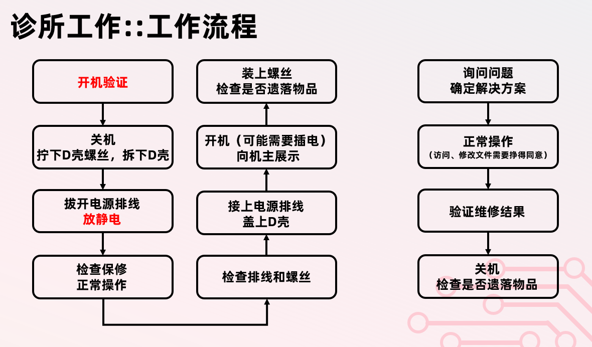
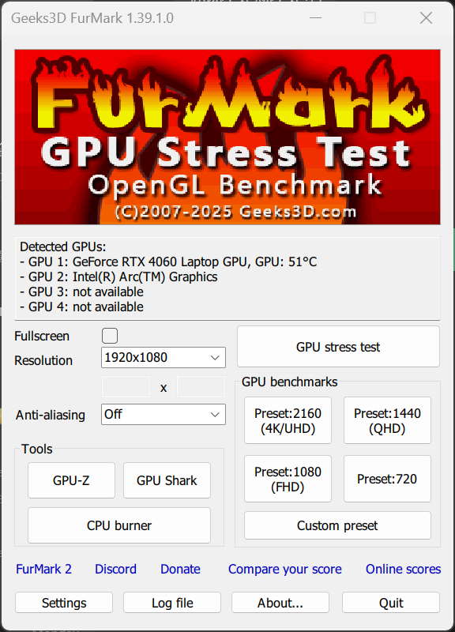
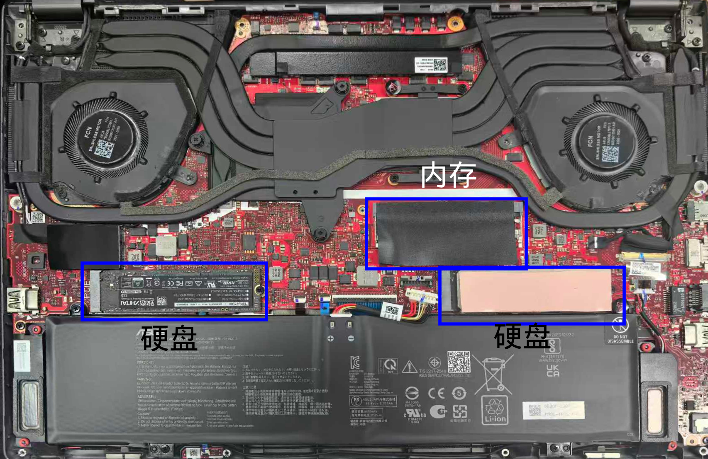
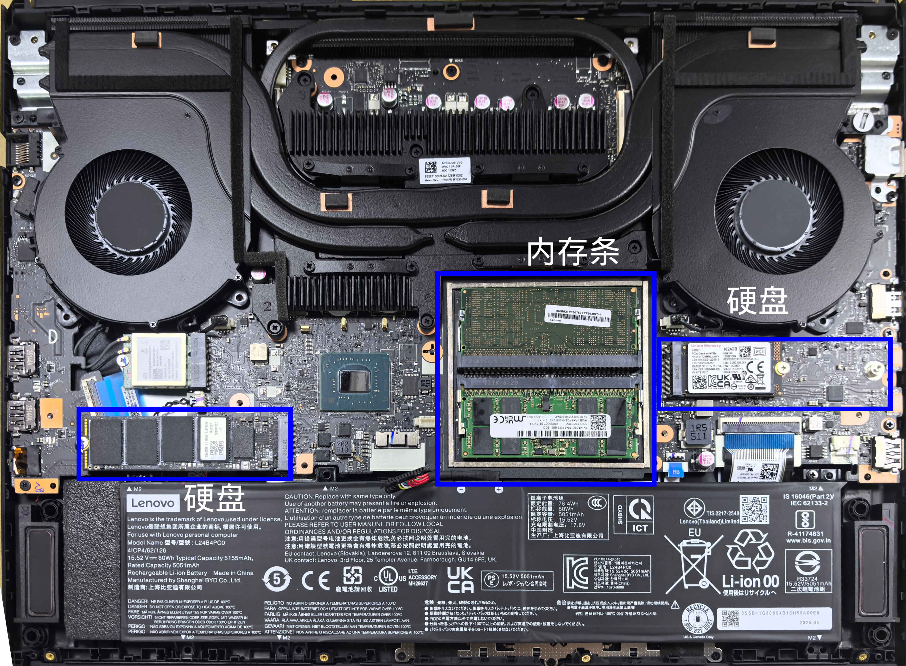
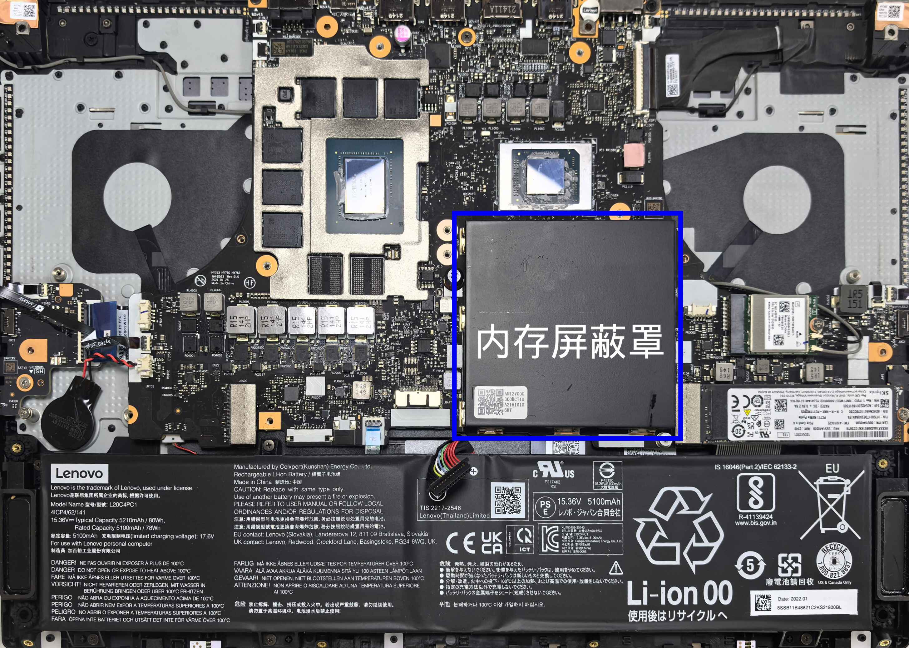
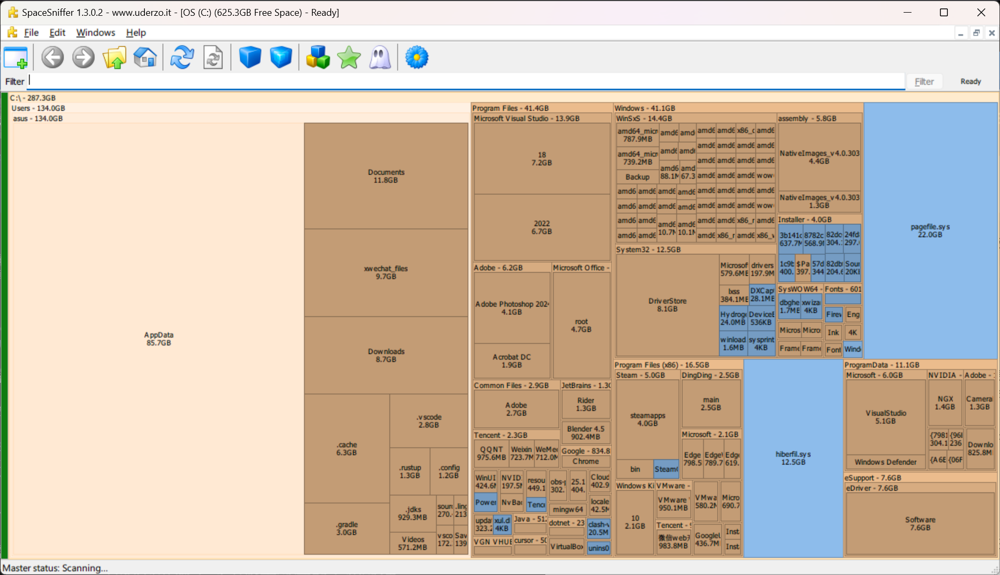

注：本篇写作时间为2025年10月（2026年3月更新），文中涉及的关于拯救者和天选等机型的数据仅保证对2022-2025年的机型有效，如有变化请及时更新！ ——25诊所

> **值班不喝酒，酒后不值班。**
> 电脑诊所严厉打击酒后值班的行为。酒后值班将面临被开除的后果。
{.is-danger}

> **下班以后也少喝点。**
> ——某不愿透露姓名的诊所部长
> ——同上 网协健身部
{.is-warning}

# 业务范围

## 诊所值班

这些工作的难度较低、耗时较短，可以在诊所常规值班时进行：

- 电脑故障排障
- 软件/系统安装
- 清灰，换硅脂
- 硬件安装更换（内存/硬盘/内存/风扇/D壳）
- 简易的数据恢复
- 任何电脑问题解答

这些工作有一定风险，需要在部长的指导下进行：

- 更换C壳
- 更换触摸板
- Dell G15/G16换硅脂

## 特殊预约

这些工作难度较高或耗时较长，需要机主向诊所任意部长进行特殊预约：

- 台式机装机
- 电脑A/B壳更换、屏幕更换
- Macbook相关操作
- 学院/部门/老师的电脑上门维修
- 电脑无法开机的故障排查

## 不受理

以下工作风险极高或者超出诊所能力范围，因此不予受理：

- 基础主板维修（尚未完全掌握）
- surface、华为matebook fold等一体机的拆机
- 清理液金
- CPU/GPU/南桥核心更换
- 其它高风险业务

# 操作规范

> **诊所工作必须严格遵循操作规范以避免事故！**
{.is-warning}

> **在工作过程中，遇到一切不确定情况都要立刻向部长求助！**
{.is-warning}

## 开机验证

在进行一切硬件操作前，一定要开机验证电脑能够正常开启（本就无法开机的除外）。此时也可以顺带检查电脑外观，如外壳有无划痕或者缺口、屏幕是否正常工作等。

> 以防电脑维修后无法开机造成的相关责任判定不明。

## 卸下螺丝

准备磁吸垫和合适尺寸的螺丝刀，将卸下的螺丝按照位置在磁吸垫摆放好。一些电脑上有保护螺丝，其即使完全拧松也无法取下。这种螺丝拧松即可，不要使用蛮力拔下。

对于D壳，注意可能藏在脚垫下方的隐藏螺丝。这最常见与惠普/戴尔的轻薄本以及ROG的幻14air。

对于散热模组，一般其上的螺丝旁都标有数字，建议按照数字顺序依次拆卸。

## 拆D壳

> 拆机前请触摸金属物件（桌腿）以释放静电，尤其是冬天
{.is-warning}

### 明确拆机方法

拆机前需要通过D壳上的标签确定电脑型号，目的是明确拆机方法（如确定有无隐藏螺丝）。如果是不熟悉的模具，可以上网搜索拆机教程。在B站上直接搜索 *电脑型号 拆机*即可搜出相应的拆机视频。B站UP小秋搞机录制了很多拆机视频可以参考。

如果在B站上没有得到结果，可以在网站https://zh.ifixit.com/上查找相应电脑拆机指南。

> 如果有不确定的情况，立刻向部长求助！
{.is-warning}

### 拆下D壳

当拧下所有螺丝后，（大部分）电脑的角落会空出一定缝隙，将撬片插入，沿缝隙移动并上翘，听到咔哒声说明已将卡扣撬开。撬开后顺着缝隙继续撬，直到全部撬开。

对于非常紧没有缝隙的电脑，使用吸盘吸住D壳后略微用力即可打开缝隙。

撬开D壳后将D壳取下放在一边即可。取下D壳后要小心避免一切物品（特别是金属的）靠近主板！

> 在放静电前禁止一切金属物品接触电脑内部，因此严禁使用金属撬片（诊所也没有金属撬片）
{.is-warning}

## 拔开电源排线和放静电

在取下D壳后，观察电源排线的拔开方法，将其拔开。随后快速连续按下电源键十次以上从而放静电。

> 一切主板上的操作都需要断电放静电后进行！
{.is-danger}

> 在拔开一切排线之前要先观察主板上附近的元器件，以免拔排线时损坏主板
{.is-danger}

如果操作需要破坏保修贴，先向机主说明；如果需要拆下散热模组，先确定不是液金。

> 操作排线和主板时，请勿使用金属工具（如金属镊子）
{.is-warning}

## 装上螺丝

上螺丝需要上两遍：第一遍只需将螺丝拧上，感到螺丝刀产生阻力为止。将全部螺丝如此拧上后再依次用力拧紧即可。

在拧紧时，对于D壳螺丝，按照顺时针或逆时针顺序拧紧即可；对于散热模组，按照散热模组上的数字顺序拧紧；对于其它情况，按照对角线进行拧紧。

> 这样操作可以保证消去金属内部应力，使得散热模组平直均匀地固定住。

## 装机

1. 检查内部螺丝是否正确安装（检查顺序：风扇、散热模组、硬盘、网卡、电池、内存屏蔽罩）
2. 检查排线是否插好（检查顺序：风扇排线、屏幕排线、网卡排线）
3. 插上电源排线
4. 盖上D壳开机，但是不要上螺丝
5. 检查能否正常开机（如果拆装了散热模组、风扇则要烤机验证其能够正常工作）
6. 告诉机主电脑已经正常开机，随后关机
7. 上螺丝

> 有些电脑在拆开后盖后需要插电源才能开机（如天选和ROG全系）。有些电脑开机自检极慢（特别是dell），需耐心等待一两分钟才有反应

> 加装或更换内存条后可能出现无法开机的情况（开机时卡住），这是新内存条不匹配导致的，将内存条重新按照原先排列插入即可解决

## 清灰换硅脂

清灰**并**换硅脂操作的流程是（拔开电源排线并放静电后）：

1. 确认电脑为硅脂散热而非液金，无法确认的先问部长，或者在B站上查找相应拆机视频以确认。假如是液金，则千万不要拆开散热模组，仅作表层清灰。随后向机主说明无法更换硅脂，建议其前往售后进行深度清理

> ROG全系、部分dell G15/G16、部分msi电脑为液金；天选、拯救者、thinkbook和大部分轻薄本为硅脂

> 液金和硅脂是两种不同的位于CPU/GPU核心与散热模组之间的导热材料。液金是一种镓的合金，一旦沾到主板上，在主板通电时会导致短路从而导致主板损毁。因此诊所不接受一切液金相关业务，在拆机时也要进行检查

> 拯救者等电脑会在一颗散热模组螺丝上贴保修贴，拧螺丝时必然会将其损毁，因而有可能影响电脑保修。因此，当发现需要破坏保修贴时，先向机主确认是否仍在保修期：如在保修期，向其说明可能会影响保修，让其决定是否继续；如果不在，向其说明将要破坏保修贴后正常进行即可
{.is-warning}

> 一般电脑的保修是两年

2. 拔开风扇排线，拧松散热模组的螺丝，如果和风扇固定在一起则要将风扇螺丝一同拧下，抬起散热模组放到一旁。可以从一侧上下摇晃散热模组直到将其取下

> 有些电脑（如拯救者）的散热模组与其它部件固定在一起，需要一起取下

> 有些电脑（如暗影精灵）的风扇压在主板下，则不需要将其取下

3. 使用软刷子和气吹清理风扇下的灰尘

4. 将风扇与散热模组分开，使用硬刷子擦掉二者之间的灰，使用气吹吹走散热模组鳍片的灰，使用刷子刷下风扇扇叶上的灰随后吹掉

> 拯救者等电脑风扇是固定在散热模组上的，需要卸下模组上的小螺丝从而卸下风扇；天选等电脑是使用胶带连接二者的，将胶带撕开即可

5. 使用酒精棉片擦掉核心和散热模组上的硅脂。注意不要将其它部分的看上去有点像硅脂的东西擦掉

> 擦核心上硅脂上仅需轻微用力，多次擦拭。不要用力太大，不要擦除核心以外的硅脂
{.is-warning}

6. 将风扇与散热模组装好

7. 在核心上涂上硅脂

8. 将散热模组装好，拧上螺丝

9. 将电脑装好，烤机验证散热效果

假如需要清灰**但不**换硅脂，那么千万不要拆开散热模组。在将表面灰尘清除后尝试拆下风扇以清除风扇和散热模组鳍片之间的灰尘。假如风扇压在主板下或与散热模组连为一体无法单独拆下，则不需要进一步操作，仅需向机主说明：无法拆开风扇的清灰对电脑散热优化有限，建议一并更换硅脂。

> 硅脂在一段时间的使用后会凝固，此时拆开散热模组再装回时硅脂间由于形变会存在间隙，从而大幅降低散热能力。因此一旦打开散热模组就一定要更换硅脂。但是假如硅脂是在两周内更换的，由于硅脂尚未凝固，此时打开散热模组后可以直接装回

> 对散热系统影响最大的是散热模组鳍片与风扇之间的积灰，以及D壳进风口的积灰。在清灰时一定要将这二者清理干净

有时会接到要求更换相变片的需求。相变片与硅脂一样，是一种导热材料，它在常温下表现为固态，散热能力略优于硅脂。

换相变片的其它操作步骤与换硅脂一致，但是不向核心上涂抹硅脂，而是将相变片剪成比核心略小一圈（每边小2mm）的矩形，将其贴在核心上即可。注意相变片两边均有贴膜，在裁剪好准备贴时，先将一面的膜撕下，将相变片贴在核心上，随后撕下另一面的膜。

> 一定不要忘记撕下相变片上的膜！
{.is-warning}

## 烤机

烤机指使电脑满负荷运行一段时间，从而测试其散热性能，使用工具`FurMark`和`AIDA64`进行。

> 烤机应当在插电源时进行

诊所有若干存有`图吧工具箱`的U盘，打开图吧工具箱，在`烤鸡工具`打开`FurMark`，在`综合检测`打开`AIDA64`。

点击`GPU stress test`，弹出框点击`GO!`即可开始烤机。此时在`AIDA64`点击`传感器`。烤机时电脑会快速升温，最后稳定在一个值。观察`AIDA64`中`CPU`和`GPU`温度，如果CPU最终稳定在95度以下、GPU稳定在90度以下则属于正常情况，高于此温度说明散热有严重问题。一般清灰换硅脂后电脑的稳定温度会更低。

一般烤机五分钟内温度就会稳定，在确定烤机结果后向机主告知散热情况良好，随后直接关闭窗口即可。

## 安装内存条/硬盘

安装内存条或硬盘的流程是（拔开电源排线并放静电后）：

1. 寻找空余的内存/硬盘槽位

> 拯救者会使用一个屏蔽罩遮住内存槽位，需要将其取下。只需捏住屏蔽罩两侧轻微用力向上提即可将其取下。在安装时注意将屏蔽罩与主板上对应的卡扣对准

2. 插入新的内存条/硬盘

> 插入内存条/硬盘/网卡时应倾斜约30度插入，不要水平插入以免与主板刮蹭

> 详细操作方法请见 TODO 将会放置于cf上

3. 将电脑装好。对于加装内存，开机后在任务管理器中查看内存是否正常识别（即查看内存大小是否符合加装后应有的总大小）。对于加装硬盘，打开磁盘管理，此时会弹出要求选择MBR还是GPT的弹窗，一定要选择GPT，随后在空余空间上`右键`->`新建简单卷`随后按照指示选择合适的大小和盘符即可

> 更换网卡的操作与硬盘类似。网卡上有两根天线，拆网卡时先将其拔开，加装新网卡后将其按照原顺序插好即可

## 清C盘

清理C盘垃圾分为若干步进行。首先，打开`设置`->`存储`->`临时文件`，等待其扫描结束后，点击“移除文件”即可清除部分垃圾。此处有很多选项可选，只需要清除默认勾选的选项即可。

随后插入诊所的U盘，打开`图吧工具箱`，在`硬盘工具`找到`SpaceSniffer`，选择C盘，等待其扫描完成。

> 扫描过程中弹出提示`Unable to examine ...`的框是正常情况，这是因为有些目录需要管理员权限才能访问，但是我们并不是以管理员权限运行此软件的。这对扫描结果没有影响，忽视即可。你也可以使用管理员权限运行SpaceSniffer从而规避这个报错

`SpaceSniffer`的作用是将文件大小可视化展示出来，文件越大，在这里展示出的面积越大。我们可以借助这个可视化的图来找到占用大的文件，将其删除或者移走以清理C盘。

那么哪些文件可以修改呢？

首先点击`Users/<用户名>/AppData/Local`，这里存放着电脑上软件的设置、缓存文件等，比如QQ/微信的聊天记录、网易云音乐的歌曲缓存。因此，需要直接找到此处每个文件夹对应的程序，在程序自带的文件管理（常命名为`储存`或`储存管理`）中进行删除。

比如`Local`下有一个`Tencent`文件夹占用很大，那么就需要打开QQ和微信，在设置中的储存删除不需要的聊天记录，以及聊天缓存的图片和视频。

> 一般占用大的软件是：QQ、微信、钉钉、剪映、网易云音乐

> 尊重机主的个人隐私，不要点开机主的QQ/微信/WallpaperEngine/图片文件夹/下载文件夹等，只需要告诉对方让其自行清理即可
{.is-warning}

然后是`Users/<用户名>/Documents`和`Users/<用户名>/Downloads`，这分别是电脑上的文档和下载文件夹。QQ等应用会将聊天记录等文件存放在文档文件夹，而后者则是浏览器等软件下载文件的默认地址。可以询问机主是否愿意我们打开它们，如果可以，那么打开后询问机主哪些文件需要保留、哪些需要删除。

之后看`Program Files`和`Program Files(x86)`，看哪些软件占用大，如果该软件机主说明其不再使用，将其卸载即可。

最后清理回收站。如果桌面上没有回收站图标，可以在资源管理器的地址栏输入`shell:RecycleBinFolder`打开回收站。向机主确认后清空即可。

> 按下delete键会将文件移动到回收站，使用shift+delete快捷键可以直接删除文件

常规C盘清理到此为止，此时已经清理了C盘上大部分非必须文件。如果此时剩余空间还是不大，说明C盘本身过小，应征求机主意见，考虑扩容C盘。

## 安装Windows系统

// TODO

详细流程可见：

https://c13sv18hodb.feishu.cn/docx/R1KwdfyCjoFgrSxPBPScABx1nif?from=from_copylink

