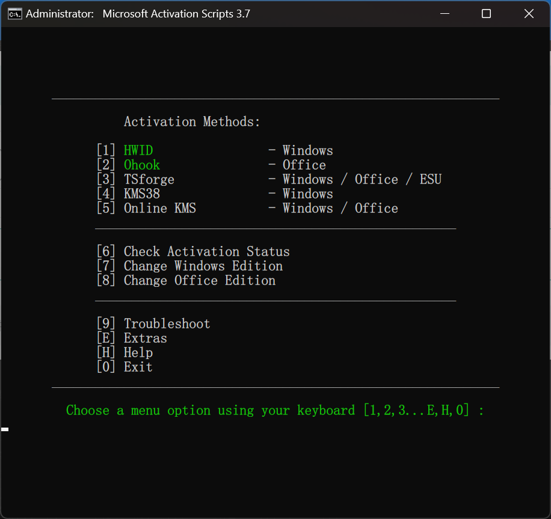

# 硬盘工具

<Alert type="danger">
数据无价 谨慎操作
避免可能丢失数据的操作
</Alert>

## DiskGenius

DiskGenius（以下简称DG）是诊所日常维护中最常用硬盘工具之一，也是各版本PE必不可少的预置工具。

DG有哪些功能，DG如何使用，使用DG时注意什么

### 功能

- `转换硬盘格式`——实现GPT(GUID)和MBR的相互转换
- `分区管理`——新建/删除/查找分区，转换分区格式，调整分区大小
- `数据恢复`——对硬盘丢失的分区/数据进行扫描和恢复（需要专业版软件）
- `信息查看`——查看硬盘S.M.A.R.T信息
- `克隆硬盘`——帮助实现全盘/分区的克隆，更换硬盘/扩容分区时可使用
- `备份还原`——可以实现全盘/分区的备份和还原
- `杂项功能`——检查分区表错误，修复坏道等

### 使用介绍

以下介绍几个简单使用场景
<Alert type="warning">
在PE里对硬盘进行操作，一定要提前关闭BitLocker
同一个分区在硬盘上的位置一定是连续的，不可断开
</Alert>

- `硬盘内空间分配`
可能由于原机硬盘分区不合理，导致C盘过小或其他情况，需要对分区的分配进行操作

1、右键需要腾出空间（变小）的分区，点击调整分区大小，拉动分区始末点，调整到合适的大小
2、拖动中间，使空余空间靠近需要扩大的分区，确定
3、同样方法挪动中间的其他分区，直至未分配空间与需要扩大的分区相连
4、右键需要扩大的分区，方法同上，使其扩大

尽量避免直接使用`“扩容分区”`，一定要知道自己每一步操作的后果是什么

- `硬盘间分区调整`
可能由于新加硬盘等情况，可能需要在硬盘间调整分区

（通过调整分区大小工具，在新硬盘上腾出一定大小空间，若新硬盘，则右键硬盘、更改为GUID格式）
1、在腾出的空间新建简单卷
2、到需要移动的分区右键，点克隆分区
3、选择源分区和目标分区，开始分区克隆
4、克隆完成后，检查文件是否齐全，占用空间是否一致
（5、对克隆后分区的大小进行调整）
> 若克隆的硬盘为C盘，需要提前在新硬盘上新建ESP分区和MSR分区
克隆C盘完成后需要对硬盘进行引导修复，

# 激活工具

## get.activated.win

用于激活Windows和office，也可以用于卸载office或者修改office版本。

在管理员终端输入`irm https://get.activated.win | iex`即可打开。

### Windows相关

要想激活Windows，在首页输入`1`，按照提示进行激活即可。

### office相关

要想激活Windows，在首页输入`2`，按照提示输入`1`，进行激活即可。

输入`2`后输入`3`，会打开一个存放着office各语言各版本下载程序的网站，用来下载office很方便。

在首页输入`8`可以卸载和修改office，但是更建议使用officetoolsplus进行类似的操作。
