# 电脑义诊排查流程

- 观看本文前，请先查看[诊所操作规程](/clinic/readme)
- 本文带有笔者**主观色彩**，具体问题请具体处理
- 熟悉流程可使用`CTRL+F`快速查询对应问题处理方式或跳转至[维修部分](#fix)
- $\cdots$

## 望闻问切

### <span id ="ask">问</span>

- `必问`同学请把门带上，同学有预约吗
- `必问`电脑遇到了什么问题，电脑这个问题什么时候出现的,持续多久
- 同学你的电脑什么时候购买的，保修还在吗
  - 刚买不久，建议直接返厂换一台
  - 保修如果还在，不建议进行换硅脂等操作，这会导致电脑失去保修
- `必问`接下来的操作我需要拆开你的电脑，有一定的风险，同学你能接受吗
  - 接受，请继续接下来的流程
  - 不接受，请[好言劝退](#out)
- $\cdots$

### <span id ="see">望</span>
<Alert type="info">

这一步需要你首先判断问题的类型，常见类型如下
安装软件、清理文件、安装系统、配置环境等，请跳转[软件模块](#software)
清灰、安装硬盘、换硅脂、换风扇、~~换屏~~等，请跳转[硬件模块](#hardware)
具体问题还请具体判断，上述类型仅作参考
部分问题比较特殊，如不在上述问题之内，请观看下表，如仍无法处理，说明你来到了[问题黑洞](#select)
</Alert>


<div class="center">
  
|特殊问题|流程1|流程2|
|:-----:|:-----:|:-----:|
网络问题|跳转至[网络模块](#network)|也许是网卡问题，页面内搜索相关信息
蓝屏问题|跳转至[蓝屏模块](#blueScreen)|跳转[安装系统](#installOS)
黑屏问题|跳转至[黑屏模块](#blackScreen)|跳转[好言劝退](#out)
$\cdots$|$\cdots$|$\cdots$

</div>

### <span id ="listen">闻</span>

- 这一部分疑似水字数，相信也没人会看这里。我们的工作中和`闻`这个字能牵扯上关系的大概只有听听风扇有没有在转，转的快不快了。

<Alert type="warning">
值得补充的是，多注意诊所内部的噪音，我们**图书馆的诊所内隔音效果不好**，让大伙都小点声谨防被投诉吧
</Alert>

### <span id ="fix">切</span>
<Alert type="info">

到这一步终于可以开始维修电脑了
点击对应模块快速跳转
</Alert>

<div class="center">

|问题模块|问题一|问题二|问题三|问题四|问题五
|:-----:|:-----:|:-----:|:-----:|:-----:|:------:|
[软件模块](#software)|[安装软件](#installSoft)|[清理文件](#clearFiles)|[安装系统](#installOS)|[配置环境](#envConfig)|$\cdots$
[硬件模块](#hardware)|[清灰](#clearDust)|[安装硬盘](#installHarddisk)|[换硅脂](#changeAbaAba)|[换风扇](#changeFan)|$\cdots$
[网络模块](#network)|$\cdots$|$\cdots$|$\cdots$|$\cdots$|$\cdots$
[蓝屏模块](#blueScreen)|$\cdots$|$\cdots$|$\cdots$|$\cdots$|$\cdots$
[黑屏模块](#blackScreen)|$\cdots$|$\cdots$|$\cdots$|$\cdots$|$\cdots$

</div>
  
### <span id ="software">软件模块</span>

|[安装软件](#installSoft)|[清理文件](#clearFiles)|[安装系统](#installOS)|[配置环境](#envConfig)|
|:----:|:----:|:----:|:----:|:----:|

#### <span id ="installSoft">安装软件</span>

##### 软件来源（优先级依次向下）

1. 诊所固定资产的U盘
2. 网协搭建的内部资源站——[需用校园网](https://cf.bitnp.net/)
3. 常用微信公众号`软件管家`，搭配百度网盘会员食用，否则~~你也不想1GB文件下一天吧~~
4. 待补充

##### 如何安装

就笔者个人使用体验而言，**大型**程序不装在C盘，如果是**SolidWorks**这种另当别论；如果程序安装在**非C盘**位置，笔者习惯新建一个文件夹专门收录各种软件。

>个人不建议建五花八门的文件夹，个人最习惯X:\Program Files\xxx	        -wm的劝告
>
>日常的一些软件都是一键式安装，基本一路回车即可。该部分主要涉及诊所业务常遇到的软件安装。此外，安装教程也能从上文提到的**软件管家**公众号上获取。

###### ~~万恶之源~~SolidWorks

该部分已有现成教程，详见[SolidWorks安装与卸载](/clinic/error-soft/#SolidWorks)
> 感谢王懋学长的付出

###### AutoDesk系列

同上，见[AutoDesk系列软件安装（CAD，Inventor等）](/clinic/error-soft/#AutoDesk)

###### <span id ="OfficeToolPlus">OfficeToolPlus</span>

官网[OfficeToolPlus](https://otp.landian.vip/zh-cn/)
`待补充`

###### 待补充

$\cdots$

##### 如何卸载软件

卸载软件最麻烦的不是把程序文件从电脑上移除，而是避免删除程序后遗留在电脑上的垃圾——如注册表——引起电脑连锁反应，比如经典的安装SolidWorks失败后再也安装不上，以及删除虚拟机后连不上网的问题。

推荐使用`Geek Uninstaller`和`Total Unistall`这两个卸载程序的程序
以`Total Unistall`为例，选中待卸载程序，等左下角绿条跑完就可以卸载，详见下图

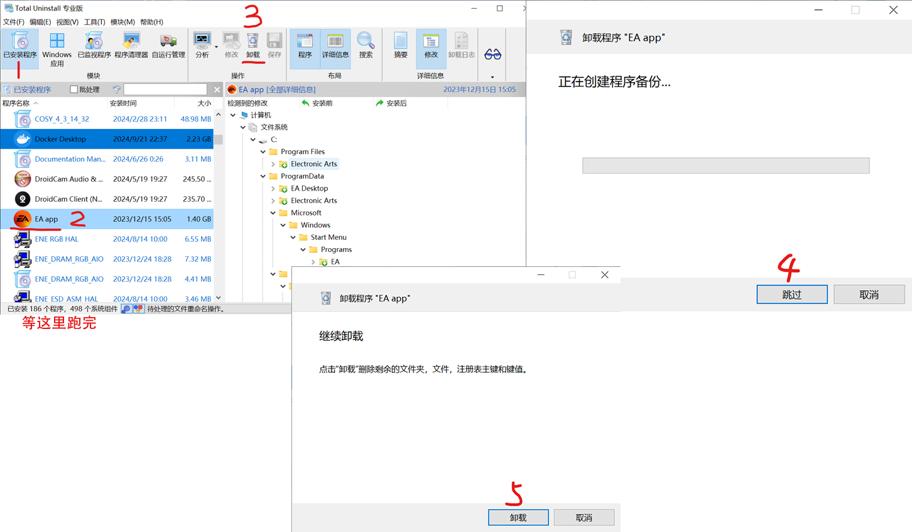

也可使用`CCleaner`在卸载完成完程序后手动清理注册表，此处不作过多说明

#### <span id ="clearFiles">清理文件</span>

力荐`TreeSize`这个软件，可以很清晰地展示文件大小。没事别乱点开别人文件夹。~~别看到不该看的~~
注意别在该软件中打开文件，会卡死，正确使用方法是`右键`，选择`在资源管理器中查看`

关于`清理C盘`这类需求，一般有如下两种解决方法：

- 将无关紧要的大文件移至别的分区或删除
- 从别的分区匀一点空间给C盘，这涉及`DiskGenius`软件的使用，[下文](#DiskGenius)会详细说明

但也有软硬链接的方式将部分程序移到别的分区，但容易出问题，不推荐使用

#### <span id ="installOS">安装系统</span>
<Alert type="info">

非Windows系统安装，请转[Ubuntu安装](/clinic/error-soft#ubuntu-%E7%B3%BB%E5%88%97)
预先准备如下：
一块PE盘，至少需要要求安装的系统镜像，最好有EasyDrv工具，方便装完系统后打上网卡驱动
一台需要安装系统的电脑，保证能进BIOS
一个有线或使用接收器的2.4G无线鼠标
</Alert>

<div class="center">
  
|[启动盘制作](#makePE)|[备份系统盘文件](#backupOSFiles)|[BIOS设置](#setBIOSconfig)|[开始安装](#startInstallOS)|[扫尾工作](#endInstallOS)|[DiskGenius使用](#DiskGenius)|
|:----:|:----:|:----:|:----:|:----:|:----:|

</div>

##### <span id ="makePE">启动盘制作</span>
<Alert type="info">

如果你已有PE盘，请跳转[备份系统盘文件](#backupOSFiles)
预先准备：一台能正常使用、已存储系统镜像的电脑，一个**确保备份资料**的U盘
</Alert>

可使用以下两种方式：

- 微PE，优点是对新机器支持好，缺点是仅支持安装Windows
- Ventory，优点是能够安装不同类型的系统，缺点是不适配老机型

<Alert type="warning">
不论怎样，初次制作启动盘时一定会格式化U盘，一定记住**备份重要资料**
</Alert>

此处以`微PE`为例，`Ventory`请自行上网搜索教程

<div class="center">

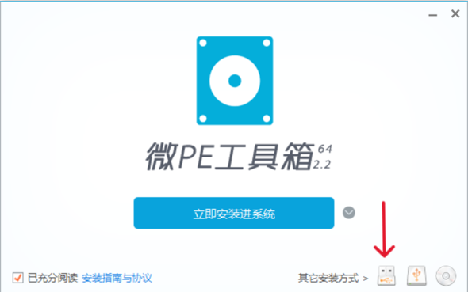$\quad$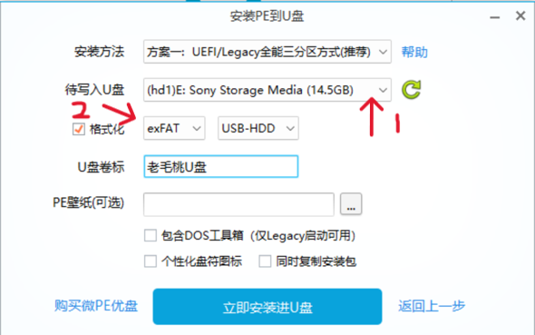

</div>

- 左图选择箭头处直接安装进U盘
- 检查右图1处是否是待格式化U盘，别把电脑本身磁盘格式化了~~寄！~~
- 右图2处建议改为NTFS，**前提是不在MacOS上使用该U盘**
- 点击显眼的蓝色按钮，耐心等待即可

之后拷贝系统镜像至主分区，镜像一定是以.iso为后缀的，可从[微软官网](https://www.microsoft.com/zh-cn/software-download)下载纯净镜像。~~以.iso后缀的不一定是镜像~~
切忌从不明渠道下载系统镜像，p2p生崽器警告！
<Alert type="info">
PE盘制作好后会出现两个分区
EFI分区，PE系统所在处，大部分情况下被隐藏
主分区，安装PE后剩余的部分，可以当做普通U盘使用
因此不必担心U盘变为启动盘后剩余空间无法使用
</Alert>

##### <span id ="backupOSFiles">备份系统盘文件</span>

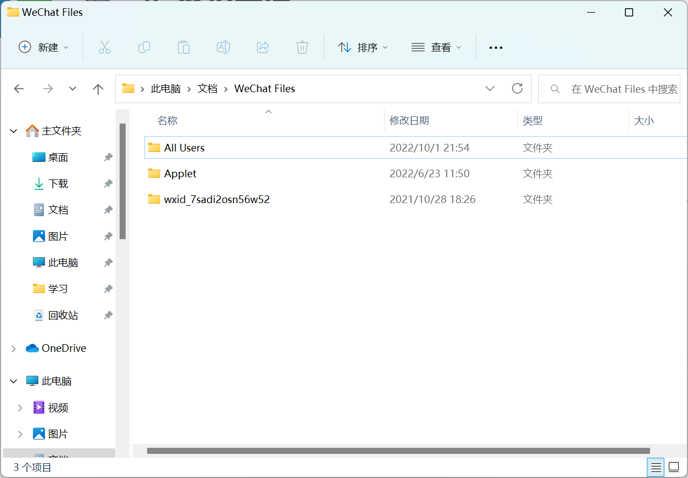
常见重要文件位置：

- 桌面
- 微信、QQ聊天记录（应用内备份）：\文档\Tencent Files、WeChat Files
- 系统默认下载目录
- BaiduNetDiskDownload、迅雷下载、360安全浏览器下载等

备份到**非系统盘**即可，无法进入系统，则进入PE备份

##### <span id ="setBIOSconfig">BIOS设置</span>

关机情况下开机，在屏幕亮起时摁对应按键进入BIOS，没进就多摁几次
下表给出对应品牌BIOS按键，不在此表中请自行搜索
|品牌|按键|品牌|按键|
|:----:|:----:|:----:|:----:|
|惠普|F2或者F10|戴尔|F2或F12|
|宏碁|F2|联想|F1、F2或Fn+F2|
|华硕|F2|$\cdots$|$\cdots$|

开机情况下有通用方法：按住shift并点击系统的`重启`键、设置界面搜索高级启动

<Alert type="info">
进入BIOS界面后，由于不同主板的BIOS不同，因此无法提供一个统一的更改启动盘启动方法，以下给出一些帮助寻找更改启动项的方法
寻找启动设置界面时，如果界面语言为英文寻找如**Boot**、**StartUp**等关键词；如为中文，寻找启动相关字眼
进入启动项设置界面后，寻找**Windows Boot Manager**和启动盘品牌名，常用如**KINGSTONE**、**SanDisk**、**Aigo**、**SAMSUNG**等
</Alert>

以下仅以旧版BIOS界面和华硕的BIOS界面为例（希望能补充后续操作的图片）

- 选中顶部Boot栏$\rightarrow$移到Boot Options Menu$\rightarrow$将启动盘调整为第一启动项$\rightarrow$F10保存并重启

- 看底部选项按F8进入Boot Menu$\rightarrow$拖动启动盘，将其移至第一顺序$\rightarrow$F10保存并重启


##### <span id ="startInstallOS">开始安装</span>

<Alert type="warning">
任何涉及硬盘的操作都要检查BitLocker是否关闭
如未关闭，使用`Win+I`打开设置，搜索`BitLocker`，点击关闭，视分区使用情况，耗时十分钟到一个小时不等，请提前告知同学
</Alert>

进入PE系统，打开桌面的DiskGenius软件(图标见下图左上角)，请确保以下部分正常，见下图
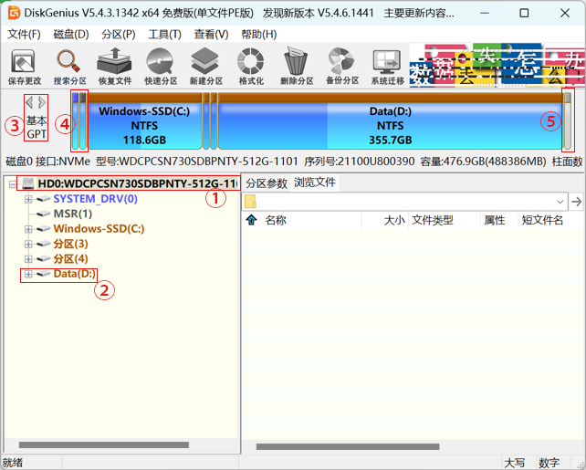

- ① ：该部分为需要安装系统的**磁盘**，在机主有多个硬盘的情况下别选错了
- ② ：该部分不是系统盘，注意区分系统盘与非系统盘。（上图中显然C盘是系统盘，会有额外图标提示）
- ③ ：硬盘分区表，分为MBR和GPT，请采取以下组合选择**Legacy+MBR/UEFI+GPT**，详细区别可自行了解。就业务而言，我们通常只会用到GPT分区表，需要实现分区表的转换见左上角磁盘$\rightarrow$转换分区表类型为GUID/MBR格式。
- ④ ：ESP和MSR分区：ESP存储了系统的引导程序、一些维修工具，除非不需要系统，否则**任何情况**下都**不应该删除**；MSR分区作为磁盘的替补分区，个人认为可有可无。
- 值得一提的是，想在一块刚买来的硬盘上装系统，注意需要手动建立一个ESP分区，具体做法为右键未分配分区$\rightarrow$建立ESP/MSR分区，默认情况回车就行。
- 在克隆硬盘时，也要注意将ESP和MSR分区一起克隆
- ⑤ ：显示为灰色区域，就是上文所提的未分配分区。

上述部分没问题后，打开系统镜像文件(.iso文件)，挂载后打开`setup.exe`文件

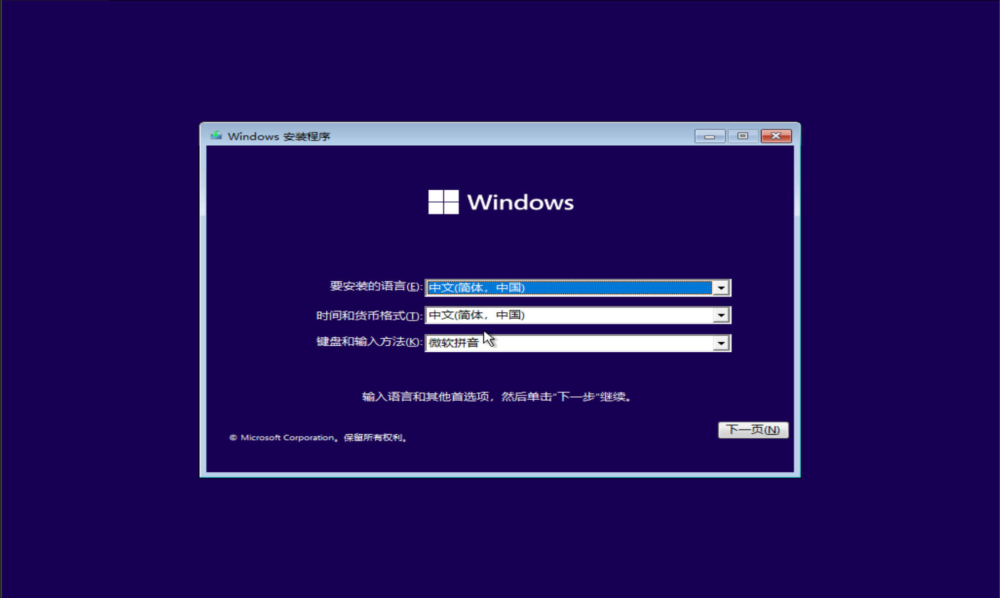
选择`简中`$\rightarrow$`下一页`$\rightarrow$`现在安装`$\rightarrow$`我没有产品密钥`$\rightarrow$选择系统版本，没有特殊情况，一律专业版/Pro，然后就到这个界面

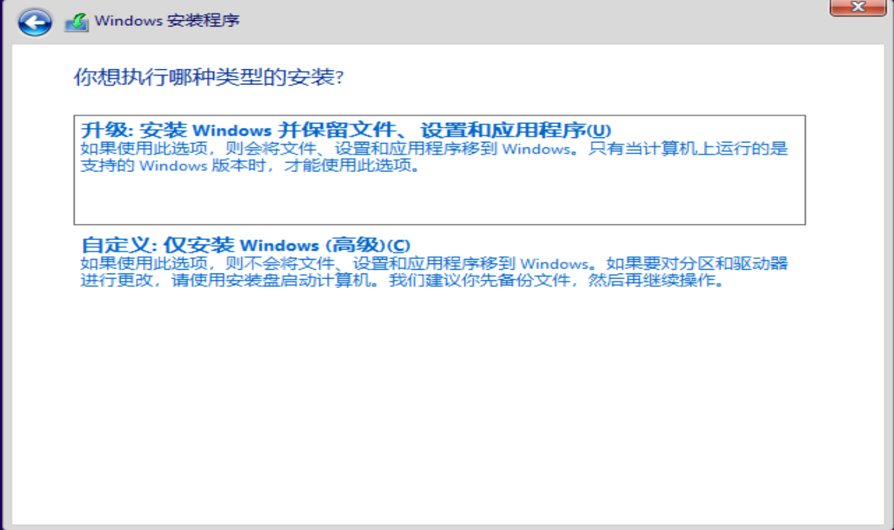

- 升级 ：除非是win10升级win11，否则不会选择该项
- 自定义安装 ：会删除安装分区所有数据，一般选择该项

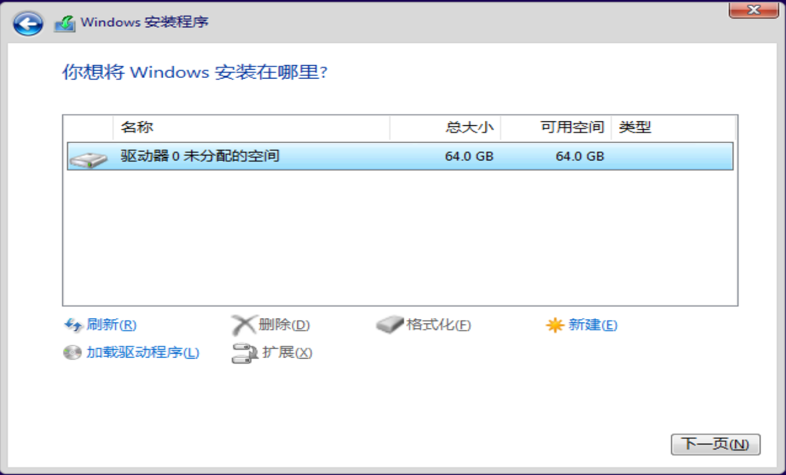

- 到这一步，由于是使用虚拟机做演示，此处显示未未分配空间
- 实际操作中，需要手动选择待安装系统分区,**注意甄别系统盘与非系统盘**，然后选择下方删除按钮手动释放空间
- 操作无误后，选择下一页

为避免后续配置问题，此处可先行跳过网络配置。按下(Fn + )Shift + F10，打开cmd窗口，输入

```
oobe\BypassNRO.cmd
```

回车执行，等待电脑自动重启后便可跳过网络配置（如下），如不行，自行上网搜索解决

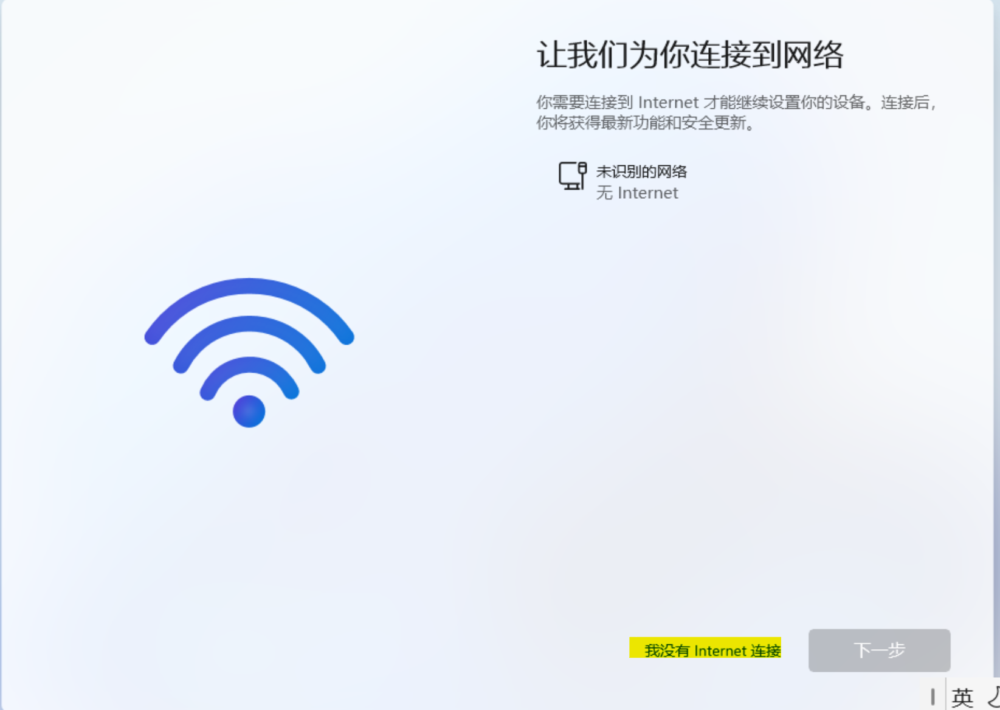

也可选择`WinNTSetup`、`EIX系统安装`或者其余安装工具

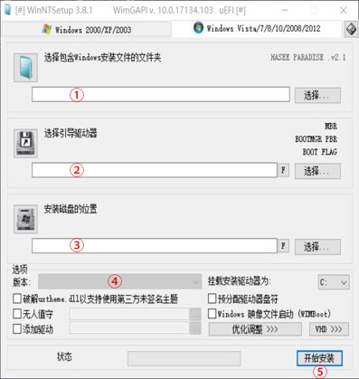

- ① ：选择需要安装的系统的镜像,.iso、.wim等
- ② ：选择EFI分区，就是前文提到的存储引导程序的分区，会自动检测，选择正确的即可
- ③ ：选择需要安装系统的分区，注意**一定要选择对目标分区且确保备份资料**
- ④ ：选择系统版本，没有特殊情况，一律xx专业版/Pro
- ⑤ ：开始安装，等着就行了，视电脑配置耗时半个小时到若干小时不等

<Alert type="info">
详细使用方式见[WinNTSetup 使用简介](https://zhuanlan.zhihu.com/p/67028057)
</Alert>

该工具上手简单，操作便捷

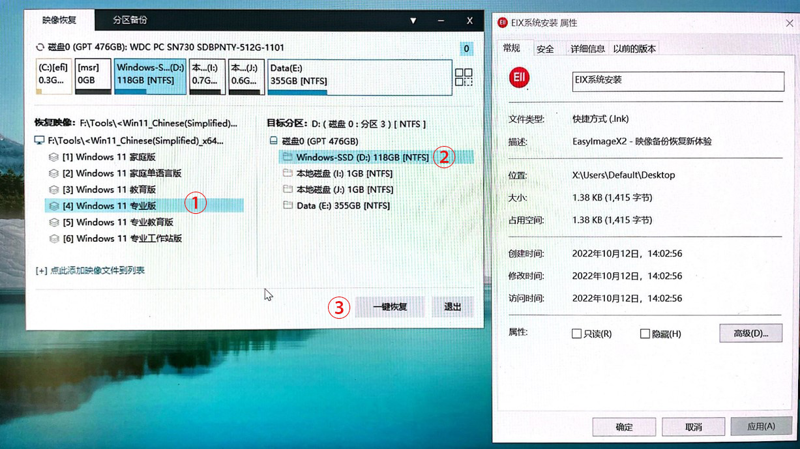

- ① ：会列举出所有磁盘上的所有镜像文件，选择xx专业版/Pro即可
- ② ：选择需要安装系统的分区，注意**一定要选择对目标分区且确保备份资料**
- ③ ：开始安装，等待，情况同上

##### <span id ="endInstallOS">扫尾工作</span>

安装完成后，电脑会自动重启，此时只需经过一~~亿亿亿亿~~点点时间等待，就可以进入系统设置环节

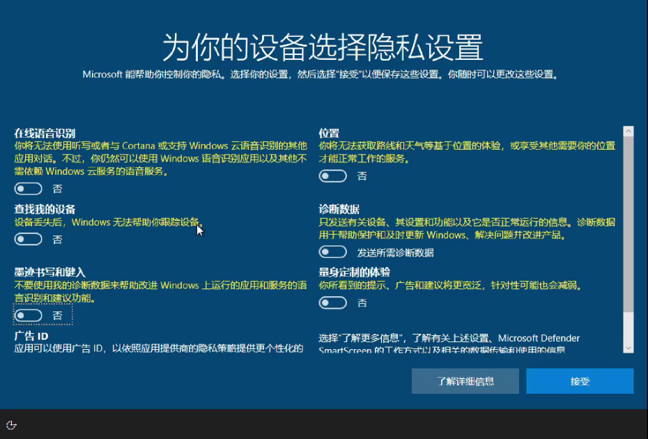

1. 系统设置有几个要点：

- 上图中可以保留定位服务和查找，其余全关
- 用户名全英文、可以先不设密码
- 可以先不联网
- 可以先不登录微软账户

2. 打上驱动和补丁
我建议是打上网卡驱动就行，剩下的可以留给机主找个网好的地方安装
~~我要说些不利于赢的话了~~
网卡驱动可选择通用网卡驱动，`EasyDrv`就可以打上；也可选择电脑对应网卡的驱动，搜索电脑对应型号，去官网下载驱动，拷贝后安装
3. 安装杀毒软件和厂商的软件
`联想`可用`联想电脑管家`，其余可用火绒并设置弹窗管理
**`重点`** 重做的系统没有厂商自带的软件，需要搜索电脑品牌，从厂商官网下载安装
4. 额外需求
如果有激活系统的需求，下载`HEU KMS`，若报毒则加信任区
如果有安装office的需求，见[OfficeToolPlus使用](#OfficeToolPlus)

##### <span id ="DiskGenius">DiskGenius使用</span>

|[磁盘坏道检测与修复](#SMART)|[分区调整](#divideDisk)|[克隆分区](#cloneDisk)|
|:----:|:----:|:----:|:----:|:----:|:----:|

###### <span id ="SMART">磁盘坏道检测与修复</span>

- 右键磁盘$\rightarrow$坏道检测与修复$\rightarrow$开始检测
检测结果好坏取决于坏道数量多少，通常硬盘读写性能下降就要怀疑是否存在坏道。
坏道过多请及时修复，在PE下进行坏道修复。
修复坏道不一定就能解决问题，配合DiskInfo(硬盘娘)综合判断磁盘情况

###### <span id ="divideDisk">分区调整</span>

1. 获取空闲空间


- ① ：选择需要调整大小的分区
- ② ：单纯分区，建议优先将后部空闲空间分离；
	如果是想将其合并至其它分区，让分离出的空闲空间在待扩容分区的前部
  以上图为例，欲将C盘扩容，则应调整分区前部为若干G；若想扩容E盘，则分区后部为若干GB
  之后右键空闲空间分配给待扩容分区即可
- ③ ：开始，等待，视分区使用情况和电脑配置耗时若干分钟

2. 分区扩容
分区扩容有更便捷操作方式，右键待扩容分区$\rightarrow$选择待缩小分区$\rightarrow$输入分配空间，等待即可

###### <span id ="cloneDisk">克隆分区</span>

`待补充`

#### <span id ="envConfig">配置环境</span>

建议安装在非C盘路径，并使用一个文件夹收纳所有的环境。这样即使重装系统也不影响已配置环境
这部分网络上教程很多，也很详细。仅列举几个可能比较常用的。
`待补充`
|配置选项|参考链接一|参考链接二|参考链接三|参考链接四|
|:----:|:----:|:----:|:----:|:----:|
|VsCode| [C/C++ 编译环境配置](https://blog.csdn.net/wohu1104/article/details/111464778)|$\cdots$|$\cdots$|$\cdots$|
|Python| Anaconda环境配置与虚拟环境使用(为什么不用docker:blush:)|$\cdots$|$\cdots$|$\cdots$|
|Java| JVM开发工具配置|$\cdots$|$\cdots$|$\cdots$|
|VmWare| 虚拟机安装与版本选择|$\cdots$|$\cdots$|$\cdots$|
|$\cdots$|$\cdots$|$\cdots$|$\cdots$|$\cdots$|

### <span id ="hardware">硬件模块</span>

该部分由于相较于图文而言，视频或是线下由值班部长教授的效果更好，在此部分仅做一些注意事项说明。进行硬件操作前，请先沐浴更衣、焚香净手，以免机魂不悦(误)
<Alert type="warning">
不允许没看过[操作规范](/clinic/readme/#OperationalSpec)前拆机，关爱他人资产，也包括你自己的
</Alert>

|[拆后盖](#Dismantling)|[清灰](#clearDust)|[安装硬盘](#installHarddisk)|[换硅脂](#changeAbaAba)|[换风扇](#changeFan)|
|:----:|:----:|:----:|:----:|:----:|

#### <span id ="Dismantling">拆后盖</span>

俗称的后盖是笔记本的D面，需要注意的点有：

- 脚垫片下面有时有隐藏螺丝，如果拆后盖感觉不对劲，请勿暴力拆解，可上网查询相关拆解方法
- 部分螺丝属于防丢螺丝，若你拧一颗螺丝发出“咔哒咔哒”的声音，则该螺丝很有可能是防丢螺丝
- 部分机型由于D面包C面的的设计，需要从C面撬开

#### <span id ="clearDust">清灰</span>

- 这应该是最基础的业务了吧。
- 风扇中堆积的灰不好清理，可以捏住刷子的头去刮扇叶上的灰
- 没有其它特别值得注意的点，注意断电

#### <span id ="installHarddisk">安装硬盘</span>

- 需要注意的是有的电脑只有单硬盘槽，无法扩容，需要将原本磁盘克隆至新硬盘上，详见[克隆分区](#cloneDisk)
- 有的硬盘被一层金属片遮挡，需要将其先拆下；而有的硬盘被包裹在金属壳中，需要先将硬盘和底座插入槽中，再将另一半壳合上

#### <span id ="changeAbaAba">换硅脂</span>
<Alert type="warning">

拆散热模块前，请仔细辨别电脑是否为液金散热，若是，请[好言劝退](#out)
</Alert>

涂硅脂时视芯片面积，可用十字涂法或五点涂法

#### <span id ="changeFan">换风扇</span>

换风扇通常伴随着换硅脂，基本流程和换硅脂一致

### <span id ="network">网络模块</span>

网络真是个玄学问题

#### 如何连接校园网

详见[校园网使用指南](https://mp.weixin.qq.com/s?__biz=Mzg2NjcxMTA1OA==&mid=2247491381&idx=1&sn=75241f2c6fb26063cb51f2151f8fa944&chksm=ce47fc48f930755eb0b4a74081017322edb700b7ce8d55348264f4fd63da9f3ae84272171322&mpshare=1&scene=23&srcid=0921d5cLOJH8S5iN7S4KAhbZ&sharer_sharetime=1663762538433&sharer_shareid=58bb95d0c9ada8587b0bde17bffbb749#rd "上网不涉密，涉密不上网")

#### Wi-Fi搜索不到

详见[Wi-Fi搜索不到](/clinic/icu/#noWiFi)
`待补充`

### <span id ="blueScreen">蓝屏模块</span>

重装系统解决大部分蓝屏问题
`待补充`

### <span id ="blackScreen">黑屏模块</span>

总不能是电脑亮度开最低了还不自知吧
`待补充`

## <span id ="select">问题黑洞</span>

到这一步，你有两个选择，但作为诊所的一员，在不涉及硬件和系统相关的情况下，笔者鼓励你选择第一项

- 尝试自行解决问题，妥善运用搜索引擎，搜索引擎使用技巧见[此链接](https://segmentfault.com/a/1190000038432191)
常用有：`“`电脑型号`”`+`“`问题类型`”`+（可选）`site`:www.example.com
- 如果值班部长空闲，请直接[摇人](#sos)；如果在忙，请口头描述问题

## <span id ="sos">摇人</span>

别气馁，这个问题目前你还无法独自处理，请你向当天值班的部长寻求帮助。如果事情顺利，那么问题很快就会被解决，多看多学；如果出了意外，那么你也能看到你的部长接着摇人。

## <span id ="out">好言劝退</span>

很可惜，这类业务并不在我们诊所的能力范围，请告知前来维修的同学去联系官方售后解决或者自行找更专业的维修店处理。

# 施工中

笔者能力有限，望后来者能继续补充
